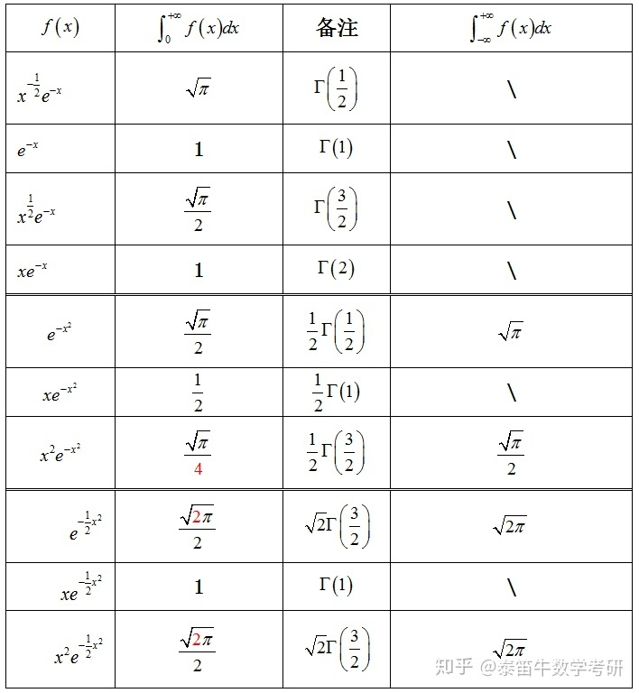

# Gamma Function伽马函数

## 目录

-   [定义](#定义)
-   [性质](#性质)
-   [取值](#取值)
    -   [\Gamma (n+1)=n !](#Gamma-n1n-)
    -   [\Gamma\left(n+\frac{1}{2}\right)=\frac{1 \cdot 3 \cdot 5 \cdots(2 n-1)}{2^{n}} \sqrt{\pi}](#Gammaleftnfrac12rightfrac1-cdot-3-cdot-5-cdots2-n-12n-sqrtpi)
-   [应用](#应用)

<https://zhuanlan.zhihu.com/p/76354265>

# 定义

$$
\Gamma(x)=\int_{0}^{\infty} e^{-t} t^{x-1} d t \quad x>0
$$

> ✒️伽马函数和$ e  $的指数没有关系，只与$x$有关

# 性质

1.  $\Gamma(n)是光滑的$
2.  $\Gamma(n+1)=n\Gamma(n)\ \ \ \ \ \ n>0$
3.  $\Gamma(1)=1\ \ \ \ \Gamma(\frac{1}{2})=\sqrt{\pi}$

# 取值

## $\Gamma (n+1)=n !$

$$
\Gamma(n+1)=n \Gamma(n)=n(n-1) \Gamma(n-1)=n !
$$

## $\Gamma\left(n+\frac{1}{2}\right)=\frac{1 \cdot 3 \cdot 5 \cdots(2 n-1)}{2^{n}} \sqrt{\pi}$

# 应用

$$
为什么\int_{-\infty}^{\infty} u^{2} \mathrm{e}^{-\frac{u^{2}}{2}} \mathrm{~d} u=\sqrt{2\pi}?
$$

<https://math.stackexchange.com/questions/2018926/i-int-0-infty-t2-e-t2-2-dt>

$$
\int_{0}^{\infty} t^{2} e^{-t^{2} / 2} d t\\\\Let\ t^{2} / 2=s\\then, I=\sqrt{2} \int_{0}^{\infty} s^{1 / 2} e^{-s} d s\\\\\begin{array}{l}\\=\sqrt{2} \Gamma(3 / 2) \\\\=\sqrt{2} \frac{\sqrt{\pi}}{2} \\\\=\sqrt{\frac{\pi}{2}}\\\end{array}
$$
