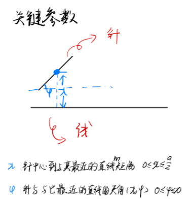
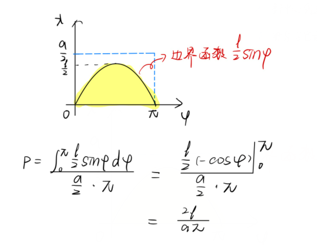

# 蒲丰Buffon投针问题

## 目录

-   [问题描述](#问题描述)
-   [解](#解)
    -   [【预备】关键参数](#预备关键参数)
-   [应用：估算
    \pi ](#应用估算pi-)

<https://www.bilibili.com/video/BV1kA411n7TE>

## 问题描述

平面上有一些平行线，相邻两条之间的距离为$ a
  $，向此平面投出一长度为$ l(l＜a)  $的针，求此针与任意平行线相交的概率。

## 解

### 【预备】关键参数

那么我们可以“简单”得到边界函数

应用：估算$ 
\pi  $
------
