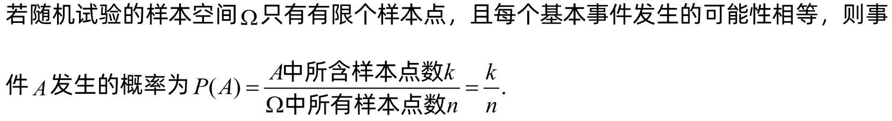
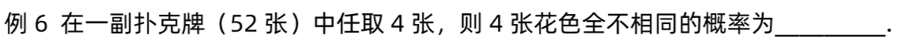
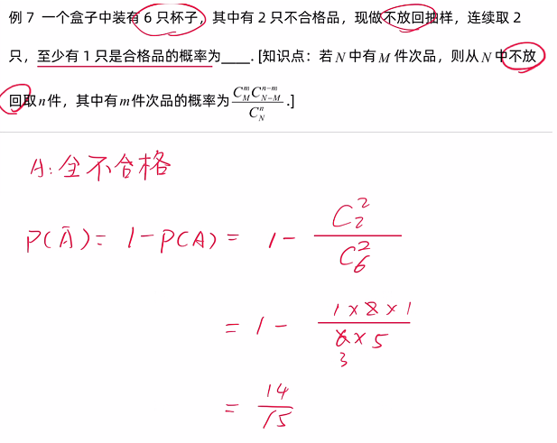

# 古典概型

## 目录

-   [摸球](#摸球)
    -   [无放回](#无放回)
    -   [有放回](#有放回)
        -   [波利亚(Polyá) 罐子模型](#波利亚Polyá-罐子模型)
-   [放球（以球为对象）](#放球以球为对象)
    -   [容量无限](#容量无限)
    -   [容量有限](#容量有限)

## 摸球

### 无放回

[抽签原理：中奖与顺序无关](抽签原理：中奖与顺序无关/抽签原理：中奖与顺序无关.md "抽签原理：中奖与顺序无关")

一副扑克牌有**54张牌**，其中52张是正牌，另外2张是副牌（大王和小王）。 52张正牌又均分为13张一组，并以黑桃、红桃、梅花、方块四种花色表示各组，每组花色的牌包括从1-10（1通常表示为A）以及J、Q、K标示的13张牌

### 有放回

#### 波利亚(Polyá) 罐子模型

$$
\begin{array}{l}\boldsymbol{P}\left(A_{1} A_{2} \overline{A_{3}} \overline{A_{4}}\right) \\ =P\left(A_{1}\right) P\left(A_{2} \mid A_{1}\right) P\left(\overline{A_{3}} \mid A_{1} A_{2}\right) P\left(\overline{A_{4}} \mid A_{1} A_{2} \overline{A_{3}}\right) \\ =\frac{r}{r+t} \cdot \frac{r+a}{r+t+a} \cdot \frac{t}{r+t+2 a} \cdot \frac{t+a}{r+t+3 a}\end{array}
$$

> ✒️**被用于简化的`传染病模型`**

## 放球（以球为对象）

### 容量无限

### 容量有限
