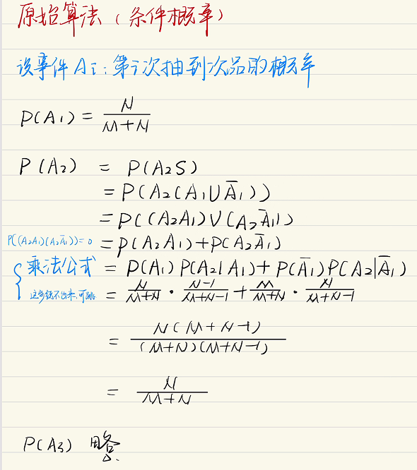
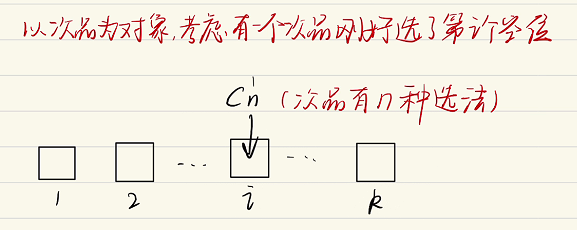
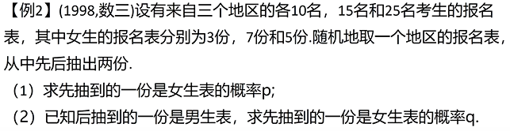
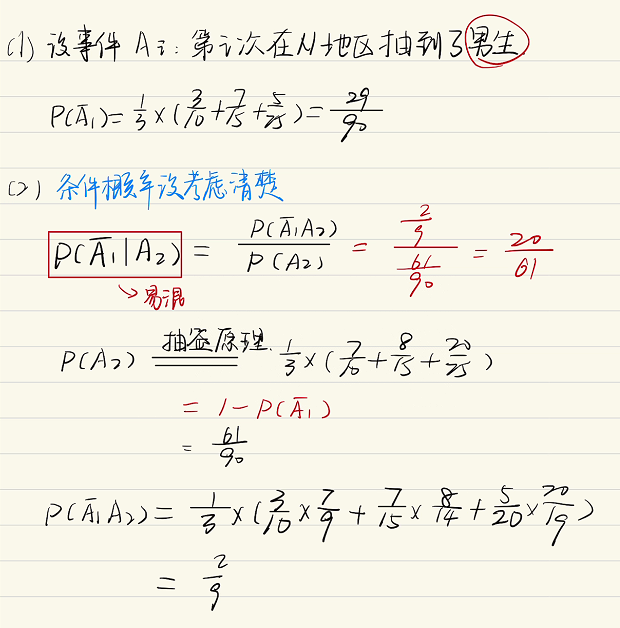
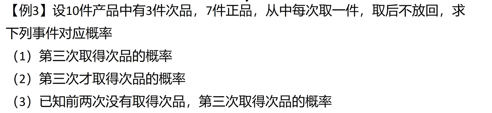
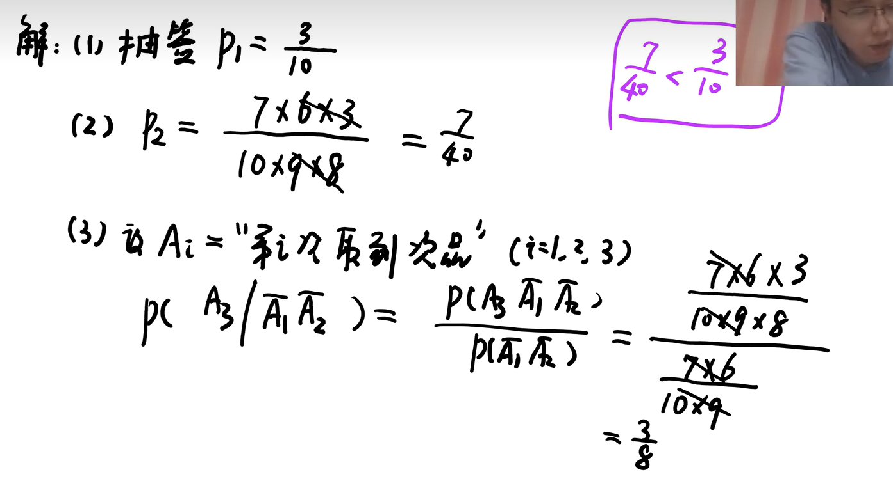

# 抽签原理：中奖与顺序无关

## 目录

-   [问题提出](#问题提出)
    -   [一批产品有 \mathrm{M} 个正品， \mathrm{N} 个次品，任意抽取 k 次 (k \leq \min (M, N)) ， \\\每次抽一个，抽取后不放回，求第 i(1 \leq i \leq k) 次抽出次品的概率 \mathrm{P}.](#一批产品有-mathrmM-个正品-mathrmN-个次品任意抽取-k-次-k-leq-min-M-N--每次抽一个抽取后不放回求第-i1-leq-i-leq-k-次抽出次品的概率-mathrmP)
    -   [老实人算法](#老实人算法)
        -   [特别的，当k=M+N时](#特别的当kMN时)
        -   [【例1】](#例1)
        -   [【例2】](#例2)
        -   [【例3】](#例3)

<https://www.bilibili.com/video/BV1FF41157dh>

> ✒️简单来说，这概率放不放回都一样，每次都等概率为$\frac{N(中奖）}{M+N}$

## 问题提出

### $一批产品有 \mathrm{M} 个正品， \mathrm{N} 个次品，任意抽取 k 次 (k \leq \min (M, N)) ， \\每次抽一个，抽取后不放回，求第 i(1 \leq i \leq k) 次抽出次品的概率 \mathrm{P}.$

### 老实人算法

***

剩下$k-1$个空位可以随便放，所以是$A_{M+N-1}^{k-1}$

$$
\begin{aligned} P=\frac{C_{N}^{1} A_{M+N-1}^{k-1}}{A_{M+N}^{k}} & =\frac{N \cdot(M+N-1) !(M+N-k+1) !}{(M+N) !(N+N-k+1) !} \\ & =\frac{N}{M+N}\end{aligned}
$$

#### 特别的，当k=M+N时

$$
P=\frac{C_{N}^{1} A_{M+N-1}^{M+N-1}}{A_{M+N}^{M+N}}=\frac{N \cdot(M+N-1) !}{(M+N) !}=\frac{N}{M+N}
$$

#### 【例1】

(1993，数一)一批产品共有10个正品和2个次品，任意抽取两次，每 次抽取一个抽出后不再放回，则第二次抽出的是次品的概率为

> ✒️直接运用抽签原理$P=\frac{2}{10+2}=\frac{1}{6}$

#### 【例2】

#### 【例3】

