# 中心极限定理

## 目录

-   [中心极限定理](#中心极限定理)
    -   [客观背景](#客观背景)
    -   [概念](#概念)
    -   [独立同分布的中心极限定理：L-L中心极限定理](#独立同分布的中心极限定理L-L中心极限定理)
        -   [例：参会家长](#例参会家长)
        -   [例2：灯泡寿命总和](#例2灯泡寿命总和)
    -   [棣莫弗—拉普拉斯中心极限定理：D-L中心极限定理](#棣莫弗拉普拉斯中心极限定理D-L中心极限定理)
        -   [例1：老年人保费](#例1老年人保费)
        -   [例2](#例2)
    -   [李雅普诺夫定理](#李雅普诺夫定理)
    -   [例](#例)

# 中心极限定理

### 客观背景

在客观实际中有许多随机变量,它们是由大量的相互独立的随机因素的综合影响所形成的,而其中毎个因素 在总的影响中所起的作用都是微小的.这种随机变量往往近似地服从正态分布,这就是中心极限定理的客观 背景.

### 概念

> 概率论中有关论证**独立随机变量**的**和**的**极限分布**是**正态分布**的一系列定理称为中心极限定理。

> ✒️也就是说，这一系列定理，
>
> **对象**（独立随机变量）相同，结论（极限分布式正态分布）相同，但符合不同的条件

## 独立同分布的中心极限定理：L-L中心极限定理

$ 设随机变量 X_{1}, X_{2}, \cdots 独立同分布， E\left(X_{k}\right)=\mu, D\left(X_{k}\right)=\sigma^{2} \neq 0,(k=1,2, \cdots) ，则当 n 充 分大时，近似有  $

$$
\sum_{k=1}^{n} X_{k} \sim N\left(n \mu, n \sigma^{2}\right) ，即 \frac{\sum_{i=1}^{n} X_{k}-n \mu}{\red{\sqrt{n} \sigma}} \stackrel{\text { 近倾 }}{\sim} N(0,1).
$$

$$
\frac{\bar{X}-\mu}{\sigma / \sqrt{n}} \stackrel{\overset { 近似地 }\sim}{ } N(0,1) 或 \bar{X} \stackrel{\overset { 近似地 }\sim}{ } N\left(\mu, \sigma^{2} / n\right).
$$

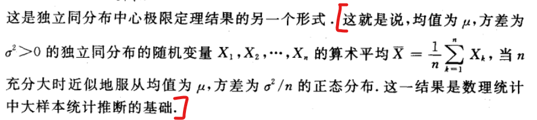

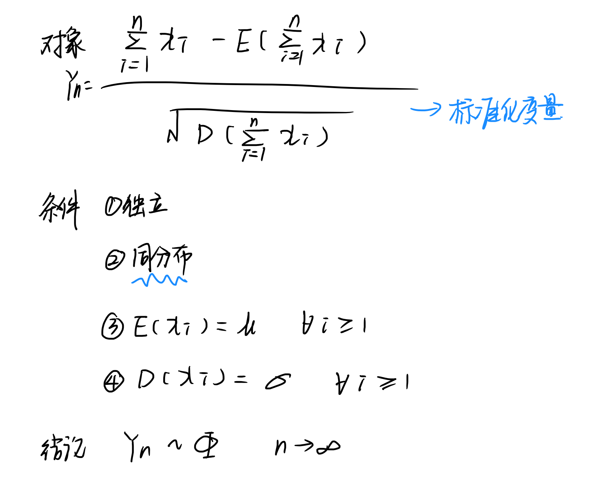

### 例：参会家长

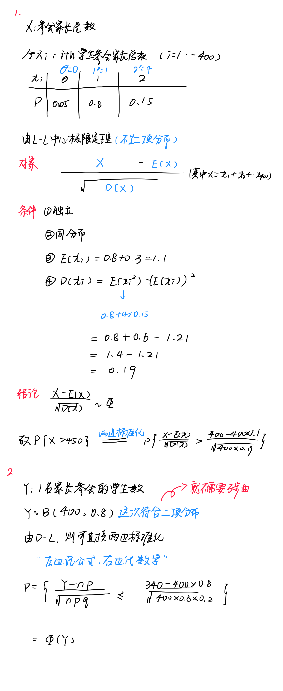

### 例2：灯泡寿命总和

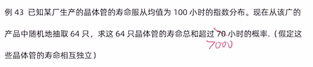

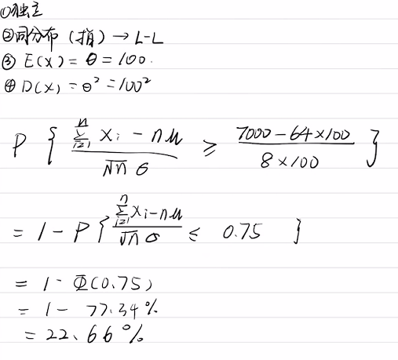

## **棣莫弗—拉普拉斯中心极限定理**：D-L中心极限定理

$设随机变量X\sim B(n,p)，则当n充分大时，近似有：$

$$
 X \sim N(n p, n p q), 即 \frac{X-n p}{\red{\sqrt{n p q}}} \stackrel{\text { 近似 }}{\sim} N(0,1).
$$

二项分布的极限是正态分布

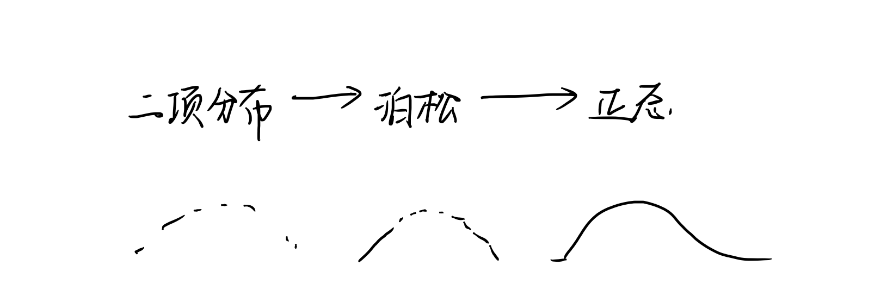

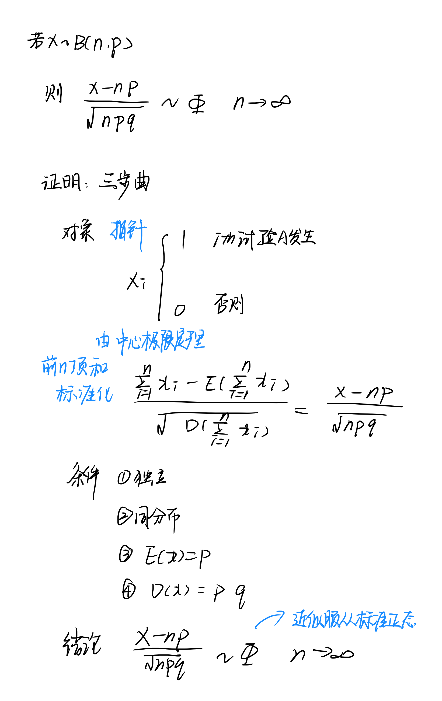

### 例1：老年人保费

某保险公司的老年人寿保险有1万人参加,每人每年交200元. 若老人在该年内死亡,公司付给家属1万元. 设老年人死亡率为0.017,试求保险公司在一年内的这项保险中亏本的概率.

$$
保险公司亏本的概率\\\\\begin{array}{l}\\P\{10000 X>10000 \times 200\}=P\{X>200\} \\\\=P\left\{\frac{X-n p}{\sqrt{n p(1-p)}}>\frac{200-n p}{\sqrt{n p(1-p)}}\right\} \\\\=P\left\{\frac{X-n p}{\sqrt{n p(1-p)}}>2.321\right\} \\\\\approx 1-\Phi(2.321) \approx 0.01 .\\\end{array}
$$

> ✒️就是求每年死亡超过200人的概率
>
> 解决问题的关键在于两边标准化

-   原笔记

    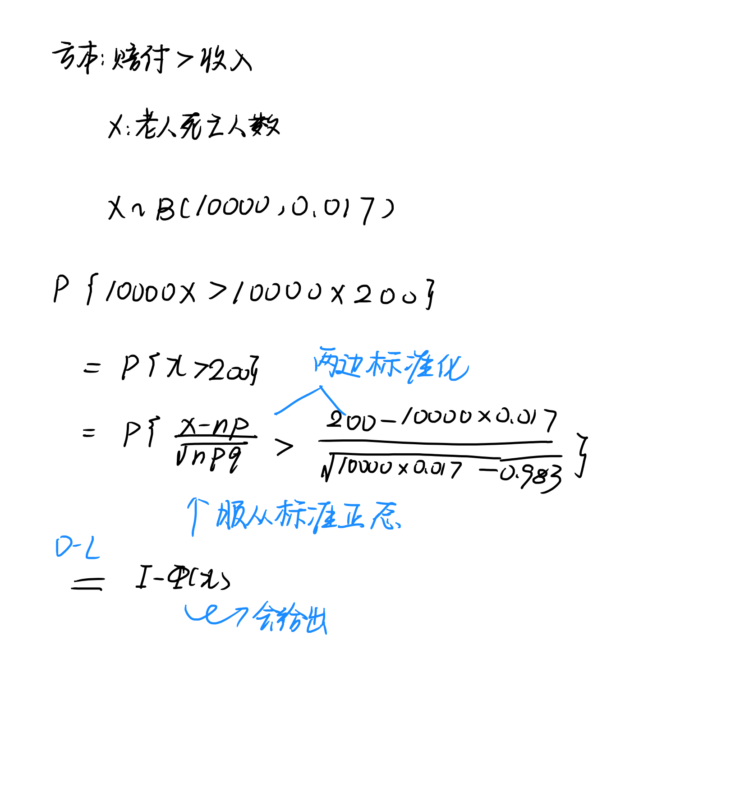

### 例2

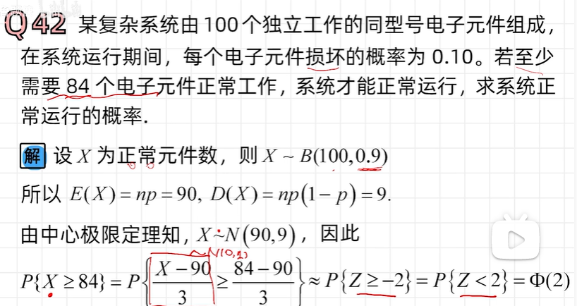

## 李雅普诺夫定理

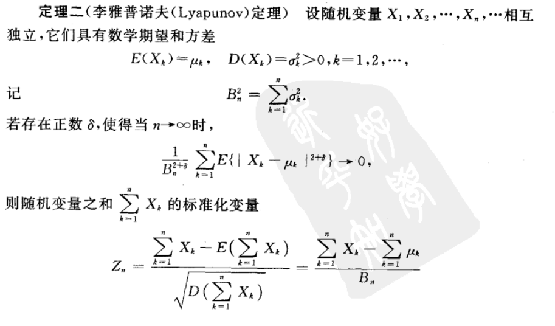

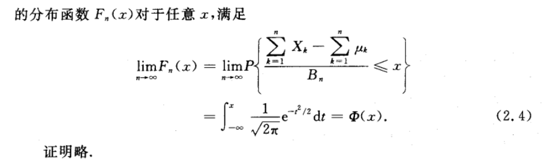

## 例
