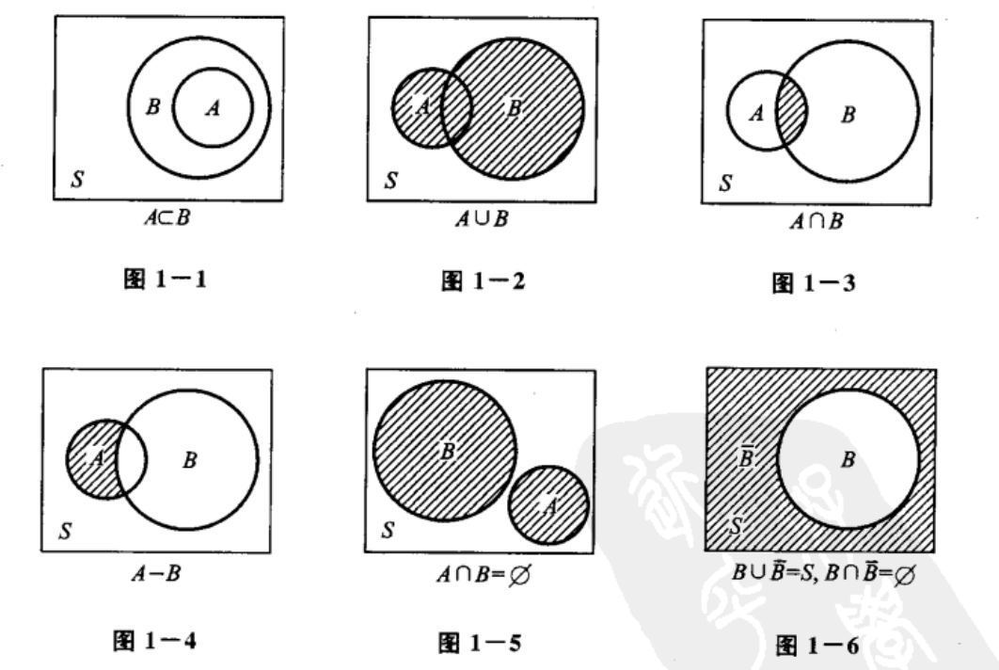
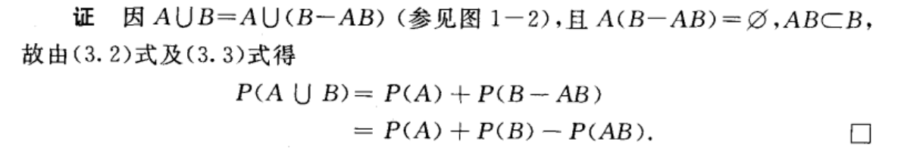
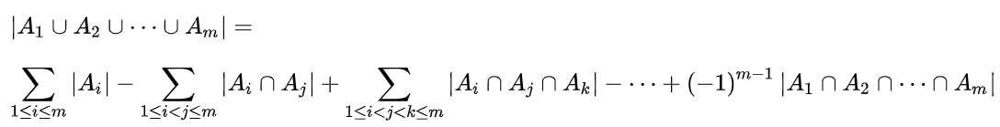
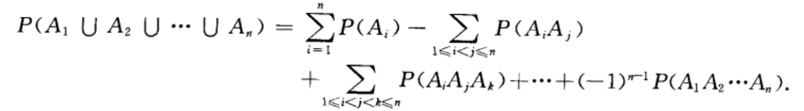
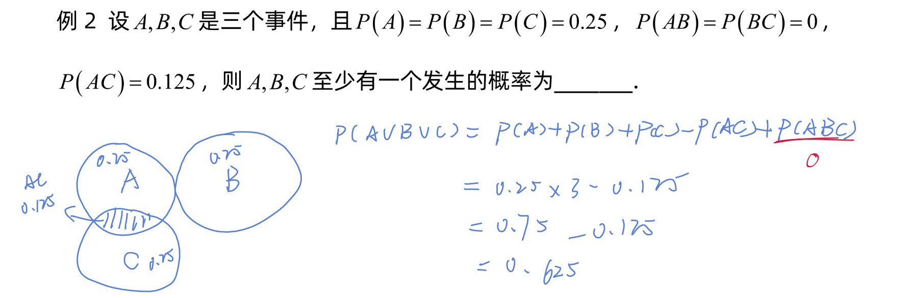

# 事件关系与事件运算

## 目录

-   [关系](#关系)
    -   [1.包含](#1包含)
    -   [2.和事件](#2和事件)
    -   [3.积事件](#3积事件)
    -   [4.差事件](#4差事件)
    -   [5.互斥事件](#5互斥事件)
    -   [6.逆事件（对立事件）](#6逆事件对立事件)
-   [性质](#性质)
    -   [有限可加性](#有限可加性)
    -   [减法公式](#减法公式)
    -   [加法公式](#加法公式)
        -   [推广](#推广)

## 关系

> ✒️概率论借用了集合论的知识来表达事件中的关系
>
> 最好考虑韦恩图来考虑问题

### 1.包含

$$
A\sub B
$$

特别的

如果$A\sub B$且$ B\sub A  $，那么$A=B$

### 2.和事件

$当且仅 当 A, B 中至少有一个发生时, 事件 A \cup B 发生.$

### 3.积事件

$当且仅 当A, B 同时发生时,事件 A \cap B 发生. A \cap B 也记作 A B.$

### 4.差事件

$当且仅当A 发生、 B 不发生时事件 A-B 发生.$

$P(A \bar{B})=P(A-B)$

### 5.互斥事件

$A \cap B=\varnothing$

### 6.逆事件（对立事件）

$A \cup B=S 且 A \cap B=\varnothing ，$

$那么，这个A 的对立事件B被记为\ \ \ \  \bar{A}=S-A.$

> ✒️\*\*`逆事件`**看起来像**`互斥事件`\*\*的加强

## 性质

### 有限可加性

$若 A_{1}, A_{2}, \cdots, A_{n} 是两两互不相容的事件,\\ 则有 P\left(A_{1} \cup A_{2} \cup \cdots \cup A_{n}\right)=P\left(A_{1}\right)+P\left(A_{2}\right)+\cdots+P\left(A_{n}\right).$

### 减法公式

$设 A, B 是两个事件, 若 A \subset B, 则有$

$$
P(B-A)=P(B)-P(A)\\P(B) \geqslant P(A)
$$

### 加法公式

对于任意两事件 A, B 有

$$
P(A \cup B)=P(A)+P(B)-P(A B)
$$

> ✒️加法公式由减法公式推出

#### 推广

可以根据**容斥原理**进一步推广这个式子

> 在[计数](https://baike.baidu.com/item/计数/9276342?fromModule=lemma_inlink "计数")时，必须注意没有重复，没有遗漏。为了使[重叠](https://baike.baidu.com/item/重叠/9009438?fromModule=lemma_inlink "重叠")部分不被重复计算，人们研究出一种新的计数方法，这种方法的基本思想是：先不考虑重叠的情况，把包含于某内容中的所有对象的数目先计算出来，然后再把计数时重复计算的数目[排斥](https://baike.baidu.com/item/排斥/10717656?fromModule=lemma_inlink "排斥")出去，使得计算的结果既无遗漏又无重复，这种计数的方法称为容斥原理。&#x20;
>
> <https://baike.baidu.com/item/容斥原理/10146840>
>
> 

***

***

