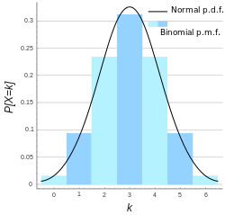
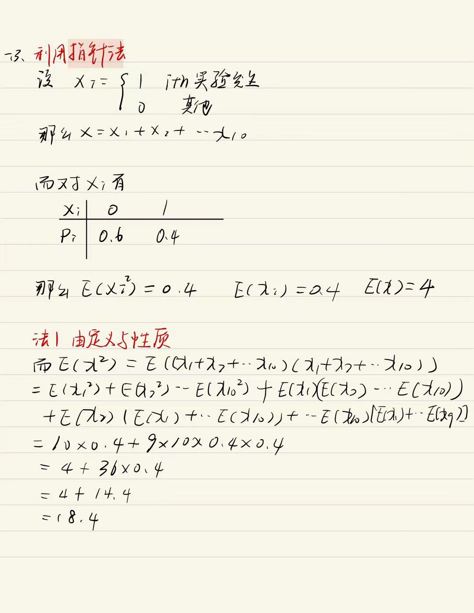

# 二项分布Binomial distribution

## 目录

-   [二项分布X \sim B(n,p)](#二项分布X-sim-Bnp)
    -   [概率密度？（存疑）](#概率密度存疑)
    -   [分布律](#分布律)
    -   [数学期望E\[X\]=n p](#数学期望EXn-p)
    -   [方差\operatorname{D}\[X\]=n p q](#方差operatornameDXn-p-q)
        -   [痴呆证明](#痴呆证明)
        -   [聪明版](#聪明版)
        -   [EX ](#EX-)

# 二项分布$X \sim B(n,p)$

> 令一组伯努利试验的成功概率为p，失败概率为q=1−p，**则n次伯努利试验中会有多少次成功？**

> $定义随机变量X为 n 次试验中成功的次数, 则X的取值范围为 \{0,1,2 \ldots n\} 。对于 k=0,1,2 \ldots, n, 因为存在 C_{n}^{k} 中方法来选出 n 次试验中哪 k 次成功, 而每个发生的概率是 p^{k} q^{n-k}, 所以有\\\operatorname{Pr}\{X=k\}=C_{n}^{k} p^{k} q^{n-k}\\满足如上概率分布称为二项分布。名称 “二项”的来源是因为上式的等号右侧是 (p+q)^{n} 的二项 展开式中的第 k 项。$

$当 k 增加时, 概 率 P\{X=k\} 先是随之增加, 直至达到最 大值 , 随 后单调减少.\\ 我们指出, 一般, 对于固定 的 n 及 p, 二项分布 b(n, p) 都具有这一 性质.$

## 概率密度？（存疑）

$$
f(x)=\frac{n !}{x !(n-x) !} p^{x}(1-p)^{n-x}
$$

## 分布律

$$
\mathrm{P}(\mathrm{X}=\mathrm{i})=c_{n}^{i} p^{i}(1-p)^{n-i}
$$

## 数学期望$E[X]=n p$

$   \begin{array}{l}X_{i}=\left\{\begin{array}{ll}1 & i \text { th实验发生 } \\ 0 & \text { 其他 }\end{array}\right. \\ \text { 那么 } X=X_{1}+X_{2} \cdots X_{n} \\ E\left(X_{i}\right)=1 \cdot p+0 \cdot q=p \\ \therefore E(X)=E\left(X_{1}+X_{2} \cdots X_{n}\right) \\ =E\left(X_{1}\right)+E\left(X{2}\right)+\cdots E\left(X_{n}\right) \\ =\underbrace{p+p \cdots p}_{n个} \\ =n p \\\end{array} $

## [方差](../方差/方差.md "方差")$\operatorname{D}[X]=n p q$

### 痴呆证明

$\begin{aligned} D\left(X_{i}\right) & =E\left\{\left[X_{i}-E\left(X_{i}\right)\right]^{2}\right\} \\ & =E\left[\left(X_{i}-p\right)^{2}\right] \\ & =p(1-p)^{2}+q(-p)^{2} \\ & =p q^{2}+q p^{2} \\ & =p q(p+q) \\ & =p q\end{aligned}$

### 聪明版

$\begin{aligned} D\left(X_{i}\right) & =E\left(X_{i}^{2}\right)-\left(E\left(X_{i}\right)\right)^{2} \\ & =p-p^{2} \\ & =p(1-p) \\ & =p q\end{aligned}$

由方差的性质有

$$
D(x)=\sum_{i=1}^{n} D\left(x_{i}\right)=E\left(\lambda^{2}\right)-(E(\lambda))^{2}
$$

所以

$D(X)=n D(X_i)=n p q$

### EX&#x20;

> 设X表示10次独立重复射击命中目标的次数，每次射击命中率为0.4，则$E(X^2)=$

$\begin{array}{l} X \sim B(10,0.4) \\ E\left(X^{2}\right)=D(X)+(E(X))^{2} \\ =n p q+(n p)^{2} \\ =10 \times 0.4 \times 0.6+(10 \times 0.4)^{2} \\ =2.4+16 \\ =18.4\end{array}$

-   具体解法

    

    
