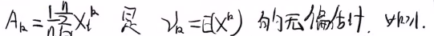
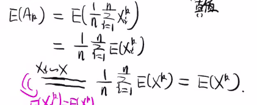
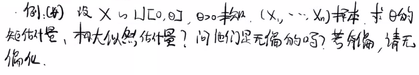
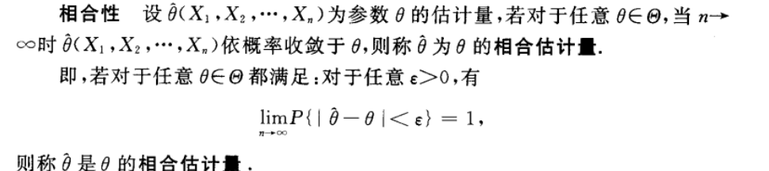
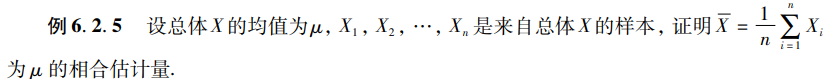
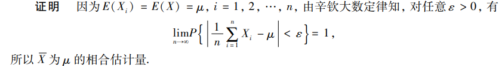

# 估计量的评选标准

## 目录

-   [1.无偏性](#1无偏性)
    -   [例](#例)
        -   [例1.1
            A\_k是\nu\_k的无偏估计量](#例11A_k是nu_k的无偏估计量)
        -   [例1.2B *{2}=\frac{1}{n }\sum*{i=1}^{n}\left(X \_{i}-\bar{X}\right)^{2} 是 D(X)=\sigma^{2} 的有偏估计](#例12B_2frac1n-sum_i1nleftX_i-barXright2-是-DXsigma2-的有偏估计)
            -   [样本方差S^2是\sigma^2的无偏估计](#样本方差S2是sigma2的无偏估计)
        -   [例1.3](#例13)
            -   [矩估计：无偏](#矩估计无偏)
            -   [极大似然估计：有偏](#极大似然估计有偏)
-   [2.有效性](#2有效性)
    -   [续例1.3](#续例13)
        -   [矩估计](#矩估计)
        -   [极大似然估计](#极大似然估计)
        -   [比较](#比较)
-   [3.相合性](#3相合性)
    -   [例](#例)
        -   [例1辛钦的利用](#例1辛钦的利用)
        -   [例2B\_2、S^2都是\sigma^2的相合估计量](#例2B_2S2都是sigma2的相合估计量)

<https://www.bilibili.com/video/BV17341197vN/?t=1506>

估计量好坏的评判准则

# 1.无偏性

若估计量 $ \hat{\theta}=\hat{\theta}\left(X_{1}, X_{2}, \cdots, X_{n}\right)  $的数学期望 $ E(\hat{\theta})  $存在, 且对于任意 $ \theta \in \Theta  $有

$$
\\\\E(\hat{\theta})=\theta
$$

则称 $ \hat{\theta}  $是$ \theta  $的无偏估计量.

> ✒️**也就是估计值的期望和真实值一样**

## 例

### 例1.1\$

A\_k是\nu\_k的无偏估计量 \$

特别的

$$
k=1 \Rightarrow E(\bar{X})=E(X)=\mu
$$

### 例1.2$B_{2}=\frac{1}{n }\sum_{i=1}^{n}\left(X_{i}-\bar{X}\right)^{2} 是 D(X)=\sigma^{2} 的有偏估计$

**由**$B_{2}=\overline{X^{2}}-(\bar{X})^{2}$**代入可得**

$$
\begin{aligned} E\left(B_{2}\right) & =E\left(\overline{X^{2}}-(\bar{X})^{2}\right) \\ & =E(\overline{X^{2}})-E((\bar{X})^{2}) \\ & \overset{A_2=\overline{X^2}}=E\left(X^{2}\right)-\left[D(\bar{X})+(E(\bar{X}))^{2}\right]\end{aligned}
$$

$ D(\bar{X})=\frac{D(X)}{n}=\frac{\sigma^{2}}{n}
  $**代入可得**

$$
\begin{array}{l}=E\left(X^{2}\right)-\left[\frac{D(X)}{n}+(E(X))^{2}\right] \\ =E\left(X^{2}\right)-(E(X))^{2}-\frac{D(X)}{n} \\ =D(X)-\frac{D(X)}{n}\\=\frac{n-1}{n} D(X)\end{array}
$$

所以可以得出结论$ \Rightarrow E\left(B_{2}\right)=\frac{n-1}{n} D(X) \neq D(X)  $，所以有偏

> ✒️但是我们可以通过无偏化，利用修正，令$S^{2}=\frac{n}{n-1} B_{2}=\frac{n}{n-1} \cdot \frac{1}{n} \sum_{i=1}^{n}\left(X_{i}-\bar{X}\right)^{2}=\frac{1}{n-1} \sum_{i=1}^{n}\left(X_{i}-\bar{X}\right)^{2}$

#### 样本方差$S^2$是$\sigma^2$的无偏估计

证明

$$
\begin{aligned} E\left(S^{2}\right) & =E\left[\frac{1}{n-1}\left(\sum_{i=1}^{n} X_{i}^{2}-n \bar{X}^{2}\right)\right]=\frac{1}{n-1}\left[\sum_{i=1}^{n} E\left(X_{i}^{2}\right)-n E\left(\bar{X}^{2}\right)\right] \\ & =\frac{1}{n-1}\left[\sum_{i=1}^{n}\left(\sigma^{2}+\mu^{2}\right)-n\left(\sigma^{2} / n+\mu^{2}\right)\right]=\sigma^{2},\end{aligned}
$$

### [例1.3](https://www.bilibili.com/video/BV17341197vN/?t=2595 "例1.3")

> ✒️在[点估计](../点估计/点估计.md "点估计")中，我们计算出了很多矩估计和极大似然估计答案不一样的矩，比如[均匀分布Uniform distribution](<../均匀分布Uniform distribution/均匀分布Uniform distribution.md> "均匀分布Uniform distribution")，那么哪一种方法得到的结果更好呢？我们用无偏性来进行一下比较。

#### 矩估计：无偏

$$
\hat{\theta}=2 \bar{X}
$$

显然这是无偏的。

#### 极大似然估计：有偏

**易知**

$$
\hat \theta=M=max(X_1,X_2\dots X_n)
$$

**根据无偏性的定义，我们需要求**

$$
\begin{aligned}E(\hat\theta)&=E(M)
\\&\overset{def}=\int_{-\infty}^\infty mf_M(m)dm

\end{aligned}
$$

**那么这个**$f_M(m)$**究竟是什么呢？**

> ✒️我们先求$F_M(m)$，然后迂回的求出$f_M(m)$

我们在[分布函数、概率密度、分布律](../分布函数、概率密度、分布律/分布函数、概率密度、分布律.md "分布函数、概率密度、分布律")中已经证明了

$$
F_{\max }(z)=F_{X}(z) F_{Y}(z)
$$

由于独立同分布，这个结论可以加强为

$$
\stackrel{X _{i}\sim X}{\Rightarrow} F_{M}(m)=\left(F_{X}(m)\right)^{n}
$$

而

$$
F_{X}(x)=\left\{\begin{array}{ll}0 & x<0 \\ \int_{0}^{x} \frac{1}{\theta} d t=\frac{x}{\theta} & 0 \leq x<\theta \\ 1 & x \geqslant \theta\end{array}\right.
$$

我们可以得到

$$
 F_{M}{(m)}=\left\{\begin{array}{cc}0 & m<0 \\ \left(\frac{m}{\theta}\right)^{n} & 0 \leq m<\theta \\ 1 & m \geqslant \theta\end{array}\right.
$$

所以

$$
f_{M}(m)=F_{M}^{\prime}=\left\{\begin{array}{cc}\frac{1}{\theta^{n}} \cdot n m^{n-1} & 0 \leq m<0 \\ 0 & \text { 其他 }\end{array}\right.
$$

**代回**$E(\hat\theta)$**中**

$$
\begin{aligned} E(M) & =\int_{-\infty}^{+\infty} m f_{M}(m) d m \\ & =\int_{0}^{\theta} \frac{n m \cdot m^{n-1}}{\theta^{n}} d m \\ & =\frac{n}{\theta^{n}} \int_{0}^{\theta} m^{n} d m \\ & =\left.\frac{n}{\theta^{n}} \cdot \frac{m^{n+1}}{n+1}\right|_{0} ^{\theta}\\&=\frac{n}{n+1} \cdot \frac{1}{\theta^{n}}\left[\theta^{n+1}-0\right] \\ & =\frac{n}{n+1} \theta\end{aligned}
$$

**无偏化**

$$
\frac{n+1}{n} M=\frac{n+1}{n} \max\{ X_1, \cdots, X_{n}\}
$$

> ✒️所以从`无偏性`出发，矩估计得到的[均匀分布Uniform distribution](<../均匀分布Uniform distribution/均匀分布Uniform distribution.md> "均匀分布Uniform distribution")参数更合理。

# 2.有效性

设$\hat{\theta}_{1}=\hat{\theta}_{1}\left(X_{1}, X_{2}, \cdots, X_{n}\right) 与 \hat{\theta}_{2}=\hat{\theta}_{2}\left(X_{1}, X_{2}, \cdots, X_{n}\right)$都是 $\theta$ 的**无偏估计量**, 若对于任意 $\theta \in \Theta$, 有

$$
\\\\D\left(\hat{\theta}_{1}\right) \leqslant D\left(\hat{\theta}_{2}\right)\\\\
$$

$且至少对于某一个 \theta \in \Theta 上式中的不等号成立, 则称 \hat{\theta}_{1} 较 \hat{\theta}_{2} 有效.$

> ✒️本质上就是让我们再求两个方差

### 续例1.3

> ✒️我们在无偏化极大似然估计结果的基础下，我们继续比较矩估计$\hat\theta_1$和极大似然估计$\frac{n+1}{n}\hat \theta_2$哪个更好

#### 矩估计

$D(\hat\theta_1)$可以直接求出来：

$$
D\left(\hat{\theta}_{1}\right)=D(2 \bar{X})=4 D(\bar{X})=\frac{4 D(X)}{n}=\frac{4}{n} \cdot \frac{\theta^{2}}{12}=\frac{\theta^{2}}{3 n}.
$$

#### 极大似然估计

$$
D\left(\frac{n+1}{n} \hat{\theta}_{2}\right)=D\left(\frac{n+1}{n} M\right)=\frac{(n+1)^{2}}{n^{2}} D(M).
$$

**求**$D(M)$

由于我们已经求出了

$$
f_{M}(m)=F_{M}^{\prime}=\left\{\begin{array}{cc}\frac{1}{\theta^{n}} \cdot n m^{n-1} & 0 \leq m<0 \\ 0 & \text { 其他 }\end{array}\right.
$$

和

$$
\begin{aligned} E(M) & =\int_{-\infty}^{+\infty} m f_{M}(m) d m \\ & =\int_{0}^{\theta} \frac{n m \cdot m^{n-1}}{\theta^{n}} d m \\ & =\frac{n}{\theta^{n}} \int_{0}^{\theta} m^{n} d m \\ & =\left.\frac{n}{\theta^{n}} \cdot \frac{m^{n+1}}{n+1}\right|_{0} ^{\theta}\\&=\frac{n}{n+1} \cdot \frac{1}{\theta^{n}}\left[\theta^{n+1}-0\right] \\ & =\frac{n}{n+1} \theta\end{aligned}
$$

只需求

$$
\begin{aligned}E\left(M^{2}\right)&{=} \int_{-\infty}^{+\infty} m^{2} f_{M}(m) d m \\ &=\int_{0}^{\theta} m^{2} \frac{1}{\theta^{n}} n m^{n-1} d m 
\\ &=\frac{n}{\theta^{n}} \int_{0}^{\theta} m^{n+1} d m\\&=\left.\frac{n}{\theta^{n}} \cdot \frac{1}{n+2} m^{n+2}\right|_{0} ^{\theta} 
\\ &=\frac{n}{(n+2) \theta^{n}}\left[\theta^{n+2}-0\right]\\&=\frac{n}{n+2} \theta^{2} \\\end{aligned}
$$

就有

$$
\begin{aligned} D(M) & =\frac{n}{n+2} \theta^{2}-\left(\frac{n}{n+1}\right)^{2} \theta^{2} \\ & =\left(\frac{n}{n+2}-\frac{n^{2}}{(n+1)^{2}}\right) \theta^{2}=\frac{n(n+1)^{2}-n^{2}(n+2)}{(n+2)(n+1)^{2}} \theta^{2} \\ & =\frac{n^{3}+2 n^{2}+n-n^{3}-2 n^{2}}{(n+2)(n+1)^{2}} \theta^{2}=\frac{n}{(n+2)(n+1)^{2}} \theta^{2}\end{aligned}
$$

**代回**$D\left(\frac{n+1}{n} \hat{\theta}_{2}\right)$有

$$
D\left(\frac{n+1}{n} \hat\theta_{2}\right)=D\left(\frac{n+1}{n} M \right)=\frac{(n+1)^{2}}{n^{2}} \frac{n}{(n+2)(n+1)^{2}} \theta^{2}=\frac{\theta^{2}}{n(n+2)}
$$

#### 比较

$$
D\left(\hat{\theta}_{1}\right)=D(2 \bar{X})=4 D(\bar{X})=\frac{4 D(X)}{n}=\frac{4}{n} \cdot \frac{\theta^{2}}{12}=\frac{\theta^{2}}{3 n}.
$$

$$
D\left(\frac{n+1}{n} \hat\theta_{2}\right)=D\left(\frac{n+1}{n} M \right)=\frac{(n+1)^{2}}{n^{2}} \frac{n}{(n+2)(n+1)^{2}} \theta^{2}=\frac{\theta^{2}}{n(n+2)}
$$

显然，当$n>1$时，有$n+2>3$

所以有

$$
\frac{\theta^{2}}{n(n+2)} \leqslant \frac{\theta^{2}}{3 n}
$$

> ✒️结论就是：
>
> 虽然均匀分布的极大似然估计是有偏估计，但是对其无偏化后，比矩估计更有效

# 3.相合性

$$
\hat{\theta} \stackrel{P}{\rightarrow} \theta \Rightarrow E(\hat{\theta}) \rightarrow \theta, D(\hat{\theta}) \rightarrow 0
$$

> ✒️这是最重要，但是我们最不care

### 例

#### 例1辛钦的利用

#### 例2$B_2、S^2都是\sigma^2的相合估计量$

> ✒️解题逻辑就是
>
> $$
> B_2=\overline{X^2}-(\bar X)^2\overset{P}\rightarrow E(X^2)-(E(X))^2=D(X)=\sigma^2
> $$

根据`辛钦大数定理`，有

$$
A_{k} \stackrel{P}{\rightarrow} E\left(X ^{k}\right)=\nu_{k}
$$

那么不难推出

$$
A_{1}=\bar{X} \stackrel{P}{\longrightarrow} E(X) \\ A_{2}=\overline{X^{2}} \stackrel{P}{\longrightarrow} E(X^{2})
$$

构造连续函数

$$
g(x,y)=x-y^2
$$

根据[大数定理](../大数定理/大数定理.md "大数定理")

对于$X_{n} \rightarrow a \quad Y_{n} \rightarrow b$，如果二元函数$z=g(x,y)$在$(a,b)$处连续，则

$$
Z_{n}=g\left(X_{n}, Y_{n}\right) \stackrel{P}{\longrightarrow} z=g(a, b)
$$

$$
g\left(\overline{X^{2}}, \bar{X}\right)=\overline{X^{2}}-(\bar{X})^{2}=B_{2}\\\stackrel{P}{\longrightarrow}\\g\left(E\left(X^{2}\right), E(X)\right)=E\left(X^{2}\right)-[E(X )]^{2}=D(X)
$$

那么有

$$
B_{2} \stackrel{P}{\rightarrow} D(X)
$$

又因为

$$
\left.\begin{array}{c}\frac{n}{n-1} \rightarrow 1, n \rightarrow \infty \\ B_{2} \stackrel{P}{\rightarrow}D(X)\end{array}\right\} \Rightarrow S^{2} \stackrel{P}{\rightarrow}1\cdot D(X)=D(X) 
$$

所以

$$
S^{2}=\frac{n}{n-1} B_{2} \stackrel{P}{\longrightarrow} D(X)
$$
