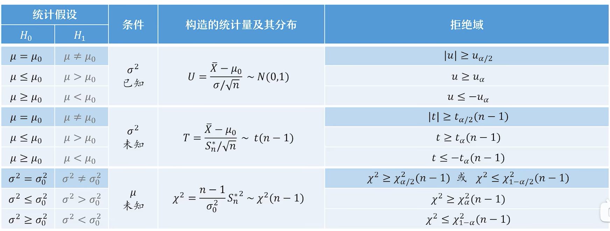
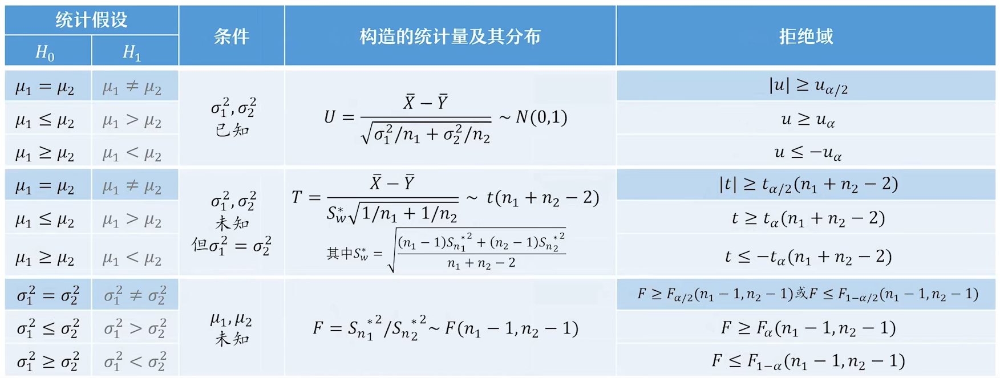
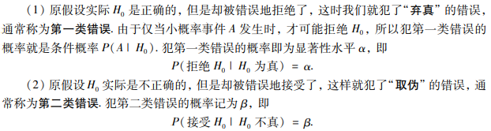
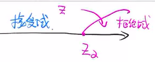
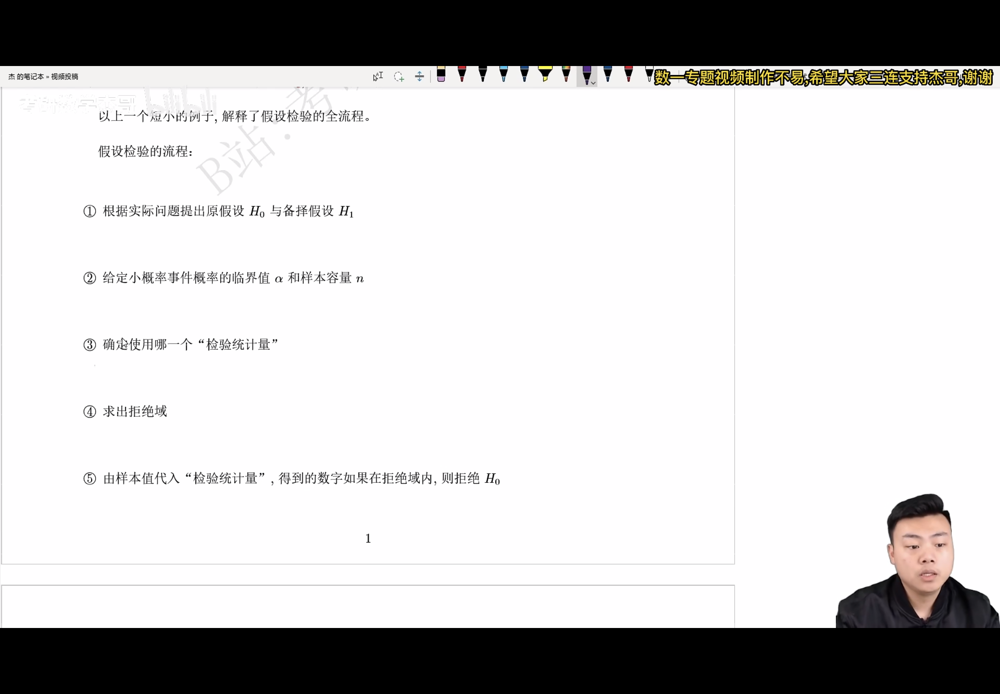
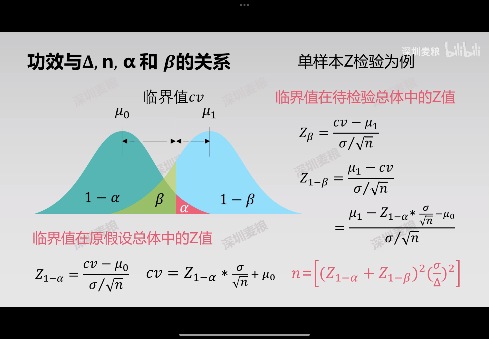

# 假设检验

## 目录

-   [假设检验的思想（哲学基础）：证伪思想](#假设检验的思想哲学基础证伪思想)
-   [步骤](#步骤)
    -   [做原假设/备择假设](#做原假设备择假设)
    -   [差异显著（小概率时间发生）](#差异显著小概率时间发生)
    -   [证伪](#证伪)
-   [检验统计量](#检验统计量)
-   [概念](#概念)
    -   [假设检验可能犯的两类错误](#假设检验可能犯的两类错误)
    -   [显著性检验/检验功效](#显著性检验检验功效)
    -   [双边检验/单边检验（主要看H\_1)](#双边检验单边检验主要看H_1)
    -   [双边](#双边)
    -   [单边](#单边)
        -   [左边：](#左边)
        -   [右边：](#右边)

### 假设检验的思想（哲学基础）：证伪思想

一个伪命题是没有办法被直接证明的。

而当我们没法证明一个真命题的时候，如果不能证伪，那么我们只能承认这个命题是真的。

> ✒️假设检验就是概率论中的反证法
>
> 反证法需要矛盾基础和矛盾对象：小概率原理
>
> 小概率事件在一次试验中是几乎不会发生的

## 步骤

### 做原假设/备择假设

### 差异显著（小概率时间发生）

### 证伪

## 检验统计量

## 概念

### 假设检验可能犯的两类错误

### 显著性检验/检验功效

### 双边检验/单边检验（主要看$H_1$)

> ✒️我们是针对$H_1$，来检验$H_0$

### 双边

$H_{0}: \mu=\mu_{0}, \quad  H_{1}: \mu≠\mu_{0} \quad$$\begin{array}{l}u>u_{0} \\ u<u_{0}\end{array}$

### 单边

#### 左边：

一型 $H_{0}: \mu=\mu_{0}, \quad  H_{1}: \mu<\mu_{0} \quad$

二型 $H_{0}: \mu≥\mu_{0}, \quad  H_{1}: \mu<\mu_{0} \quad$

#### 右边：

一型 $H_{0}: \mu=\mu_{0}, \quad  H_{1}: \mu>\mu_{0} \quad$

二型 $H_{0}: \mu≤\mu_{0}, \quad  H_{1}: \mu>\mu_{0} \quad$

