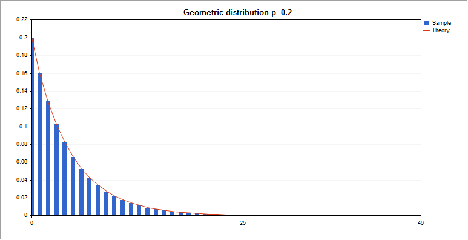
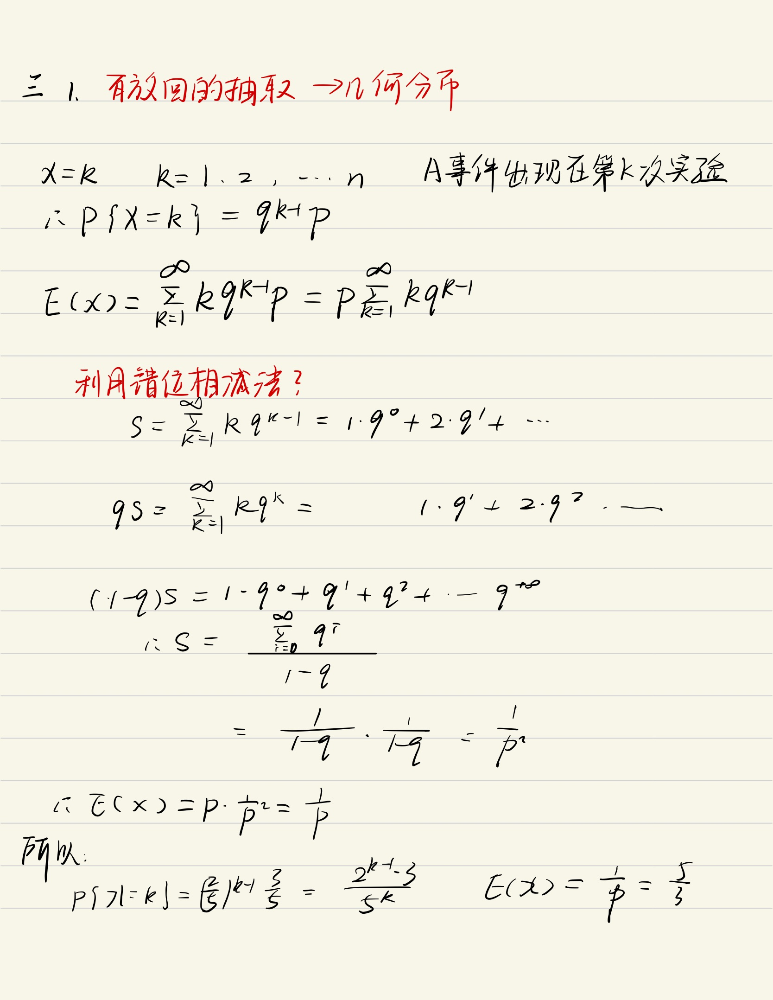
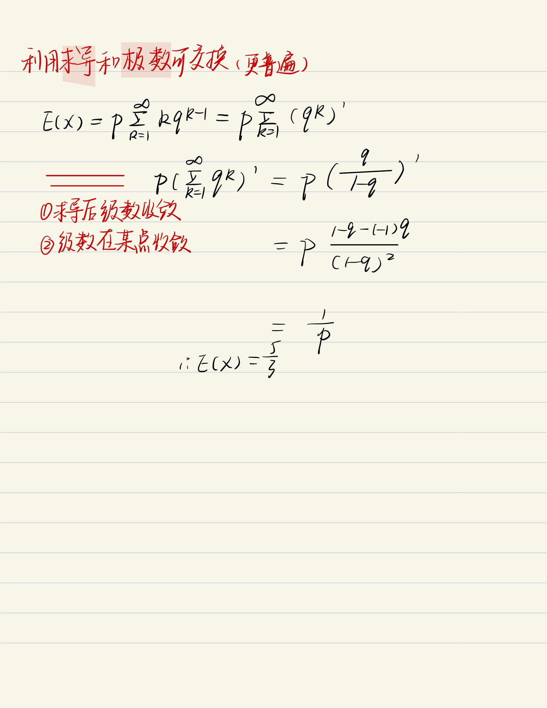

# 几何分布

几何分布$
 $
==

> 假定我们有一系列伯努利试验，其中每一个的成功概率为p，失败概率为q=1−p。**在获得一次成功前要进行多次试验？**

> $定义随机变量X为获得一次成功所需的试验次数。X的取值范围为 \{1,2,3 \ldots\}, 且对于 k \geq 1, 因为一次成功前有 k-1 次失败, 所以有\\\\\operatorname{Pr}\{X=k\}=q^{k-1} p\\\\这就是一种几何分布。$

## 数学期望$E[X]=1 / p$

### EX

一批产品中包括6件正品，4件次品，现有放回的抽取，每次取一件，设X表示直至抽到正品为止所抽取的次数，求随机变量X的分布律和数学期望E（X)

## 方差$\operatorname{D}[X]=q / p^{2}$
