# 分布函数、概率密度、分布律

## 目录

-   [分布函数【离散或者连续】](#分布函数离散或者连续)
    -   [【n维】联合分布函数](#n维联合分布函数)
    -   [【二维】](#二维)
    -   [性质](#性质)
        -   [1.
            0≤F(x)≤1 \quad x\in(-\infty,+\infty)](#10Fx1-quad-xin-inftyinfty)
        -   [2.
            F(x\_1)≤F(x\_2)\quad (x\_1＜x\_2) ](#2Fx_1Fx_2quad-x_1x_2-)
        -   [3.F(-\infty)=lim *{x\rightarrow-\infty}F(x)=0
            \quad F(\infty)=lim*{x\rightarrow\infty}F(x)=1](#3F-inftylim_xrightarrow-inftyFx0-quad-Finftylim_xrightarrowinftyFx1)
        -   [4.处处右连续lim \_{x\rightarrow x\_0^+}F(x)=F(x\_0)\quad (-\infty\<x\_0<\infty)](#4处处右连续lim_xrightarrow-x_0FxFx_0quad--inftyx_0infty--)
        -   [考点：函数分布](#考点函数分布)
-   [概率密度【连续】](#概率密度连续)
    -   [【一维】](#一维)
        -   [性质](#性质)
        -   [考点：函数分布](#考点函数分布)
            -   [公式法](#公式法)
            -   [图像法](#图像法)
    -   [【二维】](#二维)
        -   [性质：](#性质)
        -   [联合概率密度](#联合概率密度)
        -   [边缘概率密度](#边缘概率密度)
        -   [条件概率密度](#条件概率密度)
        -   [独立](#独立)
            -   [二维正态随机变量独立：\rho=0](#二维正态随机变量独立rho0)
            -   [n维推广：](#n维推广)
        -   [考点：判断独立](#考点判断独立)
        -   [考点：函数分布](#考点函数分布)
        -   [公式法](#公式法)
            -   [1.Z=X+Y](#1ZXY)
            -   [有限个相互独立的正态随机变量的线性组合仍然服从正态分布](#有限个相互独立的正态随机变量的线性组合仍然服从正态分布)
            -   [2.Z=\frac{Y}{X}、Z=XY](#2ZfracYXZXY)
            -   [3.M=max\\{X,Y\\},N=min\\{X,Y\\}](#3MmaxXYNminXY)
        -   [画图法](#画图法)
-   [分布律【离散】](#分布律离散)
    -   [【一维】](#一维)
    -   [考点：函数分布](#考点函数分布)
        -   [三横线表法](#三横线表法)
    -   [【二维】](#二维)
        -   [联合分布律](#联合分布律)
        -   [边缘分布律](#边缘分布律)
        -   [条件分布律](#条件分布律)
        -   [独立](#独立)
        -   [考点：函数分布](#考点函数分布)
            -   [表格上计算法](#表格上计算法)

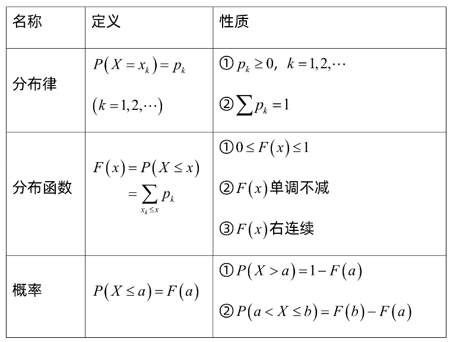

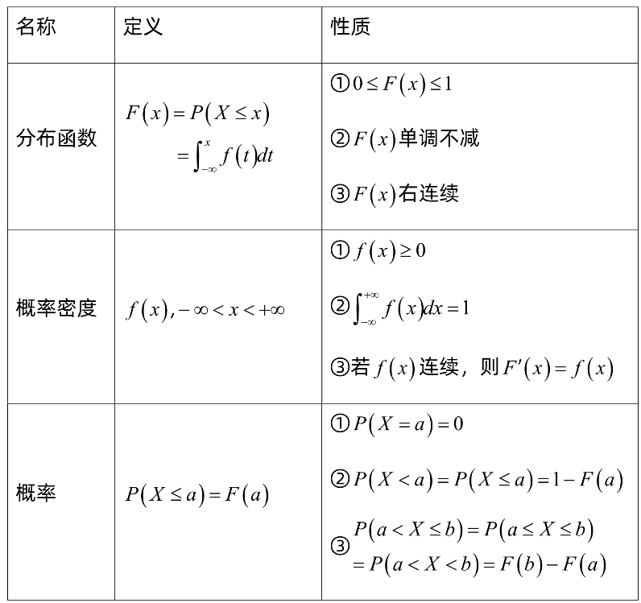

# 分布函数【离散或者连续】

> ✒️`分布函数`成功联系了高等数学与概率论
>
> 

### 【n维】联合分布函数

> $对于任意 n 个实数 x_{1}, x_{2}, \cdots, x_{n}, n 元函数$
>
> $$
> F\left(x_{1}, x_{2}, \cdots, x_{n}\right)=P\left\{X_{1} \leqslant x_{1}, X_{2} \leqslant x_{2}, \cdots, X_{n} \leqslant x_{n}\right\}
> $$
>
> $ 称为 n 维随机变量 \left(X_{1}, X_{2}, \cdots, X_{n}\right) 的分布函数或随机变量 X_{1}, X_{2}, \cdots, X_{n} 的联 合分布函数.  $

### 【二维】

> $定义 设 (X, Y) 是二维随机变量, 对于任意实数 x, y, 二元函数:\\\\F(x, y)=P\{(X \leqslant x) \cap(Y \leqslant y)\} \stackrel{\text { 记成 }}{=} P\{X \leqslant x, Y \leqslant y\}\\\\称为二维随机变量 (X, Y) 的分布函数, 或称为随机变量 X 和 Y 的联合分布 函数.$

> ✒️离散的概率密度不能由分布函数直接求导得

## 性质

#### 1.$0≤F(x)≤1 \quad x\in(-\infty,+\infty)$

#### 2.$F(x\_1)≤F(x\_2)\quad (x\_1＜x\_2)$

#### 3.$F(-\infty)=lim \_{x\rightarrow-\infty}F(x)=0\quad F(\infty)=lim \_{x\rightarrow\infty}F(x)=1$

证明：

$$
\begin{aligned} P\{x \in(-\infty,+\infty)\} & =P\left\{\bigcup_{n \in z} x \in(n-1, n]\right\}\quad 拆分成不同段 \\ & =\sum_{n \in z} P\{x \in(n-1, n]\}\quad 可列可加性  \\ & =\sum_{n \in z}\{F(n)-F(n-1)\} \\ &=\sum_{n=0}^{\infty}\{F(n)-F(n-1)\}+\sum_{n=0}^{\infty}\{F(-n)-F(-n-1)\}\\& =F(0)-F(-1)+F(1)-F(0)+\cdots \lim _{n \rightarrow \infty} F(n)-\lim _{n \rightarrow \infty} F(n-1) \\ &+F(-1)-F(-2)+F(-2)-F(-3)+\cdots \lim _{n \rightarrow \infty} F(-n)-\lim _{n \rightarrow \infty} F(-n-1) \\ &=\lim _{n \rightarrow \infty} F(n)-\lim _{n \rightarrow \infty} F(-n-1) \\ &=F(\infty)-F(-\infty) \\ &=1\end{aligned}\\所以有\\0 \leqslant F(-\infty) \leqslant F(\infty) \leqslant 1 \Rightarrow\left\{\begin{array}{l}F(\infty)=1 \\ F(-\infty)=0\end{array}\right.
$$

#### 4.处处右连续$ lim_{x\rightarrow x_0^+}F(x)=F(x_0)\quad (-\infty<x_0<\infty)  $&#x20;

### 考点：函数分布

> ✒️详见`概率密度`和`分布律`

# 概率密度【连续】

## 【一维】

$如果对于随机变量 X 的分布函数 F(x), 存在非负函数 f(x), 使对于任意实数 x 有$

$$
\\\\F(x)=\int_{-\infty}^{x} f(t) \mathrm{d} t,\\\\
$$

$  则称 X 为连续型随机变量, 其中函数 f(x) 称为 X 的概率密度函数, 简称概率 密度
. $

> ✒️\*\*`连续型`****随机变量的****`分布函数`****是****`连续`\*\***函数**
>
> 改变概率密度在$ f(x)  $在个别点的函数值不影响分布函数$F(x)$的取值

### 性质

-   $f(x) \geqslant 0;$
-   $\int_{-\infty}^{\infty} f(x) \mathrm{d} x=1$
-   $对于任意实数 x_{1}, x_{2}\left(x_{1} \leqslant x_{2}\right),\\\\P\left\{x_{1}<X \leqslant x_{2}\right\}=F\left(x_{2}\right)-F\left(x_{1}\right)=\int_{x_{1}}^{x_{2}} f(x) \mathrm{d} x ;$

> ✒️显然，对于连续型变量
>
> 若$X=a$为不可能事件$\Rightarrow$$P\{X=a\}=0$
>
> $P\{X=a\}=0$$\nRightarrow$$X=a$为不可能事件
>
> 但是对于离散型变量
>
> 若$X=a$为不可能事件$\Leftrightarrow$$P\{X=a\}=0$

-   $若 f(x) 在点 x 处连续, 则有 F^{\prime}(x)=f(x).$

### 考点：函数分布

-   Y=g(X)的概率密度求解
    -   能用反函数表出X：公式法
    -   不能用反函数表出X：图像法（更泛用）

#### 公式法

**前提**

验证变换函数$g(x)$的导数$g'(x)$在`支撑`上恒大于0或恒小于0（单调递增或者单调递减）

$$
f_{Y}(y)=\left\{\begin{array}{ll}f_{X}[h(y)]\left|h^{\prime}(y)\right|, & \alpha<y<\beta, \\ 0, & \text { 其他, }\end{array}\right.
$$

$$
\alpha=\min \{g(-\infty), g(\infty)\}\\ \beta=\max \{g(-\infty), g(\infty)\}
$$

**证明**

1.利用$F(x)=F(h(y))$函数从关于x的换成关于y的

$$
\int_{-\infty}^{x} f_x(t) d t=F(x)=F(h(y))=\int_{-\infty}^{h(y)} f_
x(t) d t
$$

2.把$ F(h(y))  $求导得到$f_y$

> ✒️【预备】**变上限积分函数求导公式**
>
> $$
> \left(\int_{0}^{g(x)} f(t) \mathrm{d} t\right)^{\prime}=f(g(x)) \cdot g^{\prime}(x)
> $$

$$
f_{y}=F^{\prime}(h(y))=\left(\int_{-\infty}^{h(y)} f_{x}(t) d t\right)=f_{x}(h(y)) h^{\prime}(y)
$$

-   课本描述

    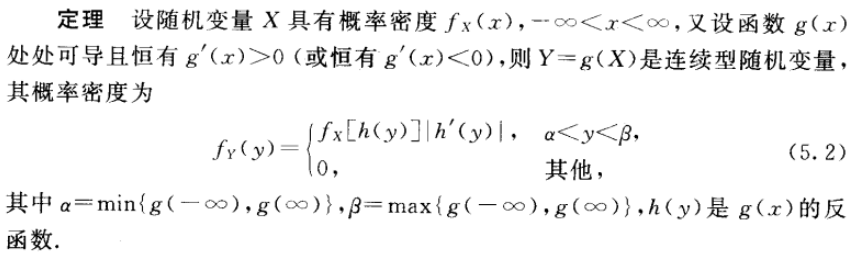

    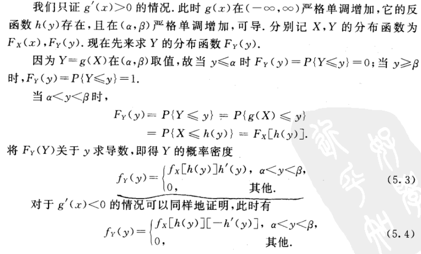

**步骤**

1.套公式

**2.换分界点**

#### 图像法

1.  求支撑
2.  写出y=g(x)
3.  根据2画图
4.  切割+写出$F_Y(y)$+求导出$f_Y(y)$

> ✒️第四步中不需要完全求出$F_Y(y)$，可以利用变上限积分直接求导简化计算

## 【二维】

### 性质：

$1^{\circ} F(x, y) 是变量 x 和 y 的不减函数, 即对于任意固定的 y, 当 x_{2}>x_{1} 时 F\left(x_{2}, y\right) \geqslant F\left(x_{1}, y\right); 对于任意固定的 x, 当 y_{2}>y_{1} 时 F\left(x, y_{2}\right) \geqslant F\left(x, y_{1}\right).$

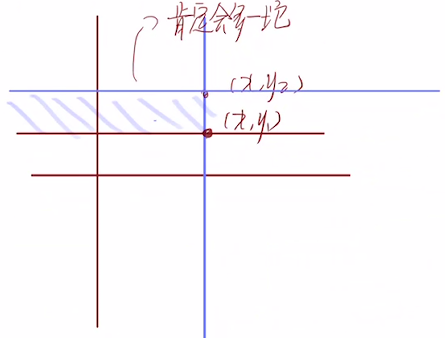

$2^{\circ} 0 \leqslant F(x, y) \leqslant 1 \text {, 且 }$

$$
\\\\对于任意固定的 y, F(-\infty, y)=0,\\对于任意固定的 x, F(x,-\infty)=0,\\F(-\infty,-\infty)=0, F(\infty, \infty)=1.
$$

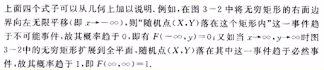

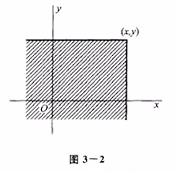

$3^{0} F(x+0, y)=F(x, y), F(x, y+0)=F(x, y), 即 F(x, y) 关于 x 右连续, 关于 y 也右连续.$

$4^{\circ} 对于任意 \left(x_{1}, y_{1}\right),\left(x_{2}, y_{2}\right), x_{1}<x_{2}, y_{1}<y_{2},下述不等式成立:$

$$
\\\\F\left(x_{2}, y_{2}\right)-F\left(x_{2}, y_{1}\right)+F\left(x_{1}, y_{1}\right)-F\left(x_{1}, y_{2}\right) \geqslant 0 \text {. }
$$

其中特别有

$$
\begin{array}{l}P\left\{x_{1}<X \leqslant x_{2}, y_{1}<Y \leqslant y_{2}\right\} \\ \quad=F\left(x_{2}, y_{2}\right)-F\left(x_{2} , y_{1}\right)+F\left(x_{1}, y_{1}\right)-F\left(x_{1}, y_{2}\right) .\end{array}
$$

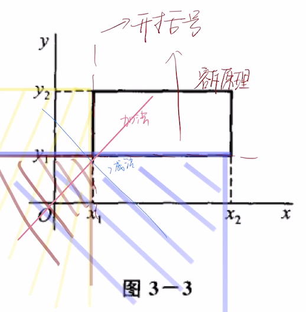

### 联合概率密度

**概率密度-分布函数**

$$
F(x, y)=\int_{-\infty}^{y} \int_{-\infty}^{x} f(u, v) \mathrm{d} u \mathrm{~d} v,
$$

> ✒️这里需要用u和v

### 边缘概率密度

对下式求导有：

$$
F_{X}(x)=F(x, \infty)=\int_{-\infty}^{x}\left[\int_{-\infty}^{\infty} f(x, y) \mathrm{d} y\right] \mathrm{d} x
$$

***

$$
f_{X}(x)=\int_{-\infty}^{\infty} f(x, y) \mathrm{d} y
$$

$$
f_{Y}(y)=\int_{-\infty}^{\infty} f(x, y) \mathrm{d} x
$$

-   例

    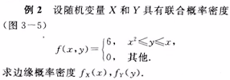

    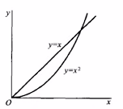

    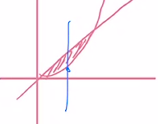
    $$
    f_{X}(x)=\int_{-\infty}^{\infty} f(x, y) \mathrm{d} y=\left\{\begin{array}{lc}\int_{x^{2}}^{x} 6 \mathrm{~d} y=6\left(x-x^{2}\right),\qquad 0 \leqslant x \leqslant 1, \\ 0, \qquad 其他. \end{array}\right.
    $$
    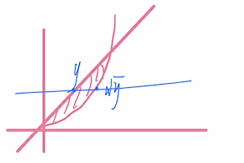
    $$
    \begin{aligned} f_{Y}(y) & =\int_{-\infty}^{\infty} f(x, y) \mathrm{d} x  =\left\{\begin{array}{ll}\int_{y}^{\sqrt{y}} 6 \mathrm{~d} x=6(\sqrt{y}-y), \qquad0 \leqslant y \leqslant 1, \\ 0, \qquad其他. \end{array}\right.\end{aligned}
    $$

### 条件概率密度

$在Y=y条件下X的条件概率密度（f_Y(y)>0)$

$$
f_{X \mid Y}(x \mid y)=\frac{f(x, y)}{f_{Y}(y)}.
$$

其中

$\begin{array}{l}f_{X \mid Y}(x \mid y)=\frac{f(x, y)}{f_{Y}(y)} \geqslant 0 \\ \int_{-\infty}^{\infty} f_{X \mid Y}(x \mid y) \mathrm{d} x=\int_{-\infty}^{\infty} \frac{f(x, y)}{f_{Y}(y)} \mathrm{d} x=\frac{1}{f_{Y}(y)} \int_{-\infty}^{\infty} f(x, y) \mathrm{d} x=1\end{array}$

### 独立

$$
f(x, y)=f_{X}(x) f_{Y}(y)
$$

> ✒️需要求出联合、边缘，然后判断是否相等。
>
> 要求这个等式“在平面上几乎处处成立”

#### 二维正态随机变量独立：$\rho=0$

#### n维推广：

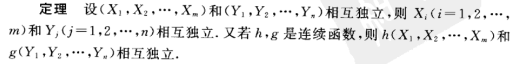

### 考点：判断独立

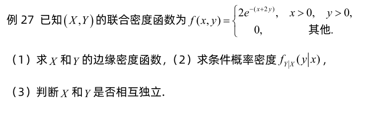

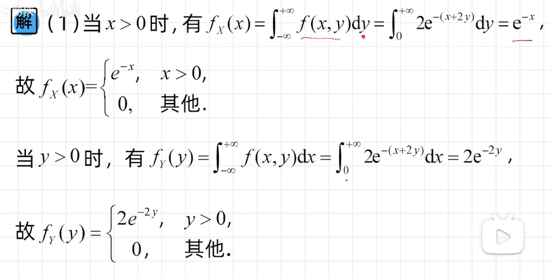

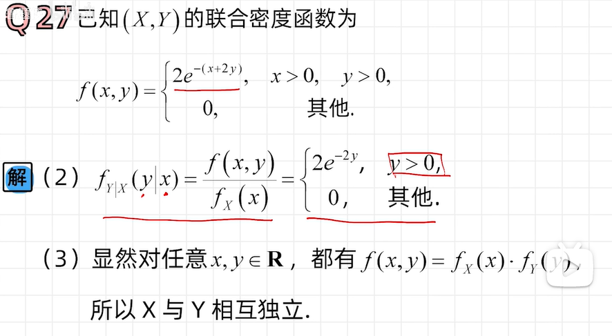

### 考点：函数分布

### 公式法

#### 1.$Z=X+Y$

**一般**

$$
\begin{array}{l}f_{X+Y}(z)=\int_{-\infty}^{\infty} f(z-y, y) \mathrm{d} y, \\ f_{X+Y}(z)=\int_{-\infty}^{\infty} f(x, z-x) \mathrm{d} x .\end{array}
$$

**独立**

$$
\begin{array}{l}f_{X+Y}(z)=\int_{-\infty}^{\infty} f_{X}(z-y) f_{Y}(y) \mathrm{d} y \\ f_{X+Y}(z)=\int_{-\infty}^{\infty} f_{X}(x) f_{Y}(z-x) \mathrm{d} x .\end{array}
$$

这个公式又被定义为$f_X和f_Y$的卷积公式

$$
f_{X} * f_{Y}=\int_{-\infty}^{\infty} f_{X}(z-y) f_{Y}(y) \mathrm{d} y=\int_{-\infty}^{\infty} f_{X}(x) f_{Y}(z-x) \mathrm{d} x
$$

证明：

$$
\begin{aligned}F_{Z}(z)&=\int_{-\infty}^{\infty}\left[\int_{-\infty}^{z-y} f(x, y) \mathrm{d} x\right] \mathrm{d} y\\&\overset{x=u-y}=\int_{-\infty}^{\infty}\left[\int_{-\infty}^{z} f(u-y, y) \mathrm{d} u\right] \mathrm{d} y\\&=\int_{-\infty}^{z}\left[\int_{-\infty}^{\infty} f(u-y, y) \mathrm{d} y\right] \mathrm{d} u\end{aligned}
$$

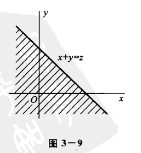

-   例题

    $例 1 设 X 和 Y 是两个相互独立的随机变量. 它们都服从 N(0,1) 分布, 其 概率密度为\\\\\begin{array}{l}\\f_{X}(x)=\frac{1}{\sqrt{2 \pi}} \mathrm{e}^{-x^{2} / 2}, \quad-\infty<x<\infty, \\\\f_{Y}(y)=\frac{1}{\sqrt{2 \pi}} \mathrm{e}^{-y^{2} / 2}, \quad-\infty<y<\infty . \\\\\end{array}\\\\求 Z=X+Y 的概率密度.$

    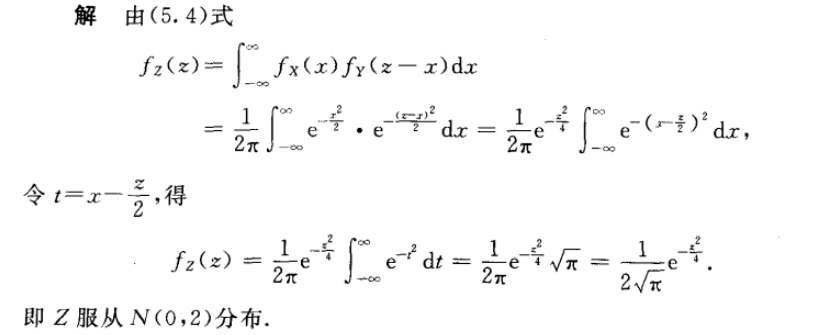
    > ✒️这里配凑了一个平方数，并且使用了一次[Gamma Function伽马函数](<../Gamma Function伽马函数/Gamma Function伽马函数.md> "Gamma Function伽马函数")
    >
    > $$
    > \int_{-\infty}^{\infty}e^{-t^2}dt=2\int_{0}^{\infty}e^{-t^2}dt=\int_{0}^{\infty}t^{\frac{1}{2}-1}e^{-t^2}dt^2=\Gamma(\frac{1}{2})=\sqrt{\pi}
    > $$

[正态分布Normal distribution](<../正态分布Normal distribution/正态分布Normal distribution.md> "正态分布Normal distribution")

#### **`有限个`****相互****`独立`****的****`正态`****随机变量的****`线性组合`****仍然服从****`正态分布`**

$若 X_{i} \sim N\left(\mu_{i}, \sigma_{i}^{2}\right)(i=1,2, \cdots, n) ，$$且它们相互独立, 则它们的和 Z=X_{1}+X_{2}+\cdots+X_{n}$

$$
Z \sim N\left(\mu_{1}+\mu_{2}+\cdots+\mu_{n}, \sigma_{1}^{2}+\sigma_{2}^{2}+\cdots+\sigma_{n}^{2}\right)
$$

#### 2.$Z=\frac{Y}{X}、Z=XY$

**一般**

$$
\begin{array}{l}f_{Y / X}(z)=\int_{-\infty}^{\infty}|x| f(x, x z) \mathrm{d} x, \\ f_{X Y}(z)=\int_{-\infty}^{\infty} \frac{1}{|x|} f\left(x, \frac{z}{x}\right) \mathrm{d} x\end{array}
$$

**独立**

$$
f_{Y / X}(z)=\int_{-\infty}^{\infty}|x| f_{X}(x) f_{Y}(x z) \mathrm{d} x.
$$

$$
f_{X Y}(z)=\int_{-\infty}^{\infty} \frac{1}{|x|} f_{X}(x) f_{Y}\left(\frac{z}{x}\right) \mathrm{d} x.
$$

证明：

> ✒️【预备】[**Fubini's theorem**](https://en.wikipedia.org/wiki/Fubini%27s_theorem "Fubini's theorem") :为什么XY的积分顺序可以交换
>
> $\iint_{X \times Y} f(x, y) \mathrm{d}(x, y)=\int_{X}\left(\int_{Y} f(x, y) \mathrm{d} y\right) \mathrm{d} x=\int_{Y}\left(\int_{X} f(x, y) \mathrm{d} x\right) \mathrm{d} y  \\if \quad \iint_{X \times Y}|f(x, y)| \mathrm{d}(x, y)<+\infty$

$\begin{aligned} F_{Y / X}(z) & =P\{Y / X \leqslant z\}=\iint_{G_{1} \cup G_{2}} f(x, y) \mathrm{d} x \mathrm{~d} y \\ & =\iint_{y / x \leqslant z, x<0} f(x, y) \mathrm{d} y \mathrm{~d} x+\iint_{y / x \leqslant z, x>0} f(x, y) \mathrm{d} y \mathrm{~d} x \\ & =\int_{-\infty}^{0}\left[\int_{z x}^{\infty} f(x, y) \mathrm{d} y\right] \mathrm{d} x+\int_{0}^{\infty}\left[\int_{-\infty}^{x} f(x, y) \mathrm{d} y\right] \mathrm{d} x \\ & \overset{\text { 令 } y=x u}=\int_{-\infty}^{0}\left[\int_{z}^{-\infty} x f(x, x u) \mathrm{d} u\right] \mathrm{d} x+\int_{0}^{\infty}\left[\int_{-\infty}^{z} x f(x, x u) \mathrm{d} u\right] \mathrm{d} x \\ & =\int_{-\infty}^{0}\left[\int_{-\infty}^{z}(-x) f(x, x u) \mathrm{d} u\right] \mathrm{d} x+\int_{0}^{\infty}\left[\int_{-\infty}^{z} x f(x, x u) \mathrm{d} u\right] \mathrm{d} x \\ & =\int_{-\infty}^{\infty}\left[\int_{-\infty}^{z}|x| f(x, x u) \mathrm{d} u\right] \mathrm{d} x \\ & =\int_{-\infty}^{z}\left[\int_{-\infty}^{\infty}|x| f(x, x u) \mathrm{d} x\right] \mathrm{d} u \quad Fubini交换积分顺序\end{aligned}$

利用变上限积分求导，我们就可以得到

$$
f_{Y / X}(z)=\int_{-\infty}^{\infty}|x| f(x, x z) \mathrm{d} x,
$$

> ✒️虽然咱看不懂究竟发现了什么，但是总而言之可能使用了一种技巧，引入了变量$ 
> u  $，代换掉了原本的y，然后利用`变上限积分求导`，用$z$代换掉了$u$。

> ✒️好像悟了，利用了这个公式可以把式子化简成只关于一个变量的积分，实际上还是只与$z$有关的式子。
>
> 直接用画图法也不是不能做，不过会麻烦一点。

**例题：**

$例 4 某公司提供一种地震保险, 保险费 Y 的概率密度为\\\\f(y)=\left\{\begin{array}{ll}\\\frac{y}{25} \mathrm{e}^{-y / 5}, & y>0, \\\\0, & \text { 其他. }\\\end{array}\right.\\\\保险赔付 X 的概率密度为$

$g(x)=\left\{\begin{array}{ll}\\\frac{1}{5} \mathrm{e}^{-x / 5}, & x>0, \\\\0, & \text { 其他. }\\\end{array}\right.\\\\设 X 与 Y 相互独立, 求 Z=Y / X 的概率密度.$

$解 由 (5.7) 式知, 当 z<0 时, f_{Z}(z)=0. 当 z>0 时, Z 的概率密度为\\\\\begin{aligned}\\f_{z}(z) & =\int_{0}^{\infty} x \cdot \frac{1}{5} \mathrm{e}^{-x / 5} \cdot \frac{x z}{25} \mathrm{e}^{-x z / 5} \mathrm{~d} x=\frac{z}{125} \int_{0}^{\infty} x^{2} \mathrm{e}^{-x\left(\frac{1+z}{5}\right)} \mathrm{d} x \\\\& =\frac{z}{125} \frac{\Gamma(3)}{[(1+z) / 5]^{3}}=\frac{2 z}{(1+z)^{3}} .\\\end{aligned}$

[Gamma Function伽马函数](<../Gamma Function伽马函数/Gamma Function伽马函数.md> "Gamma Function伽马函数")

#### 3.$M=max\{X,Y\},N=min\{X,Y\}$

**独立**

$$
F_{\max }(z)=F_{X}(z) F_{Y}(z)
$$

$F_{\max }(z)=P\{M \leqslant z\}=P\{X \leqslant z, Y \leqslant z\}=P\{X \leqslant z\} P\{Y \leqslant z\}=F_{X}(z) F_{Y}(z)$

**独立**

$$
F_{\min }(z)=1-\left[1-F_{X}(z)\right]\left[1-F_{Y}(z)\right]
$$

$\begin{aligned} F_{\min }(z) & =P\{N \leqslant z\}=1-P\{N>z\} \\ & =1-P\{X>z, Y>z\}=1-P\{X>z\} \cdot P\{Y>z\} \\&=1-[1-F_X(z)][1-F_Y(z)]\end{aligned}$

特别的，如果拓展到**独立同分布**的$X_1,X_2\cdots X_n$

**独立同分布**

$$
\begin{array}{c}F_{\max }(z)=[F(z)]^{n}, \\ F_{\min }(z)=1-[1-F(z)]^{n} .\end{array}
$$

### 画图法

$(1) 先求 Z=g(X, Y) 的分布函数:\\\\F(z)=P(Z \leq z)=P(g(X, Y) \leq z)=P\left((X, Y) \in G_{z}\right)=\iint_{G_{z}} f(x, y) d x d y \text {, }$

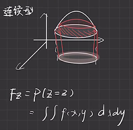

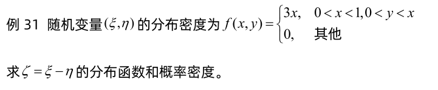

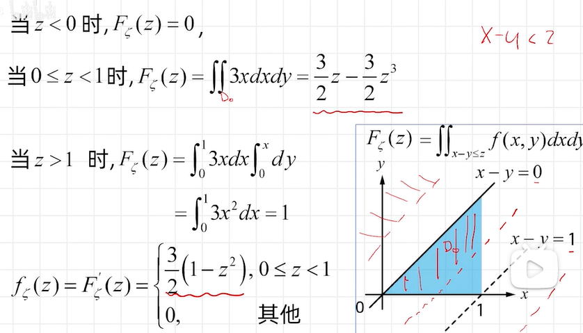

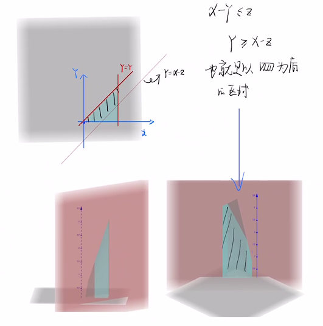

# 分布律【离散】

> ✒️只有离散型的随机变量才会有分布律，连续型的随机变量取值太多了，根本没办法画出来。
>
> 在连续型中，参考物理中的`线密度`概念，使用了`概率密度`这个表述。

### 【一维】

也就是一个二维的表格，分别是随机变量和这个随机变量所对应的事件的概率，比如随机变量取值有0,1,2，每个随机变量对应的事件（可能一个随机变量对应多个事件）的概率分别0.1,0.5,0.4。则分布律的样子就是如图

| X | 0   | 1   | 2   |
| - | --- | --- | --- |
| P | 0.1 | 0.5 | 0.4 |

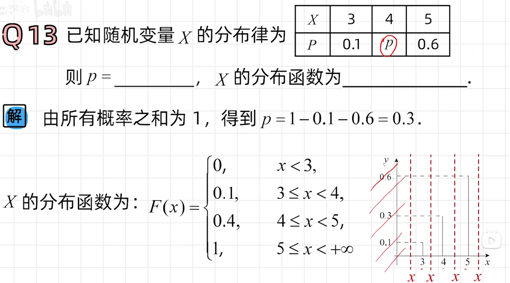

> ✒️这个图挺有意思的

### 考点：函数分布

#### 三横线表法

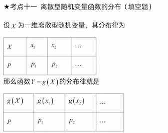

例

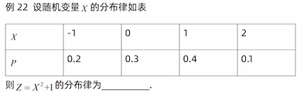

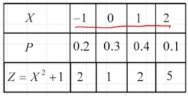

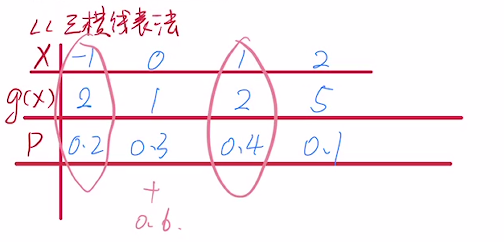

## 【二维】

### 联合分布律

$$
p_{i j} \geqslant 0, \quad \sum_{i=1}^{\infty} \sum_{j=1}^{\infty} p_{i j}=1.
$$

### 边缘分布律

> $分别称 p_{i} .(i=1,2, \cdots) 和 p_{ \cdot j}(j=1,2, \cdots) 为 (X, Y) 关于 X 和关于 Y 的边缘分 布律 \\(注意, 记号 p_{i}. 中的“•”表示 p_{i}. 是由 p_{i j} 关于 j 求和后得到的; \\同样, p \cdot j 是由 p_{i j} 关于 i 求和后得到的).$

$$
p_{i \cdot}=\sum_{j=1}^{\infty} p_{i j}=P\left\{X=x_{i}\right\}, \quad i=1,2, \cdots,\\p_{\cdot j}=\sum_{i=1}^{\infty} p_{i j}=P\left\{Y=y_{j}\right\}, \quad j=1,2, \cdots,
$$

如果带边缘分布的话就是

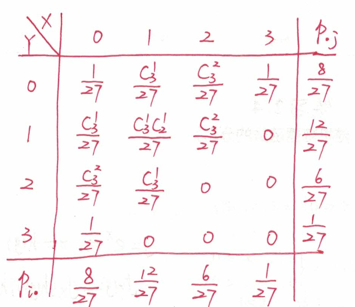

### 条件分布律

$在 Y=y_{j} 条件下随机变量 X 的条件分布律（ P\{Y=y_j\}>0 ）：\\P\left\{X=x_{i} \mid Y=y_{j}\right\}=\frac{P\left\{X=x_{i}, Y=y_{j}\right\}}{P\left\{Y=y_{i}\right\}}=\frac{p_{i}}{p_{.},}, i=1,2, \cdots\\在 X=x_{i} 条件下随机变量 Y 的条件分布律（ P\{X=x_i\}>0 ）：\\P\left(Y=y_{j} \mid X=x_{i}\right\}=\frac{P\left\{X=x_{i}, Y=y_{j}\right\}}{P\left\{X=x_{i}\right\}}=\frac{p_{ij}}{p_{i},}, j=1,2, \cdots$

### 独立

$$
P\left\{X=x_{i}, Y=y_{j}\right\}=P\left\{X=x_{i}\right\} P\left\{Y=y_{j}\right\}
$$

$ 
\Leftrightarrow  $

$$
P\{X \leqslant x, Y \leqslant y\}=P\{X \leqslant x\} P\{Y \leqslant y\} \\ F(x, y)=F_{X}(x) F_{Y}(y)
$$

### 考点：函数分布

#### 表格上计算法

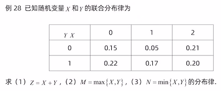

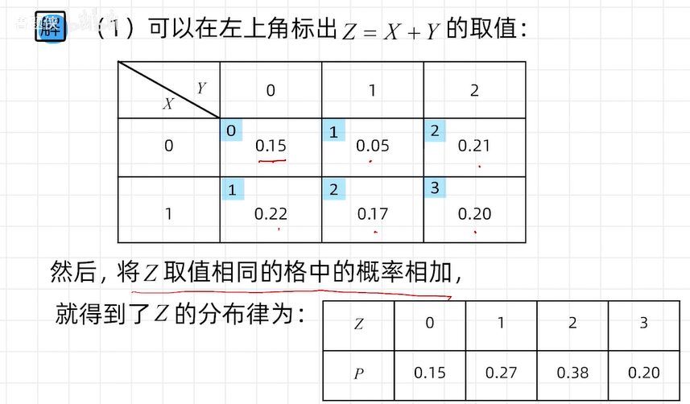
