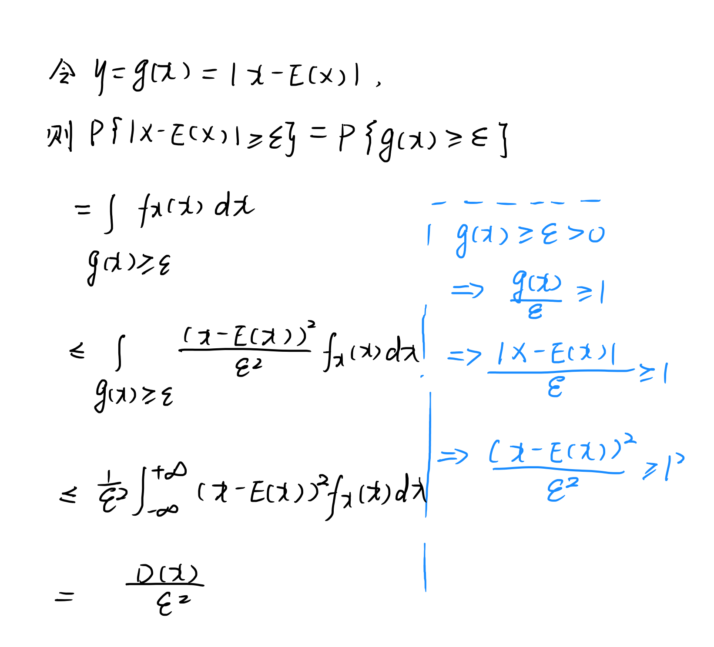

# 切比雪夫不等式Chebyshev不等式

# 切比雪夫不等式Chebyshev不等式

> 在[概率论](https://zh.m.wikipedia.org/wiki/概率論 "概率论")中，**切比雪夫不等式**（英语：Chebyshev's Inequality）显示了[随机变量](https://zh.m.wikipedia.org/wiki/隨機變量 "随机变量")的“几乎所有”值都会“接近”[平均](https://zh.m.wikipedia.org/wiki/平均 "平均")。在20世纪30年代至40年代刊行的书中，其被称为比奈梅不等式（英语：Bienaymé Inequality）或比奈梅-切比雪夫不等式（英语：Bienaymé-Chebyshev Inequality）。切比雪夫不等式，对任何分布形状的数据都适用。

## 定义

$$
若随机变量X,E(X),D(X)存在，对\forall \varepsilon >0
$$

$$
P\{|X-E(X)| \geq \varepsilon\} \leq \frac{D(X)}{\varepsilon^{2}}\\\Leftrightarrow 1-p\{|X-E(X)| \geq \varepsilon\} \geq 1-\frac{D(X)}{\varepsilon^{2}}\\\Leftrightarrow p\{|X-E(X)|<\varepsilon\} \geq 1-\frac{D(X)}{\varepsilon^{2}}
$$

## 证明

