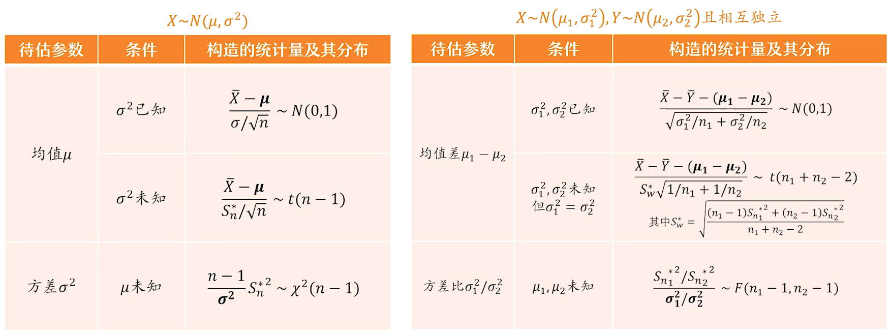

# 区间估计

<https://www.bilibili.com/video/BV1ot411y7mU?p=70>

> ✒️这一节的逻辑很简单，就是背出下面这张表，然后往里套

就是要估计

$$
P\left(\hat{\theta}_{1} \leq \theta \leq \hat{\theta}_{2}\right)=1-\alpha
$$

其中$\alpha$被称为置信度，一般在题目中会给出

## 枢轴变量

这是一个需要被构造的量，构造方法如下表

补充一个表格里没写的:

如果求方差$\sigma^2,\mu已知，则可以用$

$$
\frac{1}{\sigma^{2}} \sum_{i=1}^{n}\left(x_{i}-\mu\right)^{2}=\sum_{i=1}^{n}\left(\frac{x_{i}-\mu}{\sigma}\right)^{2}  \sim \chi^{2}(n)
$$

> ✒️这些式子需要和[三大分布](../三大分布/三大分布.md "三大分布")[正态总体下的抽样分布](../正态总体下的抽样分布/正态总体下的抽样分布.md "正态总体下的抽样分布")相结合

> ✒️接下来去看书，看书就够了从P196看起
