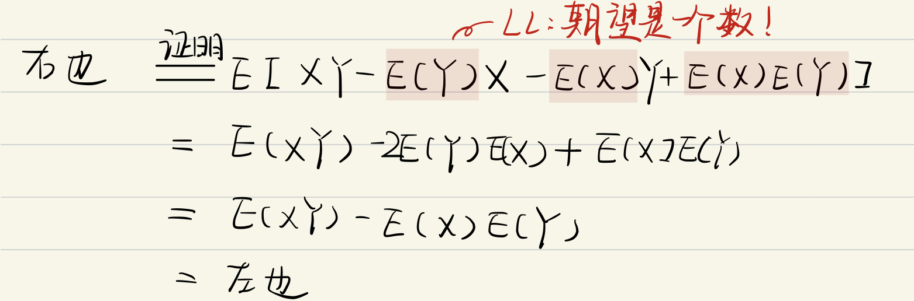
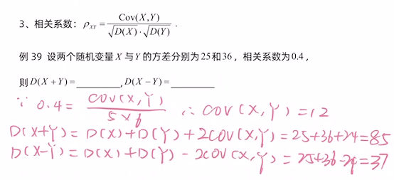

# 协方差

# 协方差

## 定义

$$
COV(X,Y)=E[(X-E(X))(Y-E(Y))]
$$

特别的

$$
COV(X,X)=D(X)
$$

## 计算方法

$COV(X,Y)$

-   $\overset{def}{=}E[(X-E(X))(Y-E(Y))]$
-   $=E(XY)-E(X)E(Y)$

    证明

    为什么$E(X Y)-E(X) E(Y)=E[X-E(X))(Y-E(Y)]$？
    > ✒️🗯️**LL:从左边到右边我证不出来，所以我们证从右边到左边**
-   $\overset{利用方差}=\frac{1}{2}[D(X+Y)-D(X)-D(Y)]$

    证明：

    $ \begin{array}{l}
    D(X+Y)={\color{Blue} E\left((X+Y)^{2}\right)} -{\color{Red} (E(X+Y))^{2}}  \\
    ={\color{Blue} E\left(X^{2}\right)+2 E(X Y)+E\left(Y^{2}\right)} -{\color{Red} (E(X)+E(Y))^{2}}  \\
    ={\color{Blue} E\left(X^{2}\right)} -{\color{Red} (E(X))^{2}} +{\color{Blue} E\left(Y^{2}\right)} -{\color{Red} (E(Y))^{2}} +{\color{Blue} 2 E(X Y)} -{\color{Red} 2 E(X) E(Y)}  \\由性质1，2有\\
    =D(X)+D(Y)+2 \cdot[E(X \cdot Y)-E(X) E(Y)] \\
    =D(X)+D(Y)+2 E[(X-E(X)) \cdot(Y-E(Y))]
    \end{array}  $
-   ${\rho_{XY}}{=}\frac{COV(X,Y)}{\sqrt{D(X)}\sqrt{D(Y)}}$

## 性质

1.  对称性

    $COV(X,Y)=COV(Y,X)$
2.  双线性
    -   $ 
        COV(aX+bY,Z)=aCOV(X,Z)+bCOV(Y,Z)  $

        **证明**

        $\operatorname{COV}(a X+b Y, Z)\\\overset{def}=E[({{aX }}+{{b Y}}-E({{a X}}+{{b Y})})(Z-E(Z))]\\=E\{[a(X-E(X))+b(Y-E(Y))](Z \cdot E(Z)\}\\\overset{分配}=E[a(X-E(X))(Z-E(Z))+b(Y-E(Y))(Z-E(Z))]\\=\operatorname{aCOV}(X, Z)+b \operatorname{COV}(Y, Z)$
3.  $\operatorname{Cov}(a X, b Y)=a b \operatorname{Cov}(X, Y) \quad(a, b 为常数 ) ；$
4.  $D(X \pm Y)=D(X)+D(Y) \pm 2 \operatorname{Cov}(X, Y)$
    -   例题

        
5.  若 X 与 Y 相互[独立](../独立/独立.md "独立")，则$  \operatorname{Cov}(X, Y)=0. $
    > ❓反向好像不成立？
    >
    > 这一性质可以推广到任意有限个相互独立的随机变量之积的情况.
    >
    > 证明：
    >
    > $$
    > E(X Y)=\iint x y f(x, y) d x d y\\\stackrel{独立}{=} \int x f_{X}(x) d x\left(\int{y} f_{Y}(y) d y\right)\\=E(X) \cdot E(Y)
    > $$
    >
    > 请注意：
    >
    > $X, Y 独立\nLeftarrow E(X Y)=E(X) E(Y)\Rightarrow X,Y不相关$
    >
    > 因为$Cov(X,Y)=E(XY)-E(X)E(Y)=0\Rightarrow X,Y不相关$
    >
    > > ✒️这在[相关系数](../相关系数/相关系数.md "相关系数")中有更多例子
