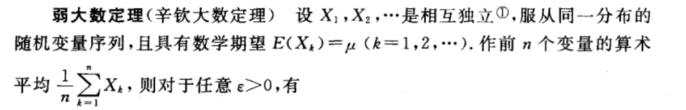
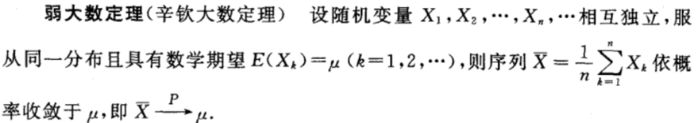
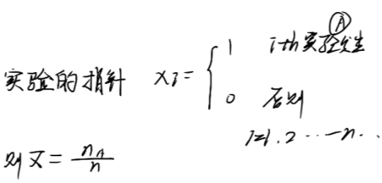

# 大数定理

## 目录

-   [极限定理3步曲](#极限定理3步曲)
-   [切式大数定理](#切式大数定理)
    -   [对象](#对象)
    -   [条件](#条件)
    -   [结论](#结论)
    -   [证明](#证明)
-   [辛钦大数定理（弱大数定理）](#辛钦大数定理弱大数定理)
    -   [条件](#条件)
    -   [表述1](#表述1)
    -   [表述2](#表述2)
    -   [依概率收敛的数列的性质](#依概率收敛的数列的性质)
        -   [一维](#一维)
        -   [二维](#二维)
-   [伯努力大数定理](#伯努力大数定理)
    -   [对象](#对象)
    -   [条件（换句话说：证明条件符合辛钦）](#条件换句话说证明条件符合辛钦)
    -   [结论](#结论)

# 极限定理3步曲

1.  对象
2.  条件
3.  结论

> ✒️结论都一样，就是对象和条件不一样

# 切式大数定理

### 对象

$ 
序列：x_{1}, x_{2} \ldots x_{n}上定义的 $

$$
\bar{X}=\frac{1}{n} \sum_{i=1}^{n} X_{i}
$$

### 条件

$$
(1) 独立\\(2) E\left(X_{i}\right)=\mu \quad \forall i\\\red{(3) D\left(X_{i}\right)=\sigma^{2} \quad \forall i \geqslant 1}
$$

### 结论

$$
\bar{X}\stackrel{P}{\rightarrow} \mu
$$

### 证明

$$
\begin{aligned} E(\bar{X}) & =E\left(\frac{1}{n} \sum_{i=1}^{n} X_{i}\right)=\frac{1}{n} \sum_{i=1}^{n} E\left(X_{i}\right) \\ & =\frac{1}{n} \cdot n \mu=\mu\end{aligned}
$$

$$
\begin{aligned}D(\bar{X})&=D\left(\frac{1}{n} \sum_{i=1}^{n} X_{i}\right) \\& \stackrel{\text { 独立性 }}{=} \frac{1}{n^{2}} \sum_{i=1}^{n} D\left(X_{i}\right)=\frac{1}{n^{2}} \cdot n \cdot \sigma^{2}=\frac{1}{n} \sigma^{2}\end{aligned}
$$

由[切比雪夫不等式Chebyshev不等式](../切比雪夫不等式Chebyshev不等式/切比雪夫不等式Chebyshev不等式.md "切比雪夫不等式Chebyshev不等式")有

$$
P\{|X-E(X)|<\varepsilon\} \geq 1-\frac{D(\bar{X})}{\varepsilon^{2}}
$$

所以

$$
1 \geqslant P\left\{|\bar{X}-E(X)|^{2}<\varepsilon\right\} \geqslant 1-\frac{D(\bar{X})}{\varepsilon^{2}}=1-\frac{\sigma^{2}}{n} \cdot \frac{1}{\varepsilon^{2}}
$$

根据`夹逼定理`有

$$
\begin{array}{l}P\left\{|\bar{X}-E(X)|^{2}<\varepsilon\right\} \rightarrow 1 \quad(n \rightarrow \infty) \\ \Rightarrow \bar{X} \stackrel{P}{\rightarrow} E(\bar{X})=\mu\end{array}
$$

# 辛钦大数定理（弱大数定理）

### 条件

1.  独立
2.  同分布
3.  $E(X_i)$均存在

> ✒️不要求方差存在

### 表述1

$$
\lim _{n \rightarrow \infty} P\left\{\left|\frac{1}{n} \sum_{k=1}^{n} X_{k}-\mu\right|<\varepsilon\right\}=1.
$$

### 表述2

### 依概率收敛的数列的性质

#### 一维

对于$ X_{n} \rightarrow a  $，如果二元函数$y=g(x)$在$a$处连续，则

$$
Y_{n}=g(X _n) \stackrel{P}{\longrightarrow} y=g(a)
$$

#### 二维

对于$X_{n} \rightarrow a \quad Y_{n} \rightarrow b$，如果二元函数$z=g(x,y)$在$(a,b)$处连续，则

$$
Z_{n}=g\left(X_{n}, Y_{n}\right) \stackrel{P}{\longrightarrow} z=g(a, b)
$$

# 伯努力大数定理

是辛钦对于二项分布这一特殊分布下的特化定理

### 对象

当$X \sim B(n, p)$时

### 条件（换句话说：证明条件符合辛钦）

1.  独立
2.  同分布
3.  $E(X_i)$均存在

<!---->

1.  n重伯努利显然独立
2.  对于每一$X_i$显然都满足$E(X_i)=p$&#x20;
3.  对于每一$X_i$显然都满足$D(X_i)=npq$&#x20;

### 结论

$$
\bar{X}\stackrel{P}{\rightarrow} \mu
$$

$$
\Rightarrow \frac{n A}{n} \stackrel{p}{\longrightarrow} p
$$
