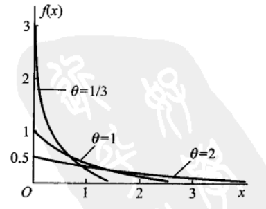
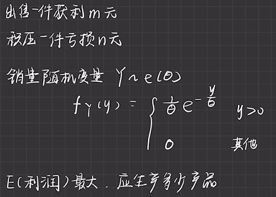
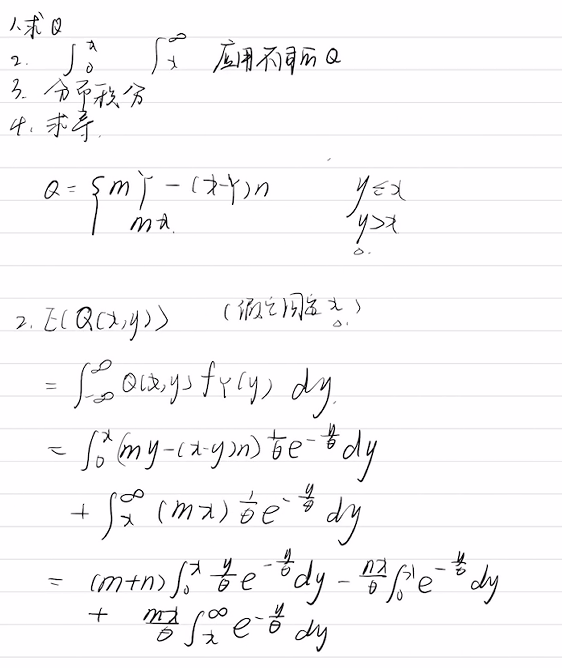
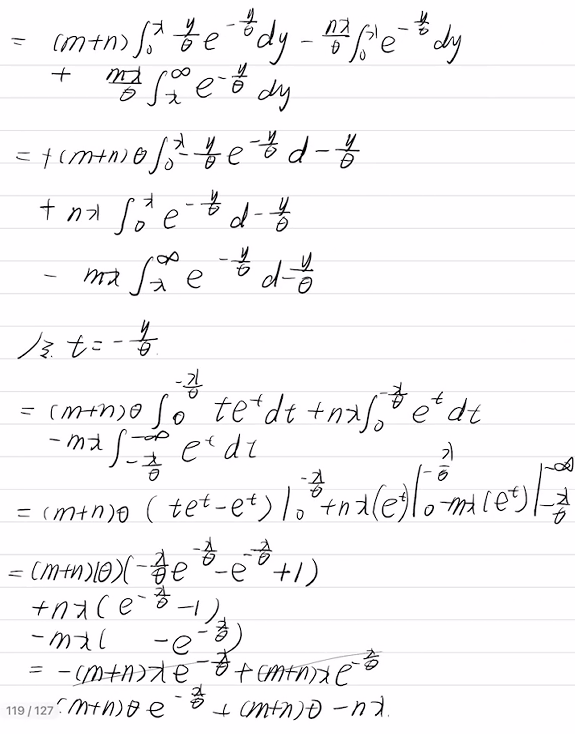
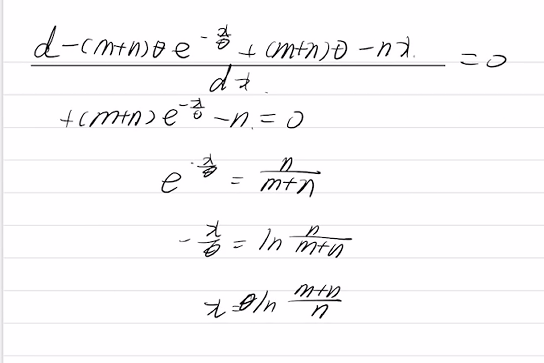

# 指数分布Exponential distribution

## 目录

-   [指数分布\theta](#指数分布theta)
    -   [分布函数](#分布函数)
    -   [概率密度](#概率密度)
    -   [由泊松概率求得](#由泊松概率求得)
    -   [数学期望 \theta](#数学期望-theta)
        -   [例题](#例题)
    -   [方差\theta^2](#方差theta2)

# 指数分布$\theta$

<https://www.zhihu.com/question/24796044>

泊松分布，指在单位时间里（也可以是在时间t内），事件出现的次数，次数可以是x=0,1,2,……直至可数无穷次。

**指数分布，需要强调的是，说的是时间，是我们关注的事件A出现时，距离上次发生等待的时间。**

## 分布函数

$$
F(x)=\left\{\begin{array}{ll}1-\mathrm{e}^{-x / \theta}, & x>0, \\ 0, & \text { 其他. } .\end{array}\right.
$$

## 概率密度

$$
f(x)=\left\{\begin{array}{ll}\frac{1}{\theta} \mathrm{e}^{-x / \theta}, & x>0, \\ 0, & \text { 其他, }\end{array}\right.
$$

## 由**泊松概率求得**

<https://www.zhihu.com/question/24796044/answer/500550962>

泊松分布，指在单位时间里（也可以是在时间t内），事件出现的次数，次数可以是x=0,1,2,……直至可数无穷次。

**指数分布，需要强调的是，说的是时间，是我们关注的事件A出现时，距离上次发生等待的时间。**

**接下来我们可以通过泊松概率求得指数分布的概率密度函数**

在单位时间内事件A发生的可能性为

$$
F_{X_{1}}(单位时间)=P\left(X_{1} \leq 单位时间\right)=1-P\left(X_{1}>单位时间\right)
$$

超出单位时间直到$X_1$时事情才会发生的可能为：$P\left(X_{1}>单位时间\right)$的概率，我们来先计算这个

**在一段时间内，事件出现的次数问题，就是泊松过程。** 则

$$
P\left(X_{1}>单位时间\right)=P(N(x)=0)=\frac{e^{-\lambda x}(\lambda x)^{0}}{0 !}=e^{-\lambda x}
$$

$$
F_{X_{1}}(单位时间)=P\left(X_{1} \leq 单位时间\right)=1-P\left(X_{1}>单位时间\right)=1-e^{-\lambda 单位时间}
$$

由于单位时间是可以改变的，可以使一天，半天，一小时，所以我们设其为$x$

于是有：

$$
F_{X_{1}}(x)=P\left(X_{1} \leq x\right)=1-P\left(X_{1}>x\right)=1-e^{-\lambda x}
$$

$$
f_{X_{1}}(x)=F_{X_{1}}^{\prime}(x)=\lambda e^{-\lambda x} \sim E\left(\frac{1}{\lambda}\right), x>0
$$

我们得出来的就是参数$\theta=\frac{1}{\lambda}$的指数分布。

## 数学期望 $\theta$

<https://www.zhihu.com/question/39023789/answer/1373089469>

$$
E(X)=\int_{-\infty}^{\infty} x f(x) d x=\int_{-\infty}^{0} x \cdot 0 \cdot d x+\int_{0}^{\infty} x \cdot \frac{1}{\theta} e^{-\frac{x}{\theta}} \cdot d x=\int_{0}^{\infty} x\cdot\frac{1}{\theta} e^{-\frac{x}{\theta}} \cdot d x
$$

利用分部积分法：

$$
E(X)=-\left.x e^{-\frac{x}{\theta}}\right|_{0} ^{\infty}+\int_{0}^{\infty} e^{-\frac{x}{\theta}} d x
$$

$$
E(X)=\left(-\left.x e^{-\frac{x}{\theta}}\right|_{0} ^{\infty}\right)+\left(-\left.\theta e^{-\frac{x}{\theta}}\right|_{0} ^{\infty}\right)
$$

$$
E(x)=\lim _{x \rightarrow \infty}-\frac{\theta}{e^{\frac{x}{\theta}}}+\theta=0+\theta=\theta
$$

#### 例题

> ✒️这题虽然有指数函数的形式和计算特点，但是因为`分段函数`的出现，不能直接套用现有结论。

> ✒️所求的应该是一个$x$关于$m,n,\theta$的函数

-   详细

    

    

    

易得利润函数为

$$
\begin{aligned}Q&=Q(X,Y)
\\&=\left\{\begin{array}{l}m \cdot Y-n(X-Y)\quad供>求 \\ m X\quad 供≤求\end{array}\right.
 \end{aligned}
$$

那么对于某一固定的$x$有：

$$
\begin{aligned}
E(Q)
&=\int_{-\infty}^{+\infty} Q(x,y) f_{Y}(y) d y
\\&=\int_{0}^{+\infty} Q(x,y) f _Y(y) d y 
\\&=\int_{0}^{x}(m y-n(x-y)) \frac{1}{\theta} e^{-\frac{y}{\theta}} d y+\int_{x}^{+\infty} m x\frac{1}{\theta} e^{-\frac{y}{\theta}} d y
\\&= -\int_{0}^{x}(m+n) y e^{-\frac{y}{\theta}} d -\frac{y}{\theta}+n x \int_{0}^{x} e^{-\frac{y}{\theta}} d-\frac{y}{\theta}-mx \int_{x}^{+\infty} e^{-\frac{y}{\theta}} d-\frac{y}{\theta}
\\&=\left.(m+n) \theta\left(-\frac{y}{\theta} e^{-\frac{y}{\theta}}+e^{-\frac{y}{\theta}}\right)\right|_{0} ^{x}+\left.n x e^{-\frac{y}{e}}\right|_{0} ^{x}-\left.m x e^{-\frac{y}{\theta}}\right|_{x} ^{+\infty}
\\&=-(m+n) \theta e^{-\frac{x}{\theta}}+(m+n) \theta-nx
\end{aligned}
$$

要使$E(Q)$取到最大值，那么应该有：

$$
\begin{aligned}\frac{d E(Q)}{d x}&=-(m+n) \theta e^{-\frac{x}{\theta}}(-\frac{1}{\theta})-n=0
\\&\Rightarrow(m+n) e^{-\frac{x}{\theta}}=n \\&\Rightarrow e^{-\frac{x}{\theta}}=\frac{n}{m+n}\\ &\Rightarrow-\frac{x}{\theta}=\ln \frac{n}{n +m}\\ &\Rightarrow x=-\theta \ln \frac{n}{ m +n} \end{aligned}
$$

## 方差$\theta^2$

$$
E(X^2)=\int_{-\infty}^{\infty} x^2 f(x) d x=\int_{0}^{\infty} x^2\cdot\frac{1}{\theta} e^{-\frac{x}{\theta}} \cdot d x=2\theta^2
$$

$$
D(X)=E\left(X^{2}\right)-(E(X))^{2}=2\theta^2-\theta^2=\theta^2
$$
