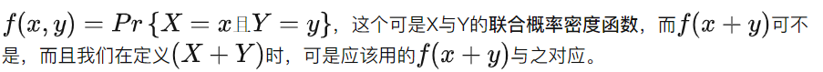
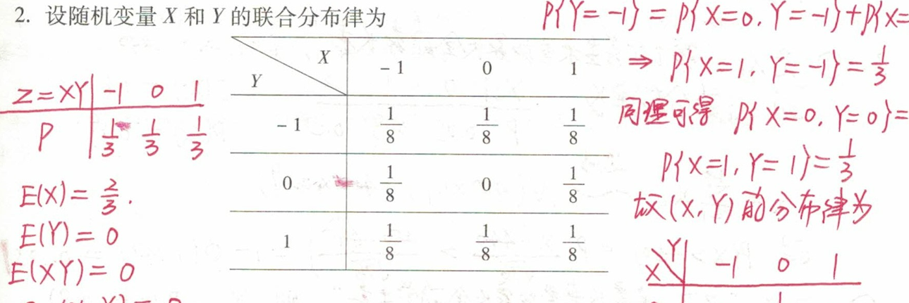
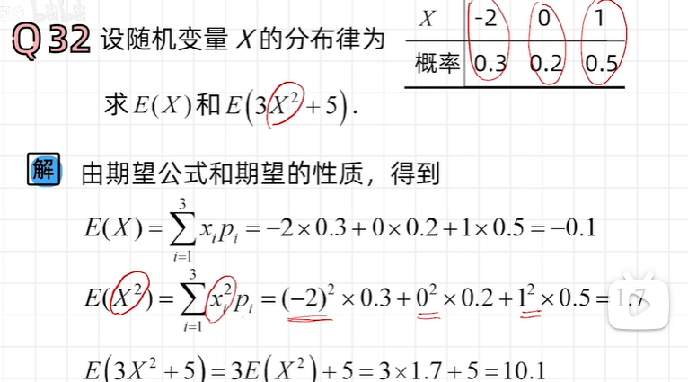
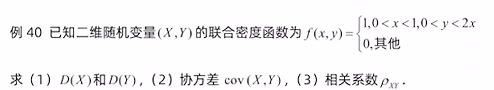
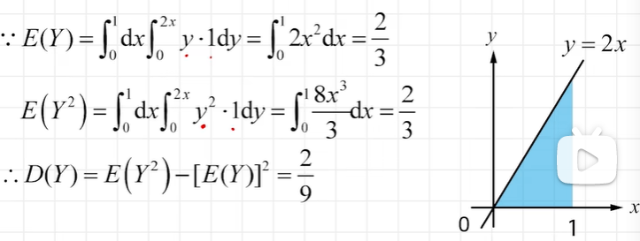
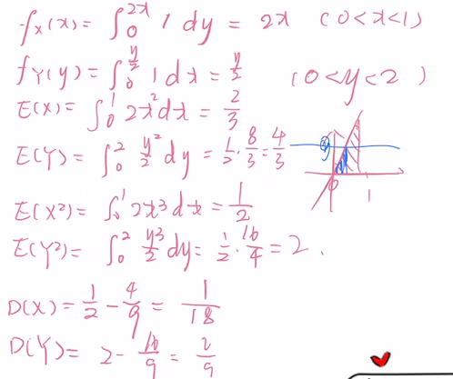

# 数学期望

## 目录

-   [【一维】](#一维)
-   [【二维】](#二维)
-   [性质(线性性质)](#性质线性性质)
-   [意义](#意义)
    -   [E(X^2)=0意味着什么？](#EX20意味着什么)
        -   [【离散】不可能事件与概率为0的事件是同一个事件](#离散不可能事件与概率为0的事件是同一个事件)
        -   [【连续】不可能事件与概率为0的事件  不是同一个事件](#连续不可能事件与概率为0的事件--不是同一个事件)
    -   [考点：函数期望](#考点函数期望)
        -   [离散](#离散)
        -   [连续](#连续)

## 【一维】

$$
E(X)=\int_{-\infty}^{\infty} x f(x) \mathrm{d} x
$$

$$
E(Y)=E[g(X)]=\int_{-\infty}^{\infty} g(x) f(x) \mathrm{d} x
$$

## 【二维】

$若二维随机变量 (X, Y) 的概率密度为 f(x, y), 则有$

$$
E(Z)=E[g(X, Y)]=\int^{\infty}_{-\infty} \int^{\infty}_{-\infty} g(x, y) f(x, y) \mathrm{d} x \mathrm{~d} y
$$

**我们可以用以下性质化简这个运算**

## 性质(线性性质)

1.  $设 C 是常数, 则有 E(C)=C.$
2.  $设 X 是一个随机变量, C 是常数,则有\\\\E(C X)=C E(X) \text {. }$

    $证明\\设g(x)=k x\\那么有\\E(kX)=\int kx\cdot f_{X}(x) d x\\=k \int x \cdot f_X(x) d x\\=k E (X)$
3.  $设 X, Y 是两个随机变量, 则有\\\\E(X+Y)=E(X)+E(Y) .\\\\这一性质可以推广到任意有限个随机变量之和的情况.$

    
    $$
    \begin{aligned} E(X+Y) &=\int_{-\infty}^{\infty} \int_{-\infty}^{\infty}(x+y) f(x, y) \mathrm{d} x \mathrm{~d} y \\ &=\int_{-\infty}^{\infty} \int_{-\infty}^{\infty} x f(x, y) \mathrm{d} x \mathrm{~d} y+\int_{-\infty}^{\infty} \int_{-\infty}^{\infty} y f(x, y) \mathrm{d} x \mathrm{~d} y \\&=\int_{-\infty}^{\infty}xf_X(x)dx+\int_{-\infty}^{\infty}yf_Y(y)dy\\ &=E(X)+E(Y) \end{aligned}
    $$
    

    

    

    $也就是, (X+Y)=(X, Y) 。$

    <https://www.zhihu.com/people/ricci-april/posts?page=2>
4.  $  {\color{Blue} X, Y 独立\mathbf{} } \Rightarrow E(X Y)=E(X) E(Y) . $

    这一性质可以推广到任意有限个相互独立的随机变量之积的情况.

    证明：
    $$
    E(X Y)=\iint x y f(x, y) d x d y\\\stackrel{独立}{=} \int x f_{X}(x) d x\left(\int{y} f_{Y}(y) d y\right)\\=E(X) \cdot E(Y)
    $$
    请注意：

    $X, Y 独立\nLeftarrow E(X Y)=E(X) E(Y)\Rightarrow X,Y不相关$

    因为$Cov(X,Y)=E(XY)-E(X)E(Y)=0\Rightarrow X,Y不相关$
    > ✒️这在[相关系数](../相关系数/相关系数.md "相关系数")中有更多例子
    > 一个例子：
    

    4E{}N96KBAY\(ZXSY`XFC_NWQXpNsjqH.jpg)

# 意义

## $E(X^2)=0$意味着什么？

### 【离散】`不可能事件`与`概率为0的事件`是同一个事件

$$
E\left(X^{2}\right)=\sum_{k=1}^{\infty} x^{2} P_{k}=0 \Rightarrow x_{k}=0 \quad \forall{k} \geqslant 1
$$

### 【连续】`不可能事件`与`概率为0的事件`  不是同一个事件

$$
E\left(X^{2}\right)=\int_{-\infty}^{\infty} x^{2} f_{X}(x) d x \nRightarrow x\equiv 0
$$

> ✒️因为黎曼积分允许存在有限多个间断点
>
> \$Z]GX\)0NF62E8Q\$\[KB_rRU_ITlo__.jpg)

## 考点：函数期望

### 离散

> ✒️别傻了吧唧把概率平方了

### 连续

$$
E(Z)=E[g(X, Y)]=\int^{\infty}_{-\infty} \int^{\infty}_{-\infty} g(x, y) f(x, y) \mathrm{d} x \mathrm{~d} y
$$

> ✒️可以直接用联合概率密度来算，不用分别求XY的边缘概率密度

-   不太聪明的解法（甚至还解错了）

    
    > ✒️这里需要注意，求边缘概率密度的时候，一个是用x限制y，一个是用y限制x，上下限不要弄错。
