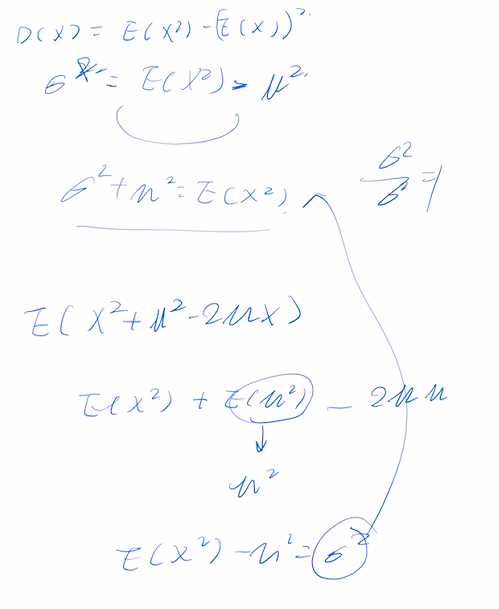

# 方差

## 目录

-   [定义](#定义)
    -   [离散](#离散)
    -   [连续](#连续)
-   [简单计算公式](#简单计算公式)
    -   [证明](#证明)
-   [标准差\sigma=\sqrt{D(X)}](#标准差sigmasqrtDX)
    -   \[标准化变量

        X^{ \*}=\frac{X-\mu}{\sigma}]\(#标准化变量XfracX-musigma)
-   [性质](#性质)
-   [二项分布X \sim B(n,p)](#二项分布X-sim-Bnp)
    -   [方差\operatorname{D}\[X\]=n p q](#方差operatornameDXn-p-q)
        -   [EX ](#EX-)
-   [几何分布
    &#x20;](#几何分布-)
    -   [方差\operatorname{D}\[X\]=q / p^{2}](#方差operatornameDXq--p2)
-   [正态分布](#正态分布)
    -   [方差\sigma^{2}](#方差sigma2)
-   [指数分布\theta](#指数分布theta)
    -   [方差\theta^2](#方差theta2)
-   [泊松分布X \sim \pi(\lambda)](#泊松分布X-sim-pilambda)
    -   [数学期望
        \lambda ](#数学期望lambda-)

> **方差（variance)：** 是在概率论和统计方差衡量随机变量或一组数据时离散程度的度量。概率论中方差用来度量随机变量和其数学期望（即均值）之间的偏离程度。统计中的方差（样本方差）是各个数据分别与其平均数之差的平方的和的平均数。在许多实际问题中，研究方差即偏离程度有着重要意义。

# 定义

$定义 设 X 是一个随机变量, 若 E\left\{[X-E(X)]^{2}\right\} 存在,则称 E\{[X\left.E(X)]^{2}\right\} 为 X 的方差, \\记为 D(X) 或 \operatorname{Var}(X), 即$

$$
D(X)=\operatorname{Var}(X)=E\left\{[X-E(X)]^{2}\right\} 
$$

## 离散

$$
D(X)=\sum_{k=1}^{\infty}\left[x_{k}-E(X)\right]^{2} p_{k}
$$

## 连续

$$
D(X)=\int_{-\infty}^{\infty}[x-E(X)]^{2} f(x) \mathrm{d} x
$$

# 简单计算公式

$$
D(X)=E\left(X^{2}\right)-[E(X)]^{2}
$$

## 证明

$$
\begin{aligned} D(X) &=E\left\{[X-E(X)]^{2}\right\}=E\left\{X^{2}-2 X E(X)+[E(X)]^{2}\right\} \\ &=E\left(X^{2}\right)-2 E(X) E(X)+[E(X)]^{2} \\ &=E\left(X^{2}\right)-[E(X)]^{2} \end{aligned}
$$

# 标准差$\sigma=\sqrt{D(X)}$

标准化变量\$

## X^{ \*}=\frac{X-\mu}{\sigma} \$

$设随机变量 X 具有数学期望 E(X)=\mu, 方差 D(X)=\sigma^{2} \neq 0$

$则\\\\\begin{array}{c}\\E\left(X^{*}\right)=\frac{1}{\sigma} E(X-\mu)=\frac{1}{\sigma}[E(X)-\mu]=0 ; \\\\D\left(X^{*}\right)=E\left(X^{* 2}\right)-\left[E\left(X^{*}\right)\right]^{2}=E\left[\left(\frac{X-\mu}{\sigma}\right)^{2}\right] \\\\=\frac{1}{\sigma^{2}} E\left[(X-\mu)^{2}\right]=\frac{\sigma^{2}}{\sigma^{2}}=1 .\\\end{array}$

-   why

    

# 性质

1.  $设 C 是常数, 则 D(C)=0.$
2.  $设 X 是随机变量, C 是常数,则有\\\\D(C X)=C^{2} D(X), \quad D(X+C)=D(X) .$

    $\begin{aligned}D(C X) &=E\left\{[C X-E(C X)]^{2}\right\}=C^{2} E\left\{[X-E(X)]^{2}\right\}=C^{2} D(X) \\ D(X+C) &=E\left\{[X+C-E(X+C)]^{2}\right\}=E\left\{[X-E(X)]^{2}\right\}=D(X) \end{aligned}$
3.  $设 X, Y 是两个随机变量, 则有\\\\D(X+Y)=D(X)+D(Y)+2 E\{(X-E(X))(Y-E(Y))\} \text {. }\\\\特别, 若 X, Y 相互独立, 则有\\\\D(X+Y)=D(X)+D(Y) .\\\\这一性质可以推广到任意有限多个相互独立的随机变量之和的情况.$

    这里应该和[协方差](../协方差/协方差.md "协方差")有很大的关系了
4.  $D(X)=0 的充要条件是 X 以概率 1 取常数 E(X), 即\\\\P\{X=E(X)\}=1 .$

# 二项分布$X \sim B(n,p)$

## [方差](方差.md "方差")$\operatorname{D}[X]=n p q$

### EX&#x20;

> 设X表示10次独立重复射击命中目标的次数，每次射击命中率为0.4，则$E(X^2)=$

几何分布$
 $
==

## 方差$\operatorname{D}[X]=q / p^{2}$

# 正态分布

### 方差$\sigma^{2}$

先利用代换$Z=\frac{X-\mu}{\sigma}$标准化

$$
\begin{aligned} D(Z) &=E\left(Z^{2}\right)=\frac{1}{\sqrt{2 \pi}} \int_{-\infty}^{\infty} t^{2} \mathrm{e}^{-t^{2} / 2} \mathrm{~d} t \\ &=\left.\frac{-1}{\sqrt{2 \pi}} t \mathrm{e}^{-t^{2} / 2}\right|_{-\infty} ^{\infty}+\frac{1}{\sqrt{2 \pi}} \int_{-\infty}^{\infty} \mathrm{e}^{-t^{2} / 2} \mathrm{~d} t=1 \end{aligned}
$$

$$
D(X)=D(\mu+\sigma Z)=D(\sigma Z)=\sigma^{2} D(Z)=\sigma^{2}
$$

LL版证明

$ 已知X \sim N\left(\mu, \sigma^{2}\right)，试求D(x)=?  $

$ 
\begin{aligned} D(X)&=E(X-E(X))^{2} \\ &=\int_{-\infty}^{\infty}(x-\mu)^{2} f_{x}(x) d x \\ &=\frac{1}{\sqrt{2\pi} \sigma} \int_{-\infty}^{\infty}(x-\mu)^{2} e^{-\frac{(x-\mu)^{2}}{2 \sigma^{2}}} d x \\ &\overset{t=\frac{x-\mu}{\sigma} }{=}\frac{1}{\sqrt{2\pi} \sigma} \int_{-\infty}^{+\infty} \sigma^{2} t^{2} e^{-\frac{t^{2}}{2}} \sigma d t \\ &=\frac{\sigma^{2}}{\sqrt{2\pi}} \int_{-\infty}^{\infty}(-t) d e^{-\frac{t^{2}}{2}} \\ &=\frac{\sigma^{2}}{\sqrt{2\pi}}\left[\left.e^{-\frac{t^{2}}{2}}\right|_{-\infty} ^{+\infty}-\int_{-\infty}^{+\infty} e^{-\frac{t^{2}}{2}} e^{-\frac{t^{2}}{2}} d(-t)\right] \\ &=\frac{\sigma^{2}}{\sqrt{2\pi}} \int_{-\infty}^{+\infty} e^{-\frac{t^{2}}{2}} d t\\&=\sigma^{2} \end{aligned}  $

# 指数分布$\theta$

## 方差$\theta^2$

$$
E(X^2)=\int_{-\infty}^{\infty} x^2 f(x) d x=\int_{0}^{\infty} x^2\cdot\frac{1}{\theta} e^{-\frac{x}{\theta}} \cdot d x=2\theta^2
$$

$$
D(X)=E\left(X^{2}\right)-(E(X))^{2}=2\theta^2-\theta^2=\theta^2
$$

# 泊松分布$X \sim \pi(\lambda)$

泊松分布，指在单位时间里（也可以是在时间t内），事件出现的次数，次数可以是x=0,1,2,……直至可数无穷次。

[数学期望](../数学期望/数学期望.md "数学期望")$ 
\lambda  $
----------

$$
\begin{aligned}E(x)&=\sum_{k=0}^{\infty} k \frac{\lambda^{k}}{k !} e^{-\lambda} \\ &=e^{-\lambda} \sum_{k=1}^{\infty} k \frac{\lambda^{k}}{k !} \\ &=\lambda e^{-\lambda} \sum_{k=1}^{\infty} \frac{\lambda^{(k-1)}}{(k-1) !} \\& \stackrel{k-1 \rightarrow k}{=} \lambda e^{-\lambda} \sum_{k=0}^{\infty} \frac{\lambda^k}{k !} \\ &\overset{e^{x}=\sum_{n=0}^{\infty} \frac{x^{n}}{n !}}=\lambda e^{-\lambda} \cdot e^{\lambda}\\&=\lambda \\\end{aligned}
$$
