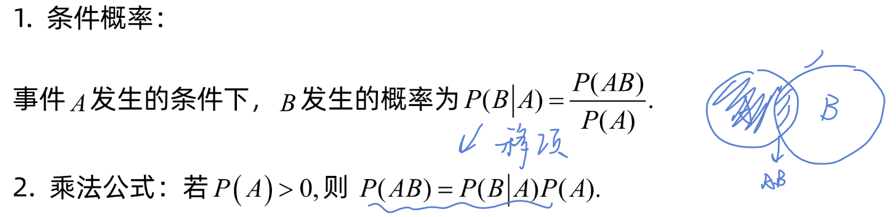
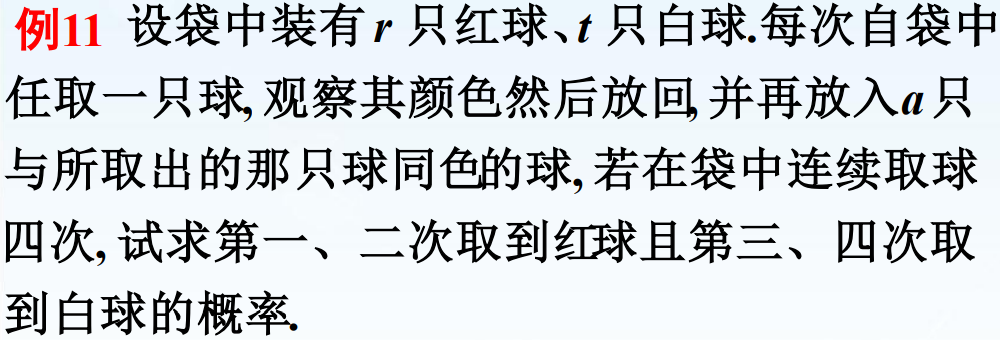
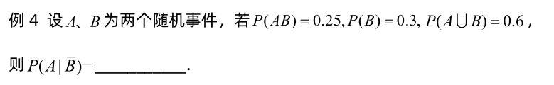
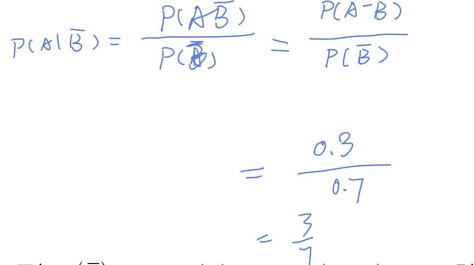
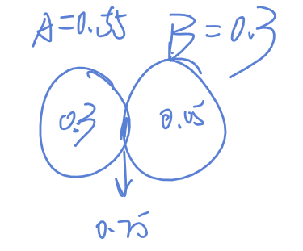
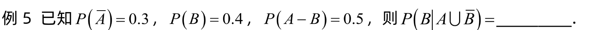
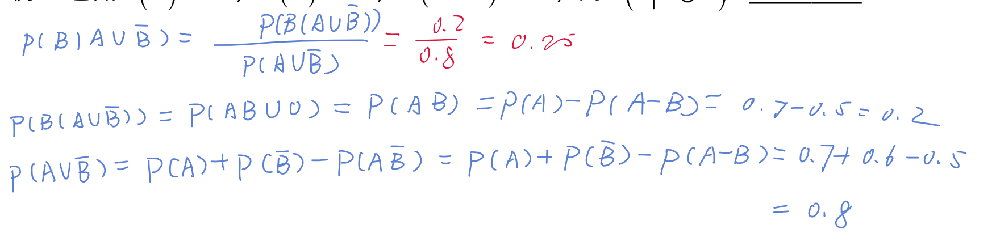
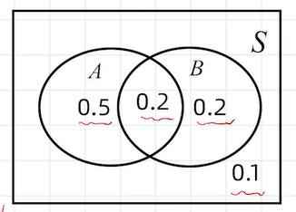
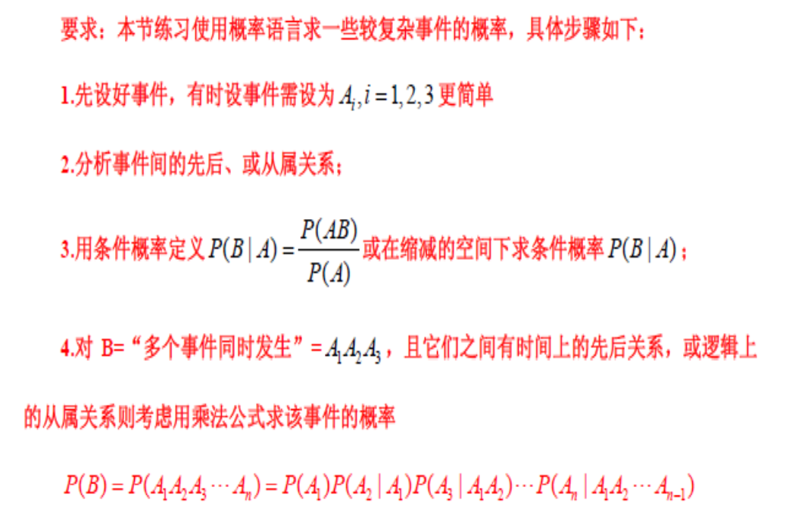

# 条件概率与乘法公式

## 目录

-   [性质](#性质)
    -   [P(\bar{B} \mid A)=1-P(B \mid A)=1-\frac{P(A B)}{P(A)}](#PbarB-mid-A1-PB-mid-A1-fracPA-BPA)
    -   [P(B \cup C \mid A)=P(B \mid A)+P(C \mid A)-P(B C \mid A)](#PB-cup-C-mid-APB-mid-APC-mid-A-PB-C-mid-A)
-   [乘法公式](#乘法公式)
    -   [波利亚(Polyá) 罐子模型](#波利亚Polyá-罐子模型)
-   [综合运用](#综合运用)
-   [总结](#总结)

## 性质

### $P(\bar{B} \mid A)=1-P(B \mid A)=1-\frac{P(A B)}{P(A)}$

$\begin{aligned} P(\bar{B} \mid A)=\frac{P(A \bar{B})}{P(A)} & =\frac{P(A(S-B))}{P(A)} \\ & =\frac{P(A-A B)}{P(A)} \\& \stackrel{减法公式}{=} \frac{P(A)-P(A B)}{P(A)}\\& =1-\frac{P(A B)}{P(A)}\end{aligned}$

### $P(B \cup C \mid A)=P(B \mid A)+P(C \mid A)-P(B C \mid A)$

$\begin{aligned} \frac{P((B \cup C)A)}{P(A)} & =\frac{P(A B \cup A C)}{P(A)} \\ & =\frac{P(A B)+P(A C)-P(A B C)}{P(A)} \\ & =P(B \mid A)+P(C \mid A)-P(B C \mid A)\end{aligned}$

> ✒️在A脑袋顶上做加法公式

## 乘法公式

$$
P(A B)=P(A) * P(B \mid A)
$$

推广

$$
P(A B C)=P(A B) * P(C \mid A B)=P(A) * P(B \mid A) * P(C \mid A B)
$$

> ✒️$对 \mathrm{B}= “多个事件同时发生” =A_{1} A_{2} A_{3},\\且它们之间有时间上的先后关系, 或逻辑上的从属关系\\则考虑用乘法公式求该事件的概率\\\\P(B)=P\left(A_{1} A_{2} A_{3} \cdots A_{n}\right)=P\left(A_{1}\right) P\left(A_{2} \mid A_{1}\right) P\left(A_{3} \mid A_{1} A_{2}\right) \cdots P\left(A_{n} \mid A_{1} A_{2} \cdots A_{n-1}\right)$

> ✒️\*\*`时间`****和****`从属`\*\***是使用乘法公式的一个重要条件**
>
> #### 波利亚(Polyá) 罐子模型
>
> 
>
> $$
> \begin{array}{l}\boldsymbol{P}\left(A_{1} A_{2} \overline{A_{3}} \overline{A_{4}}\right) \\ =P\left(A_{1}\right) P\left(A_{2} \mid A_{1}\right) P\left(\overline{A_{3}} \mid A_{1} A_{2}\right) P\left(\overline{A_{4}} \mid A_{1} A_{2} \overline{A_{3}}\right) \\ =\frac{r}{r+t} \cdot \frac{r+a}{r+t+a} \cdot \frac{t}{r+t+2 a} \cdot \frac{t+a}{r+t+3 a}\end{array}
> $$
>
> > ✒️**被用于简化的`传染病模型`**
>
> 是一个很好的例子

## 综合运用

## 总结

