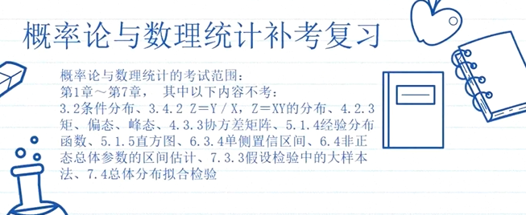
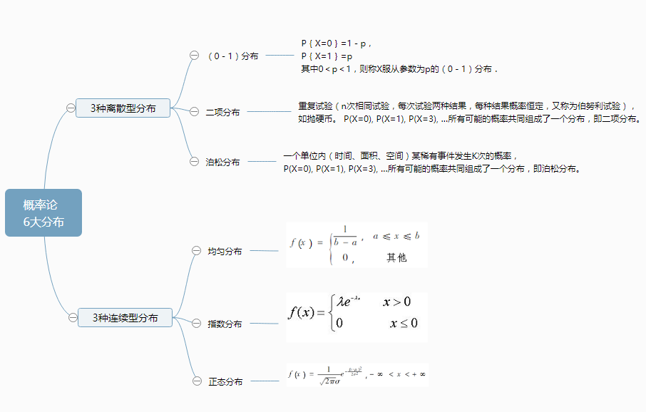
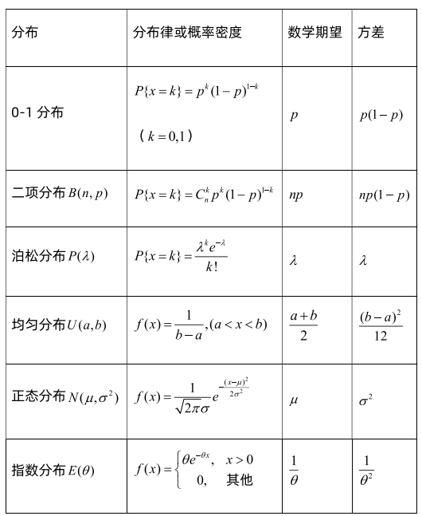

# 概率论

## 目录

-   [资料](#资料)
-   [范围](#范围)
-   [基本概念](#基本概念)
-   [数字特征](#数字特征)
-   [六大分布](#六大分布)
-   [极限定理](#极限定理)
-   [样本及抽样分布](#样本及抽样分布)
-   [参数估计](#参数估计)
-   [假设检验](#假设检验)
-   [其他](#其他)

## 资料

<http://media4.open.com.cn/l603/huashi/0809/gailvljc/index1.htm>

<https://space.bilibili.com/404193666>

<https://www.bilibili.com/video/BV1TJ411y7Zp>

[2小时过概率期末.pdf](file/2小时过概率期末_qZoZ0TiT_Y.pdf)

<https://www.bilibili.com/video/BV1er4y1D7Rz>

<https://www.bilibili.com/video/BV1Uq4y147Ts>

## 范围

***

6\(7Q\~@@333C`5Y\~8NPGI_F_4fpU3_4uAc.png)

# 基本概念

[事件关系与事件运算](事件关系与事件运算/事件关系与事件运算.md "事件关系与事件运算")

[条件概率与乘法公式](条件概率与乘法公式/条件概率与乘法公式.md "条件概率与乘法公式")

[两个模型](两个模型/两个模型.md "两个模型")

[全概率与贝叶斯](全概率与贝叶斯/全概率与贝叶斯.md "全概率与贝叶斯")

[独立](独立/独立.md "独立")

[分布函数、概率密度、分布律](分布函数、概率密度、分布律/分布函数、概率密度、分布律.md "分布函数、概率密度、分布律")

# 数字特征

[数学期望](数学期望/数学期望.md "数学期望")

[方差](方差/方差.md "方差")

[协方差](协方差/协方差.md "协方差")

[相关系数](相关系数/相关系数.md "相关系数")

# 六大分布

[0-1分布Bernoulli distribution](<0-1分布Bernoulli distribution/0-1分布Bernoulli distribution.md> "0-1分布Bernoulli distribution")

[二项分布Binomial distribution](<二项分布Binomial distribution/二项分布Binomial distribution.md> "二项分布Binomial distribution")

[泊松分布Poisson distribution](<泊松分布Poisson distribution/泊松分布Poisson distribution.md> "泊松分布Poisson distribution")

[均匀分布Uniform distribution](<均匀分布Uniform distribution/均匀分布Uniform distribution.md> "均匀分布Uniform distribution")

[正态分布Normal distribution](<正态分布Normal distribution/正态分布Normal distribution.md> "正态分布Normal distribution")

[指数分布Exponential distribution](<指数分布Exponential distribution/指数分布Exponential distribution.md> "指数分布Exponential distribution")

[几何分布](几何分布/几何分布.md "几何分布")

# 极限定理

[切比雪夫不等式Chebyshev不等式](切比雪夫不等式Chebyshev不等式/切比雪夫不等式Chebyshev不等式.md "切比雪夫不等式Chebyshev不等式")

[大数定理](大数定理/大数定理.md "大数定理")

[中心极限定理](中心极限定理/中心极限定理.md "中心极限定理")

# 样本及抽样分布

[三大分布](三大分布/三大分布.md "三大分布")

[正态总体下的抽样分布](正态总体下的抽样分布/正态总体下的抽样分布.md "正态总体下的抽样分布")

# 参数估计

[点估计](点估计/点估计.md "点估计")

[估计量的评选标准](估计量的评选标准/估计量的评选标准.md "估计量的评选标准")

[区间估计](区间估计/区间估计.md "区间估计")

# 假设检验

[假设检验](假设检验/假设检验.md "假设检验")

# 其他

[Gamma Function伽马函数](<Gamma Function伽马函数/Gamma Function伽马函数.md> "Gamma Function伽马函数")

[平方和公式](平方和公式/平方和公式.md "平方和公式")

[表](表/表.md "表")
