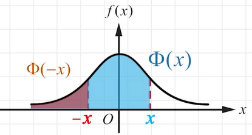
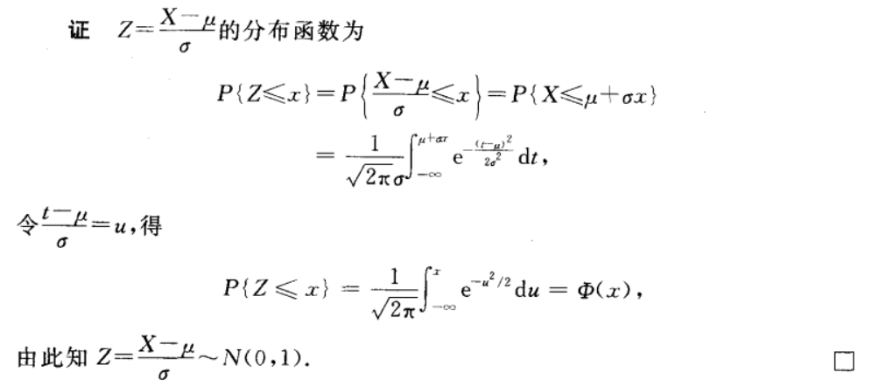
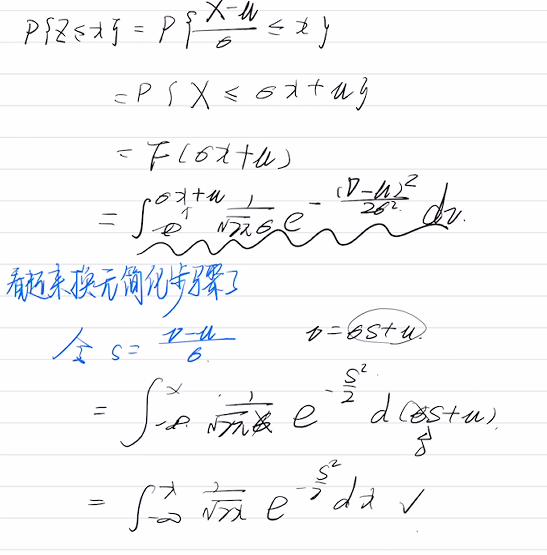
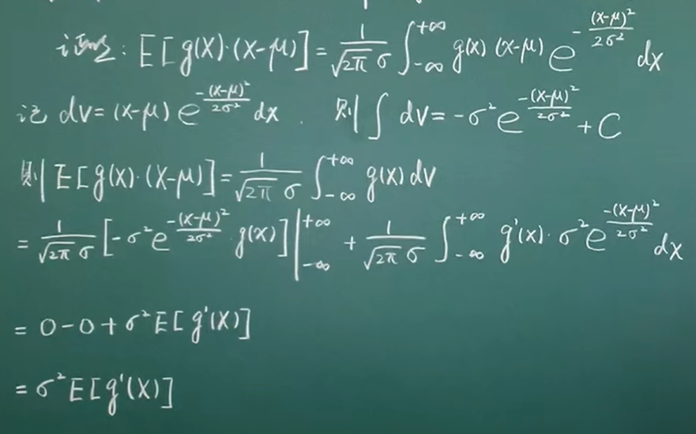
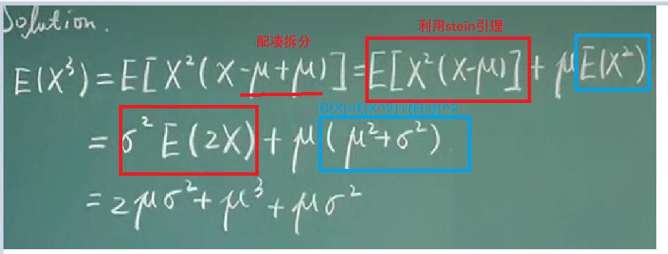

# 正态分布Normal distribution

## 目录

-   [正态分布](#正态分布)
    -   [【一维】
        X \sim N\left(\mu, \sigma^{2}\right) ](#一维X-sim-Nleftmu-sigma2right-)
        -   [概率密度](#概率密度)
        -   [概率计算公式](#概率计算公式)
        -   [性质](#性质)
        -   [标准正态分布](#标准正态分布)
            -   [概率密度](#概率密度)
            -   [分布函数](#分布函数)
            -   [证明：](#证明)
        -   [数学期望\mu](#数学期望mu)
        -   [方差\sigma^{2}](#方差sigma2)
        -   [k阶中心矩](#k阶中心矩)
            -   [【预备】stein引理](#预备stein引理)
            -   [高阶期望](#高阶期望)
            -   [中心矩与原点矩](#中心矩与原点矩)
    -   [【二维】(X, Y) \sim N\left(\mu *{1}, \mu*{2}, \sigma *{1}^{2}, \sigma*{2}^{2}, \rho\right)](#二维X-Y-sim-Nleftmu_1-mu_2-sigma_12-sigma_22-rhoright)
        -   [概率密度](#概率密度)
        -   [边缘概率密度](#边缘概率密度)
        -   [Cov(X,Y)](#CovXY)
    -   [\rho \_{XY}](#rho_XY)
-   [线性组合服从正态分布的两个条件](#线性组合服从正态分布的两个条件)
    -   [有限个相互独立的正态随机变量的线性组合仍然服从正态分布](#有限个相互独立的正态随机变量的线性组合仍然服从正态分布)
    -   [若（X,Y）服从二维正态，且X，Y独立，则Z=X，Y的线性组合 服从一维正态](#若XY服从二维正态且XY独立则ZXY的线性组合-服从一维正态)

# 正态分布

【一维】$ 
X \sim N\left(\mu, \sigma^{2}\right)  $
---------------------------------------

### 概率密度

$$
f(x)=\frac{1}{\sqrt{2 \pi} \sigma} e^{-\frac{(x-\mu)^{2}}{2 \sigma^{2}}}
$$

### 概率计算公式

根据不同的情况，给出下面三种公式：

$P(a<X \leq b)=\Phi\left(\frac{b-\mu}{\sigma}\right)-\Phi\left(\frac{a-\mu}{\sigma}\right)\\P(X \leq b)=\Phi\left(\frac{b-\mu}{\sigma}\right)\\P(X>a)=1-\Phi\left(\frac{a-\mu}{\sigma}\right)$

### 性质

$\Phi(x)+\Phi(-x)=1$

### 标准正态分布

#### 概率密度

$$
\varphi(x)=\frac{1}{\sqrt{2 \pi}} \mathrm{e}^{-t^{2} / 2}
$$

> ✒️注意一下分母上没有$\sigma$了

#### 分布函数

$$
\\\Phi(x)=\frac{1}{\sqrt{2 \pi}} \int_{-\infty}^{x} \mathrm{e}^{-t^{2} / 2} \mathrm{~d} t.\\\Phi(-x)=1-\Phi(x)
$$

#### 证明：

-   不太聪明的自己证明

    

### 数学期望$\mu$

先利用代换$Z=\frac{X-\mu}{\sigma}$标准化

$$
E(Z)=\frac{1}{\sqrt{2 \pi}} \int_{-\infty}^{\infty} t \mathrm{e}^{-t^{2} / 2} \mathrm{~d} t=\left.\frac{-1}{\sqrt{2 \pi}} \mathrm{e}^{-t^{2} / 2}\right|_{-\infty} ^{\infty}=0
$$

$$
E(X)=E(\mu+\sigma Z)=\mu
$$

**LL版本证明**

$\begin{aligned} E(x) & =\int_{-\infty}^{+\infty} x f_{x}(x) d x \\ & 
=\frac{1}{\sqrt{2 \pi} \sigma} \int_{-\infty}^{\infty} x \cdot e^{-\frac{(x-u)^{2}}{2 \sigma^{2}}} d x\\&
\overset{t=\frac{x-\mu}{\sigma}}{=} \frac{1}{\sqrt{2 \pi} \sigma} \int_{-\infty}^{+\infty}(\sigma t+\mu) e^{-\frac{t^{2}}{2}} \cdot \sigma d t\quad 使用了换元/正态分布的标准化\\
&=\frac{1}{\sqrt{2\pi}}\left[\sigma \int_{-\infty}^{+\infty} t e^{-\frac{t^{2}}{2}} d t+\mu \int_{-\infty}^{+\infty} e^{-\frac{t^{2}}{2}} d t\right]\quad 奇函数+偶\Gamma函数\\
&=\mu\end{aligned}$

> ✒️利用[Gamma Function伽马函数](<../Gamma Function伽马函数/Gamma Function伽马函数.md> "Gamma Function伽马函数")进行了求解化简
>
> $$
> \int_{0}^{+\infty} e^{-\frac{1}{2} x^{2}} d x \stackrel{{\text { 令 } x=\sqrt{2 t}}}{=} \frac{\sqrt{2}}{2}=\frac{\sqrt{2}}{2} \sqrt{\pi}=\frac{\sqrt{2 \pi}}{2}=\frac{\sqrt{2}}{2} \int_{0}^{+\infty} t^{\frac{1}{2}-1} e^{-t} d t=\frac{\sqrt{2}}{2} \Gamma\left(\frac{1}{2}\right)
> $$

### 方差$\sigma^{2}$

先利用代换$Z=\frac{X-\mu}{\sigma}$标准化

$$
\begin{aligned} D(Z) &=E\left(Z^{2}\right)=\frac{1}{\sqrt{2 \pi}} \int_{-\infty}^{\infty} t^{2} \mathrm{e}^{-t^{2} / 2} \mathrm{~d} t \\ &=\left.\frac{-1}{\sqrt{2 \pi}} t \mathrm{e}^{-t^{2} / 2}\right|_{-\infty} ^{\infty}+\frac{1}{\sqrt{2 \pi}} \int_{-\infty}^{\infty} \mathrm{e}^{-t^{2} / 2} \mathrm{~d} t=1 \end{aligned}
$$

$$
D(X)=D(\mu+\sigma Z)=D(\sigma Z)=\sigma^{2} D(Z)=\sigma^{2}
$$

LL版证明

$ 已知X \sim N\left(\mu, \sigma^{2}\right)，试求D(x)=?  $

$ 
\begin{aligned} D(X)&=E(X-E(X))^{2} \\ &=\int_{-\infty}^{\infty}(x-\mu)^{2} f_{x}(x) d x \\ &=\frac{1}{\sqrt{2\pi} \sigma} \int_{-\infty}^{\infty}(x-\mu)^{2} e^{-\frac{(x-\mu)^{2}}{2 \sigma^{2}}} d x \\ &\overset{t=\frac{x-\mu}{\sigma} }{=}\frac{1}{\sqrt{2\pi} \sigma} \int_{-\infty}^{+\infty} \sigma^{2} t^{2} e^{-\frac{t^{2}}{2}} \sigma d t \\ &=\frac{\sigma^{2}}{\sqrt{2\pi}} \int_{-\infty}^{\infty}(-t) d e^{-\frac{t^{2}}{2}} \\ &=\frac{\sigma^{2}}{\sqrt{2\pi}}\left[\left.e^{-\frac{t^{2}}{2}}\right|_{-\infty} ^{+\infty}-\int_{-\infty}^{+\infty} e^{-\frac{t^{2}}{2}} e^{-\frac{t^{2}}{2}} d(-t)\right] \\ &=\frac{\sigma^{2}}{\sqrt{2\pi}} \int_{-\infty}^{+\infty} e^{-\frac{t^{2}}{2}} d t\\&=\sigma^{2} \end{aligned}  $

### k阶中心矩

#### 【预备】stein引理

设$ X \sim N\left(\mu, \sigma^{2}\right)  $，且函数$g(x)$满足$E\left(\left|g^{\prime}(x)\right|\right)<+\infty$的可导函数，那么

$$
{E}[g(X)(X-\mu)]=\sigma^{2} {E}\left[g^{\prime}(X)\right]
$$

$$
\begin{aligned} {E}\left[g^{\prime}(X)\right] &=\int_{-\infty}^{+\infty} \frac{\partial g(x)}{\partial x} \mathcal{N}\left(x \mid \mu, \sigma^{2}\right) \mathrm{d} x \\ &\left.\stackrel{(a)}{=}\left[g(x) \mathcal{N}\left(x \mid \mu, \sigma^{2}\right)\right]\right|_{-\infty} ^{+\infty}-\int_{-\infty}^{+\infty} g(x) \frac{\partial \mathcal{N}\left(x \mid \mu, \sigma^{2}\right)}{\partial x} \mathrm{~d} x \\ &=\int_{-\infty}^{+\infty} \frac{(x-\mu)}{\sigma^{2}} g(x) \mathcal{N}\left(x \mid \mu, \sigma^{2}\right) \mathrm{d} x \\ &=\frac{1}{\sigma^{2}} {E}[g(X)(X-\mu)] \end{aligned}
$$

#### 高阶期望

<https://www.bilibili.com/video/BV175411P7Gf>

用了分部积分法

#### 中心矩与原点矩

<https://www.zhihu.com/question/47281337>

$总结一下, 设随机变量 X 服从正态分布 N\left(\mu, \sigma^{2}\right), 设其 k 阶中心矩为 A_{k}, k 阶原点矩为 B_{k}, \\k 为奇数时 A_{k}=0,\ \ \ \ \ \ \ k为偶数时 A_{k}=(k-1) \cdot(k-3) \cdots 1 \cdot \sigma^{k}; \\而 B_{k}=\sum_{i=0}^{k} C_{k}^{i} \mu^{k-i} A_{k}^{i}$

## 【二维】$(X, Y) \sim N\left(\mu_{1}, \mu_{2}, \sigma_{1}^{2}, \sigma_{2}^{2}, \rho\right)$

### 概率密度

$$
\begin{aligned} f(x, y)=& \frac{1}{2 \pi \sigma_{1} \sigma_{2} \sqrt{1-\rho^{2}}} \exp \left\{\frac{-1}{2\left(1-\rho^{2}\right)}\left[\frac{\left(x-\mu_{1}\right)^{2}}{\sigma_{1}^{2}}\right.\right.\\ &\left.\left.-2 \rho \frac{\left(x-\mu_{1}\right)\left(y-\mu_{2}\right)}{\sigma_{1} \sigma_{2}}+\frac{\left(y-\mu_{2}\right)^{2}}{\sigma_{2}^{2}}\right]\right\} \end{aligned}
$$

### 边缘概率密度

$$
f_{X}(x)=\frac{1}{\sqrt{2 \pi} \sigma_{1}} \mathrm{e}^{-\frac{\left(x-\mu_{1}\right)^{2}}{2 \sigma_{1}^{2}}}, \quad-\infty<x<\infty\\f_{Y}(y)=\frac{1}{\sqrt{2 \pi} \sigma_{2}} \mathrm{e}^{-\frac{\left(y-\mu_{2}\right)^{2}}{2 \sigma_{2}^{2}}}, \quad-\infty<y<\infty
$$

如果$ρ=0$,则XY相互**独立**，那么有

$$
f(x,y)=
f_{X}(x) f_{Y}(y)=\frac{1}{2 \pi \sigma_{1} \sigma_{2}} \exp \left\{-\frac{1}{2}\left[\frac{\left(x-\mu_{1}\right)^{2}}{\sigma_{1}^{2}}+\frac{\left(y-\mu_{2}\right)^{2}}{\sigma_{2}^{2}}\right]\right\}.
$$

> ✒️其中EXP是指以自然常数e为底的指数函数。

### $Cov(X,Y)$

$$
\begin{aligned} \operatorname{Cov}(X, Y)&=E[(X-E(X))(Y-E(Y))]\\&由E(Z)=E[g(X, Y)]=\int^{\infty}_{-\infty} \int^{\infty}_{-\infty} g(x, y) f(x, y) \mathrm{d} x \mathrm{~d} y\\&再强调一下\ 期望是一个数\\&= \int_{-\infty}^{\infty} \int_{-\infty}^{\infty}\left(x-\mu_{1}\right)\left(y-\mu_{2}\right) f(x, y) \mathrm{d} x \mathrm{~d} y \\&=\frac{1}{2 \pi \sigma_{1} \sigma_{2} \sqrt{1-\rho^{2}}} \int_{-\infty}^{\infty} \int_{-\infty}^{\infty}\left(x-\mu_{1}\right)\left(y-\mu_{2}\right) \\ & \times \exp \left[\frac{-1}{2\left(1-\rho^{2}\right)}\left(\frac{y-\mu_{2}}{\sigma_{2}}-\rho \frac{x-\mu_{1}}{\sigma_{1}}\right)^{2}-\frac{\left(x-\mu_{1}\right)^{2}}{2 \sigma_{1}^{2}}\right] \mathrm{d} y \mathrm{~d} x \end{aligned}
$$

$$
令 \left\{\begin{array}{l}t=\frac{1}{\sqrt{1-\rho^{2}}}\left(\frac{y-\mu_{2}}{\sigma_{2}}-\rho \frac{x-\mu_{1}}{\sigma_{1}}\right) \\ u=\frac{x-\mu_{1}}{\sigma_{1}}\end{array}\right.\\\Rightarrow\left\{\begin{array}{l}x=\sigma_{1} u+\mu_{1} \\ y=\left(\sqrt{1-\rho^{2}} t+\rho{u}\right) \sigma_{2}+\mu_{2}\end{array}\right.\Rightarrow\{\begin{array}{l}dx=\sigma_{1} d u \\ d y=\sqrt{1-\rho^{2}} \sigma_{2} d t\end{array}.
$$

$$
那么\begin{aligned} \operatorname{Cov}(X, Y)=& \frac{1}{2 \pi} \int_{-\infty}^{\infty} \int_{-\infty}^{\infty}\left(\sigma_{1} \sigma_{2} \sqrt{1-\rho^{2}} t u+\rho \sigma_{1} \sigma_{2} u^{2}\right) \mathrm{e}^{-\left(u^{2}+t^{2}\right) / 2} \mathrm{~d} t \mathrm{~d} u \\=& \frac{\rho \sigma_{1} \sigma_{2}}{2 \pi}\left(\int_{-\infty}^{\infty} u^{2} \mathrm{e}^{-\frac{u^{2}}{2}} \mathrm{~d} u\right)\left(\int_{-\infty}^{\infty} \mathrm{e}^{-\frac{t^{2}}{2}} \mathrm{~d} t\right) \\ &+\frac{\sigma_{1} \sigma_{2} \sqrt{1-\rho^{2}}}{2 \pi}\left(\int_{-\infty}^{\infty} u \mathrm{e}^{-\frac{u^{2}}{2}} \mathrm{~d} u\right)\left(\int_{-\infty}^{\infty} t \mathrm{e}^{-\frac{t^{2}}{2}} \mathrm{~d} t\right)\end{aligned}
$$

$$
因为\frac{\sigma_{1} \sigma_{2} \sqrt{1-\rho^{2}}}{2 \pi}\left(\int_{-\infty}^{\infty} u \mathrm{e}^{-\frac{u^{2}}{2}} \mathrm{~d} u\right)\left(\int_{-\infty}^{\infty} t \mathrm{e}^{-\frac{t^{2}}{2}} \mathrm{~d} t\right)是积分区域对称的奇函数\\所以\frac{\sigma_{1} \sigma_{2} \sqrt{1-\rho^{2}}}{2 \pi}\left(\int_{-\infty}^{\infty} u \mathrm{e}^{-\frac{u^{2}}{2}} \mathrm{~d} u\right)\left(\int_{-\infty}^{\infty} t \mathrm{e}^{-\frac{t^{2}}{2}} \mathrm{~d} t\right)=0
$$

$$
为什么\int_{-\infty}^{\infty} u^{2} \mathrm{e}^{-\frac{u^{2}}{2}} \mathrm{~d} u=\sqrt{2\pi}?
$$

<https://math.stackexchange.com/questions/2018926/i-int-0-infty-t2-e-t2-2-dt>

[Gamma Function伽马函数](<../Gamma Function伽马函数/Gamma Function伽马函数.md> "Gamma Function伽马函数")

$$
\int_{0}^{\infty} t^{2} e^{-t^{2} / 2} d t\\\\Let\ t^{2} / 2=s\\then, I=\sqrt{2} \int_{0}^{\infty} s^{1 / 2} e^{-s} d s\\\\\begin{array}{l}\\=\sqrt{2} \Gamma(3 / 2) \\\\=\sqrt{2} \frac{\sqrt{\pi}}{2} \\\\=\sqrt{\frac{\pi}{2}}\\\end{array}
$$

$$
\begin{aligned}所以Cov(X,Y)&=\frac{\rho \sigma_{1} \sigma_{2}}{2 \pi}\left(\int_{-\infty}^{\infty} u^{2} \mathrm{e}^{-\frac{u^{2}}{2}} \mathrm{~d} u\right)\left(\int_{-\infty}^{\infty} \mathrm{e}^{-\frac{t^{2}}{2}} \mathrm{~d} t\right)\\& =\frac{\rho \sigma_{1} \sigma_{2}}{2 \pi} \sqrt{2 \pi} \cdot \sqrt{2 \pi}\\&=\rho \sigma_{1} \sigma_{2}\end{aligned}
$$

## $\rho_{XY}$

$$
\rho_{X Y}=\frac{\operatorname{Cov}(X, Y)}{\sqrt{D(X)} \sqrt{D(Y)}}=\rho
$$

这就是说, 二维正态随机变量 (X, Y) 的概率密度中的参数$\rho$就是 X 和 Y 的 相关系数, 因而二维正态随机变量的分布完全可由 X, Y 各自的数学期望、方差 以及它们的相关系数所确定.

若 (X, Y) 服从二维正态分布, 那么 X 和 Y 相互独立的充要条件为$\rho$. 现在知道$  \rho=\rho_{X Y} $, 故知对于二维正态随机变量 (X, Y) 来 说,\*\* X 和 Y 不相关与 X 和 Y 相互独立是等价的\*\*.

# 线性组合服从正态分布的两个条件

#### **`有限个`****相互****`独立`****的****`正态`****随机变量的****`线性组合`****仍然服从****`正态分布`**

$若 X_{i} \sim N\left(\mu_{i}, \sigma_{i}^{2}\right)(i=1,2, \cdots, n) ，$$且它们相互独立, 则它们的和 Z=X_{1}+X_{2}+\cdots+X_{n}$

$$
Z \sim N\left(\mu_{1}+\mu_{2}+\cdots+\mu_{n}, \sigma_{1}^{2}+\sigma_{2}^{2}+\cdots+\sigma_{n}^{2}\right)
$$

$例 1 设 X 和 Y 是两个相互独立的随机变量. 它们都服从 N(0,1) 分布, 其 概率密度为\\\\\begin{array}{l}\\f_{X}(x)=\frac{1}{\sqrt{2 \pi}} \mathrm{e}^{-x^{2} / 2}, \quad-\infty<x<\infty, \\\\f_{Y}(y)=\frac{1}{\sqrt{2 \pi}} \mathrm{e}^{-y^{2} / 2}, \quad-\infty<y<\infty . \\\\\end{array}\\\\求 Z=X+Y 的概率密度.$

> ✒️这里配凑了一个平方数，并且使用了一次[Gamma Function伽马函数](<../Gamma Function伽马函数/Gamma Function伽马函数.md> "Gamma Function伽马函数")
>
> $$
> \int_{-\infty}^{\infty}e^{-t^2}dt=2\int_{0}^{\infty}e^{-t^2}dt=\int_{0}^{\infty}t^{\frac{1}{2}-1}e^{-t^2}dt^2=\Gamma(\frac{1}{2})=\sqrt{\pi}
> $$

#### 若（X,Y）服从二维正态，且X，Y独立，则Z=X，Y的线性组合 服从一维正态
