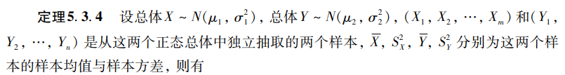
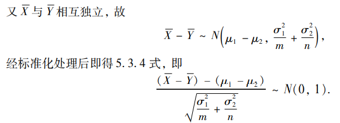
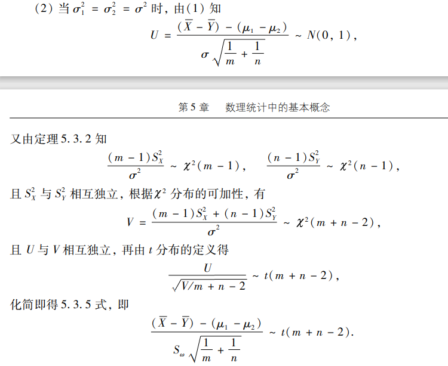
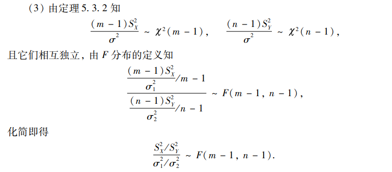
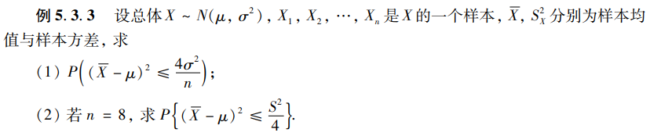
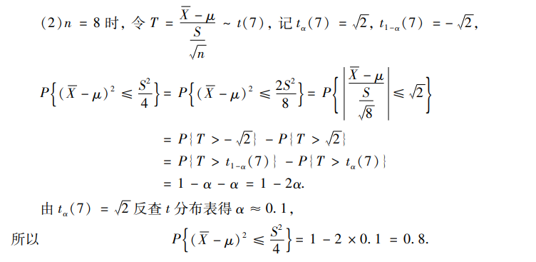
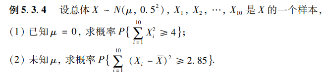
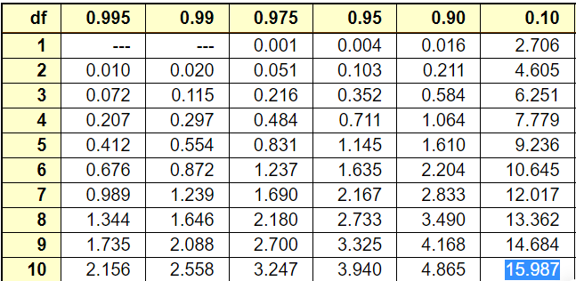
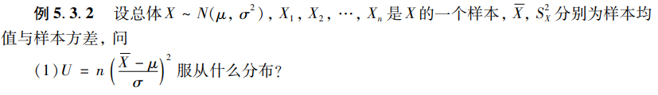
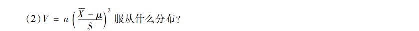

# 正态总体下的抽样分布

## 目录

-   [预备](#预备)
    -   [样本均值](#样本均值)
    -   [样本方差](#样本方差)
-   [一个正态分布总体](#一个正态分布总体)
    -   [\bar{X} \sim N\left(u, \red{\frac{\sigma^{2}}{n}}\right)](#barX-sim-Nleftu-redfracsigma2nright)
    -   [\frac{(n-1) S^{2}}{\sigma^{2}}=\frac{1}{\sigma^{2}} \sum *{i=1}^{n}\left(x*{i}-\bar{X}\right)^{2} \sim \chi^{2}(n-1)](#fracn-1-S2sigma2frac1sigma2-sum_i1nleftx_i-barXright2-sim-chi2n-1)
    -   [\bar X与S^2独立](#bar-X与S2独立)
-   [一个正态总体和一个\chi^2分布](#一个正态总体和一个chi2分布)
    -   [\frac{\bar{X}-\mu}{S} \sqrt{n} \sim t(n-1)](#fracbarX-muS-sqrtn-sim-tn-1)
-   [两个\chi^2分布](#两个chi2分布)
    -   [\frac{(\bar{X}-\bar{Y})-\left(\mu *{1}-\mu*{2}\right)}{\sqrt{\frac{\sigma *{1}^{2}}{m}+\frac{\sigma*{2}^{2}}{n}}} \sim N(0,1)](#fracbarX-barY-leftmu_1-mu_2rightsqrtfracsigma_12mfracsigma_22n-sim-N01)
        -   [当 \sigma *{1}^{2}=\sigma*{2}^{2}=\sigma^{2} 时](#当-sigma_12sigma_22sigma2-时)
    -   [\frac{\frac{S *{X}^{2}}{S*{Y}^{2}}}{\frac{\sigma *{1}^{2}}{\sigma*{2}^{2}}} \sim F(m-1, n-1).](#fracfracS_X2S_Y2fracsigma_12sigma_22-sim-Fm-1-n-1)
-   [例](#例)
    -   [考点1：根据分位点求值](#考点1根据分位点求值)
        -   [例1](#例1)
        -   [例2](#例2)
        -   [例3](#例3)
    -   [考点2：判断某一函数的分布](#考点2判断某一函数的分布)
        -   [例1](#例1)
        -   [例2](#例2)
        -   [例3](#例3)

<https://www.bilibili.com/video/BV1ot411y7mU?p=65>

> ✒️这一节需要和[区间估计](../区间估计/区间估计.md "区间估计")相结合

## 预备

### 样本均值

$$
\bar{X}=\frac{1}{n} \sum_{i=1}^{n} X_{i} \quad 
$$

### 样本方差

$$
S^{2}=\frac{1}{n-1} \sum_{i=1}^{n}\left(X_{i}-\bar{X}\right)^{2}
$$

$$
\begin{aligned} E\left(S^{2}\right) & =E\left[\frac{1}{n-1}\left(\sum_{i=1}^{n} X_{i}^{2}-n \bar{X}^{2}\right)\right]=\frac{1}{n-1}\left[\sum_{i=1}^{n} E\left(X_{i}^{2}\right)-n E\left(\bar{X}^{2}\right)\right] \\ & =\frac{1}{n-1}\left[\sum_{i=1}^{n}\left(\sigma^{2}+\mu^{2}\right)-n\left(\sigma^{2} / n+\mu^{2}\right)\right]=\sigma^{2},\end{aligned}
$$

$E\left(S^{2}\right)=\sigma^{2}$

## 一个正态分布总体

$设 X_{1}, X_{2}, \cdots, X_{n} 是正态总体 X \sim N\left(\mu, \sigma^{2}\right) 的样本$

### $\bar{X} \sim N\left(u, \red{\frac{\sigma^{2}}{n}}\right)$

$\Leftrightarrow$（标准化）

$$
\frac{\bar{X}-\mu}{\frac{\sigma}{\sqrt{n}}}=\frac{\bar{X}-\mu}{\sigma} \sqrt{n} \sim N(0,1)
$$

证明

$$
\begin{array}{l}E(\bar{X})=E\left(\frac{X_{1}+X_{2}+\cdots+X_{n}}{n}\right)=\frac{1}{n} \sum_{i=1}^{n} E\left(X_{i}\right)=\mu, \\ D(\bar{X})=D\left(\frac{X_{1}+X_{2}+\cdots+X_{n}}{n}\right)=\frac{1}{n^{2}} \sum_{i=1}^{n} D\left(X_{i}\right)=\frac{\sigma^{2}}{n},\end{array}
$$

> ✒️红色部分的理解：
>
> 当样本取的越多，方差就越小

### $\frac{(n-1) S^{2}}{\sigma^{2}}=\frac{1}{\sigma^{2}} \sum_{i=1}^{n}\left(x_{i}-\bar{X}\right)^{2} \sim \chi^{2}(n-1)$

> ✒️这玩意儿的证明不要求
>
> 在浙大版附录可见
>
> **但是为什么自由度是**$n-1$**呢？**
>
> 因为$\bar X=\frac{1}{n}(x_1+x_2+\cdots+x_n)$，增加了一个约束，所以自由度少了1

> ✒️这里需要和另一个结论做对比
>
> $$
> \frac{1}{\sigma^{2}} \sum_{i=1}^{n}\left(x_{i}-\mu\right)^{2}=\sum_{i=1}^{n}\left(\frac{x_{i}-\mu}{\sigma}\right)^{2}  \sim \chi^{2}(n)
> $$
>
> 这里用的是**总体期望**而不是**样本均值**
>
> 所以这玩意儿的自由度是n

### $\bar X$与$S^2$独立

## 一个正态总体和一个$\chi^2$分布

### $\frac{\bar{X}-\mu}{S} \sqrt{n} \sim t(n-1)$

由$\frac{\bar{X}-\mu}{\frac{\sigma}{\sqrt{n}}}=\frac{\bar{X}-\mu}{\sigma} \sqrt{n} \sim N(0,1)$，$\frac{(n-1) S^{2}}{\sigma^{2}}=\frac{1}{\sigma^{2}} \sum_{i=1}^{n}\left(x_{i}-\bar{X}\right)^{2} \sim \chi^{2}(n-1)$

根据$t$分布的定义有

$$
t(n) 分布：设 X \sim N(0,1), Y \sim \chi^{2}(n) ， X, Y 相互独立，则称 T=\frac{X}{\sqrt{Y / n}} \sim t(n).
$$

所以把两者其代入式子后不难得到

$$
\frac{\frac{\bar{X}-u}{\sigma} \sqrt{n}}{\sqrt{\frac{(n-1) S^{2}}{\sigma^{2}} / n-1}}=\frac{\bar{X}-\mu}{S} \sqrt{n} \sim t(n-1)
$$

> ✒️这里很精髓的就是比$n-1$而不是$n$。
>
> $n-1$可以相互约掉

## 两个$\chi^2$分布

### $\frac{(\bar{X}-\bar{Y})-\left(\mu_{1}-\mu_{2}\right)}{\sqrt{\frac{\sigma_{1}^{2}}{m}+\frac{\sigma_{2}^{2}}{n}}} \sim N(0,1)$

**证明：**

上面已经证明了：

$$
\bar{X} \sim N\left(\mu_{1}, \frac{\sigma_{1}^{2}}{m}\right), \bar{Y} \sim N\left(\mu_{2}, \frac{\sigma_{2}^{2}}{n}\right),
$$

#### $当 \sigma_{1}^{2}=\sigma_{2}^{2}=\sigma^{2} 时$

特别有：

$$
\frac{(\bar{X}-\bar{Y})-\left(\mu_{1}-\mu_{2}\right)}{S_{\omega} \sqrt{\frac{1}{m}+\frac{1}{n}}} \sim t(m+n-2)
$$

其中$S_{\omega}^{2}=\frac{(m-1) S_{X}^{2}+(n-1) S_{Y}^{2}}{m+n-2}, S_{\omega}=\sqrt{S_{\omega}^{2}}$'

-   证明

    

### $\frac{\frac{S_{X}^{2}}{S_{Y}^{2}}}{\frac{\sigma_{1}^{2}}{\sigma_{2}^{2}}} \sim F(m-1, n-1).$

证明：

## 例

### 考点1：根据分位点求值

#### 例1

$X \sim N\left(u, v^{2}\right). \bar{X} . S^{2} \quad n=16 \quad 求 k, P(\bar{X}>\mu+k S)=0.95.$

> ✒️题目里有$ \bar X  $和$ 
> S   $，所以应该采用公式
>
> $$
> \frac{\red{\bar X}-\mu }{\red{S}}\sqrt{n}\sim t(n-1)
> $$

$\begin{aligned}\\P(\bar{X}>\mu+k S) & =P\left(\frac{\bar{X}-u}{S} \sqrt{16}>\frac{u+k S-u}{S} \sqrt{16}\right) \\\\& =P\left(\frac{\bar{X}-u}{S} \cdot 4>4 k\right)=0.95\\\end{aligned}\\\\查上分位点得\quad 4 k=-1.753\quad k=0.438$

#### 例2

> ❗**做这题之前，要先做一下`考点2：例3`**

> ✒️一开始我把（1）当成$\left(\frac{\bar{X}-\mu}{\frac{\sigma}{\sqrt{n}}}\right)^{2} \sim \chi^{2}(1)$来做，结局好像表查不到
>
> 大概思路是，由我们熟悉的形式【考点2：例3（1）】出发
>
> $$
> \left(\frac{\bar{X}-\mu}{\frac{\sigma}{\sqrt{n}}}\right)^{2} \sim \chi^{2}(1)
> $$
>
> 然后变换待求公式为：
>
> $$
> P\left(\left(\frac{\bar X-\mu}{\frac{\sigma}{\sqrt{n}}}\right)^{2} \leq 4\right)
> $$
>
> 然后查表
>
> 然后把（2）当做$\left(\frac{\bar{X}-u}{S_{n}}\right)^{2} \sim F(1, n-1)$来做，但是F依然没法查表
>
> **但是显然书上变为正态分布的思路更优一点**
>
> **这也从侧面反应了**$\chi^2$**和**$N$**，**$t$**和**$F$**分布存在某种联系，把其去平方变绝对值可以互化两种形式**

$ 
(1) \begin{aligned} P\left((\bar{X}-\mu)^{2} \leqslant \frac{4 \sigma^{2}}{n}\right) & =P\left(|\bar{X}-\mu| \leqslant \frac{2 \sigma}{\sqrt{n}}\right)=P\left(\frac{|\bar{X}-\mu|}{\frac{\sigma}{\sqrt{n}}} \leqslant 2\right) \\ & =\Phi(2)-\Phi(-2)=2 \Phi(2)-1=0.9544\end{aligned} $

#### 例3

**(1)**

易知$\frac{1}{\sigma^{2}} \sum_{i=1}^{n}\left(x_{i}-\mu\right)^{2}=\sum_{i=1}^{n}\left(\frac{x_{i}-\mu}{\sigma}\right)^{2}  \sim \chi^{2}(n)$，统一形式后有

$$
P\left\{\sum_{i=1}^{10} X_{i}^2 \geqslant 4\right\}=P\left\{\sum_{i=1}^{10} \frac{(X_{i}-0)^2 }{0.5^{2}} \geqslant \frac{4}{0.5^{2}}\right\}=P\left\{\chi_{\alpha}^{2}(10) \geqslant 16\right\}
$$

查表有

有结论

$$
P\left\{\sum_{i=1}^{10} X_{i}^2 \geqslant 4\right\}=P\left\{\sum_{i=1}^{10} \frac{(X_{i}-0)^2 }{0.5^{2}} \geqslant \frac{4}{0.5^{2}}\right\}=P\left\{\chi_{\alpha}^{2}(10) \geqslant 16\right\}=0.1
$$

**(2)**

易知$\frac{(n-1) S^{2}}{\sigma^{2}}=\frac{1}{\sigma^{2}} \sum_{i=1}^{n}\left(x_{i}-\bar{X}\right)^{2} \sim \chi^{2}(n-1)$，统一形式后有

$$
P\left\{\sum_{i=1}^{10}\left(X_{i}-\bar{X}\right)^{2} \geqslant 2.85\right\}=P\left\{ \sum_{i=1}^{10}\frac{(X_{i}-\bar{X})^{2}}{0.5^{2}} \geqslant \frac{2.85}{0.5^{2}}\right\}=P\left\{\chi_{\alpha}^{2}(9) \geqslant 11.4\right\}
$$

查表有

其实没真查

有结论

$$
P\left\{\sum_{i=1}^{10}\left(X_{i}-\bar{X}\right)^{2} \geqslant 2.85\right\}=P\left\{ \sum_{i=1}^{10}\frac{(X_{i}-\bar{X})^{2}}{0.5^{2}} \geqslant \frac{2.85}{0.5^{2}}\right\}=P\left\{\chi_{\alpha}^{2}(9) \geqslant 11.4\right\}=0.25
$$

### 考点2：判断某一函数的分布

#### 例1

$ 已知X\sim N(\mu,\sigma^2)\quad 样本(X_1,X_2\cdots\red{X_{n+1}})\quad \bar X_n\quad S_n^2  $

$求\begin{array}{l}\frac{X_{n+1}-\bar{X}}{S_{n}} \sqrt{\frac{n}{n+1}} \text { 的分布 } \\\end{array}$

> ✒️观察形式有：
>
> $$
> \frac{正态-正态}{\sqrt{\chi^2}}*(\ )\sim t(\ )
> $$
>
> 所以关键就是去凑这个t分布

**分子**

$$
\left.\begin{array}{l}\bar{X} \sim N\left(\mu \cdot \frac{\sigma^{2}}{n}\right) \\ X_{n+1} \sim N\left(u, \sigma^{2}\right)\end{array}\right\} \Rightarrow X_{n+1}-\bar{X} \sim N\left(0,\left(1\red+\frac{1}{n}\right) \sigma^{2}\right)
$$

对其标准化有

$$
\frac{X_{n+1}-\bar{X}-0}{\sigma \sqrt{1+\frac{1}{n}}} \sim N(0,1)
$$

**分母**

由上文可知

$$
\frac{(n-1) S_{n}^{2}}{\sigma^{2}} \sim X^{2}(n-1)
$$

**套一下**$t$**分布公式**

所以不难得到

$$
\frac{\frac{X_{n+1}-\bar{X}}{\sigma \sqrt{\frac{(n+1)^{2}}{n}}}}{\sqrt{\frac{(n-1)\left(S_ n^{2}\right)}{\sigma^{2}} /(n-1)}}=\frac{X_{n+1}-\bar{X}}{S_{n}} \sqrt{\frac{n}{n+1}}\sim t(n-1)
$$

#### 例2

**根据**形式假设

$$
设 X=\frac{U}{\sqrt{\frac{V}{n}}},其中 U \sim N(0,1), V \sim \chi^{2}(n),UV独立
$$

**因**$U^{2} \sim \chi^{2}(1)$，所以

$$
X^{2}=\frac{U^{2}}{\frac{V}{n}}=\frac{\frac{U^{2}}{1}}{\frac{V}{n}} \sim F(1, n).
$$

#### 例3

$$
U=n\left(\frac{\bar{X}-\mu}{\sigma}\right)^{2}=\left(\frac{\bar{X}-\mu}{\frac{\sigma}{\sqrt{n}}}\right)^{2} \sim \chi^{2}(1)
$$

$$
易知\left(\frac{\bar{X}-\mu}{\frac{\sigma}{\sqrt{n}}}\right)^{2} \sim \chi^{2}(1)\quad \frac{(n-1) S_{n}^{2}}{\sigma^{2}} \sim \chi{2}(n-1)
$$

那么

$$
\frac{\left(\frac{\bar{X}-\mu}{\frac{\sigma}{\sqrt{n}}}\right)^{2} / 1}{\frac{(n-1) S_ n^{2}}{\sigma^{2}} /(n-1)}=\left(\frac{\bar{X}-u}{S_{n}}\right)^{2} \sim F(1, n-1)
$$
