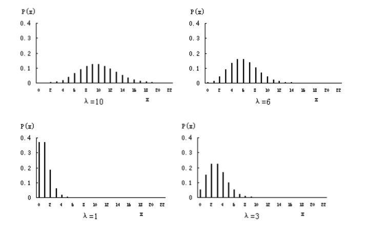
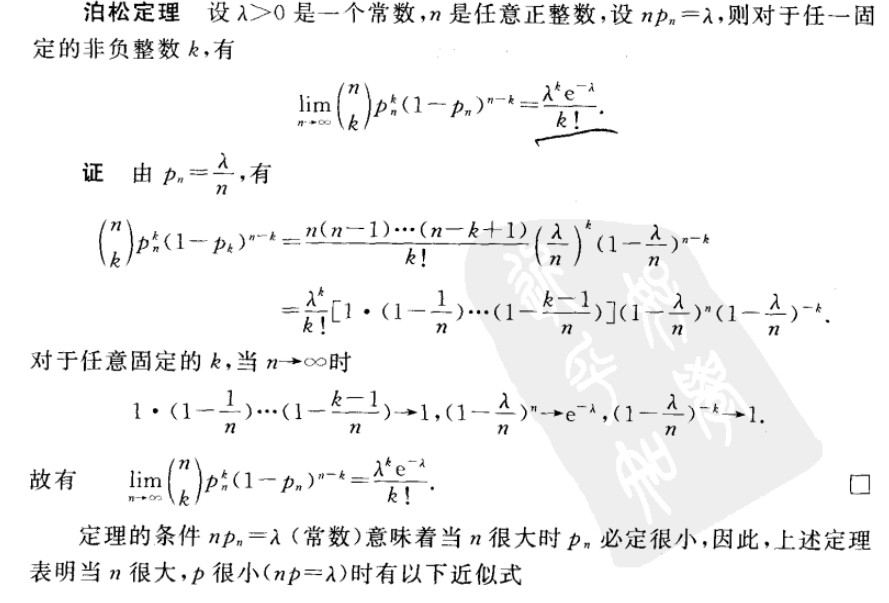
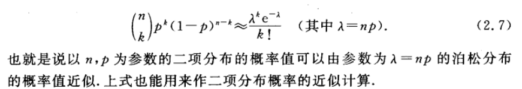
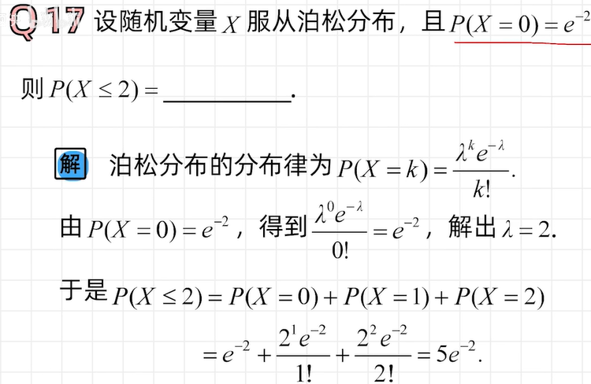

# 泊松分布Poisson distribution

## 目录

-   [泊松分布X \sim \pi(\lambda)](#泊松分布X-sim-pilambda)
    -   [概率密度？（存疑）](#概率密度存疑)
    -   [分布律](#分布律)
    -   [不同λ的分布图](#不同λ的分布图)
    -   [中心极限定理与正态分布](#中心极限定理与正态分布)
    -   [【泊松定理】泊松分布可以逼近二项分布](#泊松定理泊松分布可以逼近二项分布)
    -   [例](#例)
    -   [数学期望
        \lambda ](#数学期望lambda-)
    -   [方差](#方差)

# 泊松分布$X \sim \pi(\lambda)$

泊松分布，指在单位时间里（也可以是在时间t内），事件出现的次数，次数可以是x=0,1,2,……直至可数无穷次。

### 概率密度？（存疑）

$$
f(x ; \lambda)=\left\{\begin{array}{l}\lambda e^{-\lambda x}, x \geq 0 \\ 0, x<0\end{array}\right.
$$

### 分布律

$$
\mathrm{P}(\mathrm{X}=\mathrm{x})=\frac{e^{-\lambda} \lambda^{x}}{x !}\quad \forall x \geqslant 0
$$

### 不同λ的分布图

## 中心极限定理与正态分布

1.  中心极限定理1：把许多未知的小作用加起来看作一个变量，这个变量服从正态分布
2.  中心极限定理2：“大量统计独立的随即变量的和”的分布趋于正态分布

## 【泊松定理】**泊松分布可以逼近二项分布**

$若 X \sim B(n, p) ，当 n较大, p 较小时, X \sim \pi(n p).$

<https://zhuanlan.zhihu.com/p/26433704>

以某段时间内发生的交通事故次数为例

我们把这段时间记为\[0,1),取一个很大的自然数n,将时间段等分为n段，记$l_{i}=\left[\frac{i-1}{n}, \frac{i}{n}\right)$。

假定：

1.  在每段小区间内，发生一次事故的概率与时长$\frac{1}{n}$成正比，取比例系数为$\lambda$，即，每段小区间内发生一次事故的概率为$\frac{\lambda}{n}$。又因为，n很大，而每段小区间时间很短，所以在每段小区间内至多发生一次事故，因此，不发生事故的概率为$1-\frac{\lambda}{n}$。
2.  每段小区间内是否发生事故是相互独立的。

如果设随机变量X为在 \[0,1)时间段内发生事故的总次数，则X不仅服从泊松分布，而且服从二项分布，那么：

$$
\mathrm{X} \sim B\left(\mathrm{n}, \frac{\lambda}{n}\right), \mathrm{P} \quad(\mathrm{X}=\mathrm{i})=c_{n}^{i}\left(\frac{\lambda}{n}\right)^{i}\left(1-\frac{\lambda}{n}\right)^{n-i}\tag{1}
$$

$$
令 n \rightarrow \infty, 则,\frac{c_{n}^{i}} { n^{i}}=\frac{n !}{i !(n-i) ! n^{i}}=\frac{1}{i !}\tag{2}
$$

$$
\lim _{n \rightarrow \infty}\left(1-\frac{\lambda}{n}\right)^{n}=\lim _{n \rightarrow \infty} \left(1-\frac{1}{\frac{n}{\lambda}}\right)^{\frac{n}{\lambda} \lambda}=e^{-\lambda}\tag{3}
$$

其中(3)式应用了这个这个式子

$$
\lim _{n \rightarrow \infty}\left(1-\frac{1}{n}\right)^{n}=\frac{1}{e}
$$

将上述（2），（3）式代入（1）式，二项分布概率分布表达式即化为泊松分布概率分布表达式。

> ✒️条件存在隐含结论：n逼近无穷，p很小时，表示i逼近n的可能性几乎为0，因此n-i可以直接替换为n。

浙大版《概率论与数理统计》**泊松分布可以逼近二项分布**

> ✒️\*\*`泊松分布`****与****`二项分布`\*\***的区别？**
>
> 泊松分布与二项分布类似，但**泊松分布是在不知道事件的可能发生总次数的情况下对小概率事件建模**。泊松分布的建模对象是十字路口的事故发生次数，而二项分布的建模对象是事故发生次数与经由十字路口的汽车数量之间的相对关系。

## 例

***

<https://blog.csdn.net/saltriver/article/details/52969014>

[数学期望](../数学期望/数学期望.md "数学期望")$ 
\lambda  $
----------

$$
\begin{aligned}E(x)&=\sum_{k=0}^{\infty} k \frac{\lambda^{k}}{k !} e^{-\lambda} \\ &=e^{-\lambda} \sum_{k=1}^{\infty} k \frac{\lambda^{k}}{k !} \\ &=\lambda e^{-\lambda} \sum_{k=1}^{\infty} \frac{\lambda^{(k-1)}}{(k-1) !} \\& \stackrel{k-1 \rightarrow k}{=} \lambda e^{-\lambda} \sum_{k=0}^{\infty} \frac{\lambda^k}{k !} \\ &\overset{e^{x}=\sum_{n=0}^{\infty} \frac{x^{n}}{n !}}=\lambda e^{-\lambda} \cdot e^{\lambda}\\&=\lambda \\\end{aligned}
$$

## [方差](../方差/方差.md "方差")

$$
\begin{aligned}
E(X^2)&=\sum_{x=0}^{\infty} x^{2} \cdot \frac{\lambda^{k} e^{-\lambda}}{x !}
\\&=\lambda e^{-\lambda} \sum_{x=1}^{\infty} \frac{x \lambda^{x-1}}{(x-1) !}
\\&=\lambda e^{-\lambda} \sum_{x=1}^{\infty} \frac{(x-1+1) \lambda^{x-1}}{(x-1) !}\quad 这个拆分很关键
\\&=\lambda e^{-\lambda}\left(\sum_{m=0}^{\infty} \frac{m \cdot \lambda^{m}}{m !}+\sum_{m=0}^{\infty} \frac{\lambda^{m}}{m !}\right)(m=x-1) 
\\&=\lambda e^{-\lambda}\left(\lambda \cdot \sum_{m=1}^{\infty} \frac{\lambda^{m-1}}{(m-1) !}+\sum_{m=0}^{\infty} \frac{\lambda^{m}}{m !}\right) 
\\&=\lambda e^{-\lambda}\left(\lambda e^{\lambda}+e^{\lambda}\right)
\\&=\lambda(\lambda+1)
\end{aligned}
$$

$$
D(x)=\lambda^{2}+\lambda-\lambda^{2}=\lambda
$$
