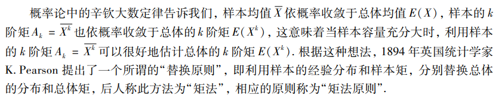
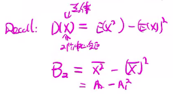
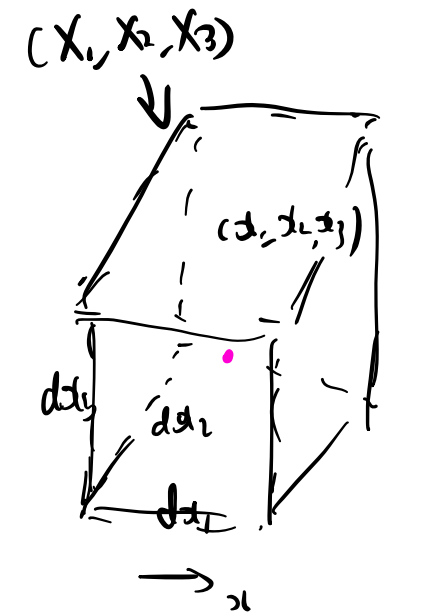
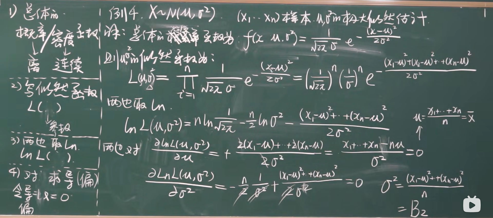
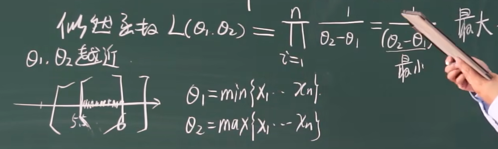

# 点估计

## 目录

-   [一般问题提法：](#一般问题提法)
    -   [估计量\hat \theta(x\_1,x\_2,\dots,x\_n)](#估计量hat-thetax_1x_2dotsx_n)
    -   [估计值](#估计值)
-   [两种常用的构造估计量的方法:三部曲](#两种常用的构造估计量的方法三部曲)
-   [矩估计法](#矩估计法)
    -   [预备](#预备)
        -   [总体X
            &#x20;的前k阶中心矩](#总体X-的前k阶中心矩)
        -   [样本k阶中心矩](#样本k阶中心矩)
        -   [总体X的k阶原点矩](#总体X的k阶原点矩)
        -   [样本k阶原点矩](#样本k阶原点矩)
    -   [1.为什么可以矩估计?](#1为什么可以矩估计)
        -   [矩估计是什么？](#矩估计是什么)
        -   [使用辛钦大数定理(三部曲)](#使用辛钦大数定理三部曲)
    -   [2.如何做矩估计？](#2如何做矩估计)
    -   [3.例子](#3例子)
        -   [3.1均匀分布](#31均匀分布)
            -   [3.1.1设总体 X \sim U(0, \theta), \theta>0 末知, X *{1}, X*{2}, \cdots, X \_{n} 为来自总体 X 的样本\求 参数 \theta 的矩估计量.](#311设总体-X-sim-U0-theta-theta0-末知-X_1-X_2-cdots-X_n-为来自总体-X-的样本求-参数-theta-的矩估计量)
            -   [3.1.2已知X\sim U (a,b),
                &#x20;X\_1 \dots X\_n样本，用样本估计a,b两个参数](#312已知Xsim-U-ab-X_1-dots-X_n样本用样本估计ab两个参数)
        -   [3.2正态分布/类型未知](#32正态分布类型未知)
            -   [3.2.1已知总体
                X  (类型未知）或者X\sim N(\mu,\sigma^2)，E(X)=\mu，D(X)=\sigma^2存在,且\sigma^2>0,但\mu和\sigma未知，已知样本(X\_1 \dots X\_n)，求\mu和\sigma^2的矩估计量](#321已知总体X--类型未知或者Xsim-Nmusigma2EXmuDXsigma2存在且sigma20但mu和sigma未知已知样本X_1-dots-X_n求mu和sigma2的矩估计量)
        -   [3.3泊松分布](#33泊松分布)
        -   [3.4指数分布](#34指数分布)
        -   [3.5二项分布](#35二项分布)
-   [极大似然估计法](#极大似然估计法)
    -   [1为什么可以估计？](#1为什么可以估计)
        -   [1.1极大似然原理](#11极大似然原理)
        -   [1.2极大似然函数](#12极大似然函数)
        -   [1.3极大似然估计法](#13极大似然估计法)
    -   [2.如何做极大似然估计？](#2如何做极大似然估计)
        -   [简化计算：对数似然方程](#简化计算对数似然方程)
        -   [步骤](#步骤)
            -   [1.写出分布律/概率密度](#1写出分布律概率密度)
            -   [2.写出似然函数](#2写出似然函数)
            -   [3.取对数](#3取对数)
            -   [4.求导/求偏导（或者放缩）](#4求导求偏导或者放缩)
            -   [4.解方程组](#4解方程组)
    -   [3.离散](#3离散)
        -   [3.1二项分布](#31二项分布)
            -   [3.1.1分布律](#311分布律)
            -   [3.1.2似然函数](#312似然函数)
            -   [3.1.3对数似然方程](#313对数似然方程)
            -   [3.1.4求导](#314求导)
            -   [3.1.5得到最大似然估计量（大写）](#315得到最大似然估计量大写)
            -   [\*3.1.6如果用矩估计法结果是什么呢？](#316如果用矩估计法结果是什么呢)
    -   [4.连续](#4连续)
        -   [4.1泊松分布](#41泊松分布)
            -   [4.1.1分布律](#411分布律)
            -   [4.1.2 似然函数](#412-似然函数)
            -   [4.1.3取对数](#413取对数)
            -   [4.1.4求导，解方程](#414求导解方程)
            -   [4.1.5 大写](#415-大写)
            -   [\*4.1.6矩估计量：](#416矩估计量)
        -   [4.2 正态分布](#42-正态分布)
            -   [4.2.1 概率密度](#421-概率密度)
            -   [4.2.2 似然函数](#422-似然函数)
            -   [4.2.3 取对数](#423-取对数)
            -   [4.2.4 求偏导，解方程](#424-求偏导解方程)
            -   [4.2.5 大写](#425-大写)
            -   [\*4.2.6 矩估计](#426-矩估计)
        -   [4.3均匀分布](#43均匀分布)
            -   [4.3.1分布律](#431分布律)
            -   [4.3.2似然函数](#432似然函数)
            -   [4.3.3 取对数](#433-取对数)
            -   [4.3.4 求偏导](#434-求偏导)
            -   [4.3.5 放缩](#435-放缩)

<https://www.bilibili.com/video/BV1ot411y7mU?p=67>

# 一般问题提法：

设总体$X$的分布函数$ F(x;\theta)  $的形式已知，$\theta$是\*\*`待估参数`**，$X_1,X_2\dots,X_n$是$ 
X   $的一个**`样本`\*\*，$x_1,x_2,\dots,x_n$是相应的一个`样本值`

点估计就是要构造一个适当的\*\*`统计量`\*\*$\hat \theta(X_1,X_2\dots,X_n)$，来近似的求出`待估参数`$\theta$

### 估计量$\hat \theta(x_1,x_2,\dots,x_n)$

是一个`样本`的`函数`

> ✒️带尖的都是估计值

### 估计值

是对于估计量不同样本值计算出来的一个值

> ✒️在不引起混淆的情况下，这\*\*`估计量`**和**`估计值`**都可以被统称为**`估计`\*\*

> ✒️这些方法实际上都在试图用样本的局部信息去恢复总体信息

# 两种常用的构造`估计量`的方法:三部曲

1.  为什么
2.  如何做
3.  一些例子

# 矩估计法

## 预备

**总体的矩**

**样本的矩**

### 总体\$ X

$的前$k\$阶`中心矩`

### 样本$k$阶`中心矩`

$$
\mu_k=E(X-E(X))^k
$$

$$
B_{k}=\frac{1}{n} \sum_{i=1}^{n}\left(X_{i}-\bar{X}\right)^{k}, k=2,3, \cdots
$$

### 总体$X$的$k$阶\*\*`原点矩`\*\*

$$
\red{\nu_k}=E(X-0)^k=\red{E(X^k)}
$$

### 样本$k$阶\*\*`原点矩`\*\*

$$
\red{A_{k}=\overline {X^k}}=\frac{1}{n} \sum_{i=1}^{n} X_{i}^{k}, k=1,2, \cdots
$$

> ✒️注意区别
>
> $$
> S^{2}=\frac{1}{n-1} \sum_{i=1}^{n}\left(X_{i}-\bar{X}\right)^{2}
> $$

## 1.为什么可以矩估计?

#### 矩估计是什么？

**用**\*\*`样本`****的**$k$**`阶原点矩`****来估计****`总体`**$ 
X   $**`的`**$ k  $**`阶原点矩`\*\*

$$
A_{k} \stackrel{P}{\longrightarrow} \nu_{k}
$$

> ✒️也可以
>
> **用**\*\*`样本`****的**$k$**`阶中心矩`****来估计****`总体`**$ 
> X   $**`的`**$ k  $**`阶中心矩`\*\*
>
> $$
> B_k\overset{P}\rightarrow\mu_k
> $$
>
> 但是不知道为什么书上用的是原点矩估计，应该是考虑到计算比较简单
>
> 这个符号也很奇怪，只有LL用$\nu$代表原点矩，浙大和学校书上都用的是$\mu$

#### 使用辛钦大数定理(三部曲)

1.  **对象**$X_1^k\dots X_n^k$
    $$
    A_{k}=\frac{1}{n} \sum_{i=1}^{n} X_{i}^{k}
    $$
2.  **条件**
    1.  独立&#x20;

        $X_1,X_2 \dots X_n$独立$\Rightarrow$$X_1^k,\dots,X_n^k$独立✅
    2.  同分布

        $X_i\sim X$（总体）

        $\Rightarrow X_i^k \sim X^k$

        $ \Rightarrow X_i^k  $同分布✅
    3.  数学期望存在

        $ 
        E(X_i^k)=E(X^k)  $已知存在✅
3.  **结论**

$$
A_{p} \stackrel{P}{\rightarrow} E\left(X^{k}\right)=\nu_{k}, \quad \forall k \geqslant 1
$$

## 2.如何做矩估计？

若$X\sim F_X(x;\theta_1,\dots,\theta_k)$且总体$X$前$k$阶矩存在(即$\nu_i(1≤i≤k)$存在)

$$
\left\{\begin{array}{l}A_1=\nu_1\\\dots\\A_k=\nu_k\end{array}\right. 
$$

因为由辛钦大数定理有：

$$
A_{p} \stackrel{P}{\rightarrow} E\left(X^{k}\right)=\nu_{k}, \quad \forall k \geqslant 1
$$

所以

通过解上述方程组，可以求解得$\theta_1,\dots,\theta_k$的`矩估计`

> ✒️**有多少阶未知数，需要用多少阶中心矩/原点矩来估计**
> 究竟是用中心矩还是原点矩呢？

## 3.例子

### 3.1均匀分布

#### 3.1.1$设总体 X \sim U(0, \theta), \theta>0 末知, X_{1}, X_{2}, \cdots, X_{n} 为来自总体 X 的样本\\求 参数 \theta 的矩估计量.$

解：

易得

$$
 E(X)=\frac{\theta}{2}
$$

构造方程

$$
\\A_{1}=E(X)
$$

可以解得

$$
\hat{\theta}=2 \bar{X}
$$

则$X\sim U(0,2\bar X)$

#### 3.1.2已知\$ X\sim U (a,b),

\$\$X\_1 \dots X\_n$样本，用样本估计$a,b\$两个参数

有多少未知数，需要用多少阶中心矩来估计

已知

$$
\begin{aligned} \nu_{1}=\red{E(X) }& =\frac{a+b}{2} \\ \nu_{2}=\red{E\left(X^{2}\right)} & \red{=D(X)+(E(X))^{2} }\\ & =\frac{(b-a)^{2}}{12}+\left(\frac{a+b}{2}\right)^{2}\end{aligned}
$$

那么

$$
\left\{\begin{array}{l}E(X)=A_{1}=\bar{X} \\ E\left(X^{2}\right)=A_{2}=\overline{X^{2}}\end{array} \Leftrightarrow\right\{\begin{array}{l}\frac{a+b}{2}=\bar{X} \\ \frac{(b-a)^{2}}{12}+\left(\frac{a+b}{2}\right)^{2}=\overline{X^{2}}\end{array} \Leftrightarrow\left \{ \begin{array}{l}a+b=2 \bar{X} \\ \frac{(b-a)^{2}}{12}=\overline{X^{2}}-(\bar{X})^{2}=B_{2}\end{array}\right.
$$

$$
 \Leftrightarrow\left\{\begin{array}{l}b+a=2 \bar{X} \\ (b-a)^{2}=12 B_{2}\end{array} \Leftrightarrow\left\{\begin{array}{l}b+a=2 \bar{X} \\ b-a=2 \sqrt{3B_{2}}\end{array} \Leftrightarrow \left \{ \begin{array}{l}\hat{a}=\bar{X}-\sqrt{3 B_{2}} \\ \hat{b}=\bar{X}+\sqrt{3 B_{2}}\end{array}\right.\right.\right.
$$

> ✒️特别有$B_2=\overline{X^2}-(\bar X)^2$
>
> $ \begin{aligned}
> B_2&=\frac{1}{n}\sum_{i=1}^n(X_i-\bar X)^2
> \\&=\frac{1}{n}\sum_{i=1}^n(X_i^2-\bar X^2)
> \\&=(\frac{1}{n}\sum_{i=1}^nX_i^2)-(\frac{1}{n}\sum_{i=1}^n\bar X^2)
> \\&=\overline{X^2} -\frac{1}{n}n\bar X^2
> \\&=\overline{X^2} -\bar X^2
> \end{aligned}  $
>
> 利用了结论：$\sum_{i=1}^{n} (X_{i}^{2}-\bar{X}^{2})=\sum_{i=1}^{n}\left(X_{i}-\bar{X}\right)^{2}$
>
> 证明：
>
> $\begin{aligned}\sum_{i=1}^{n}\left(X_{i}-\bar{X}\right)^{2}&=\sum_{i=1}^{n}\left(X_{i}^{2}-2 X_{i} \bar{X}+\bar{X}^{2}\right)\\&=(\sum X_{i}^{2})-2 \bar{X} \sum X_{i}+n\bar X^2\\&=(\sum X_{i}^{2})-2 \bar{X}n\bar X+n\bar X^2
> \\&=(\sum X_{i}^{2})-\bar nX
> \\&=\sum_{i=1}^{n} (X_{i}^{2}-\bar{X}^{2})
> \end{aligned}$

### 3.2正态分布/类型未知

#### 3.2.1已知总体\$

X   $(类型未知）或者$X\sim N(\mu,\sigma^2)，\$\$E(X)=\mu$，$D(X)=\sigma^2$存在,且$\sigma^2>0$,但$\mu和\sigma$未知，已知样本$(X\_1 \dots X\_n)$，求$\mu$和$\sigma^2\$的矩估计量

两个未知量未知（$\mu和\sigma)$$\Rightarrow$计算总体的前二阶原点矩

$$
E(X)=u\\E(X^2)=D(X)+(E(X))^{2}=\sigma^{2}+u^{2}
$$

令

$$
  \left\{\begin{array}{l}E(X)=\bar{X} \\ E\left(X^{2}\right)=\overline{X^{2}}\end{array} \Leftrightarrow\left\{\begin{array}{l}\mu=\bar{X} \\ \sigma^{2}+\mu^{2}=\overline{X^{2}}\end{array} \Leftrightarrow\left\{\begin{array}{c}\mu=\bar{X} \\ \sigma^{2}=\overline{X^{2}}-(\bar{X})^{2}=B_{2}\end{array}\right.\right.\right.
$$

$$
\Rightarrow\left\{\begin{array}{l}\hat{u}=\bar{X} \\ \hat{{\sigma}^{2}}=B_{2}\end{array}\right.
$$

> ✒️**总体有差的矩估计量是样本的二阶中心距，不是样本方差**$ S^2
>   $
>
> 这个可以在[估计量的评选标准](../估计量的评选标准/估计量的评选标准.md "估计量的评选标准")中得到证明

### 3.3泊松分布

$X\sim P(\lambda)$、

利用一阶原点矩可以估计

$$
E(X)=\lambda=\bar{X}
$$

所以有

$$
\hat \lambda=\bar X 
$$

> ✒️但是我们也可以用二阶原点矩来估计
>
> $\begin{array}{l}E(X)=\lambda=\bar{X} \\ E\left(X^{2}\right)=\lambda+\lambda^{2}=\overline{X^{2}} \\ \therefore \hat\lambda=\overline{X^{2}}-\bar{X}^{2}=B_{2}\end{array}$
>
> 这两者的估计结果显然是不等的
>
> 那么一定有哪个更准确的问题
>
> 这个判断在下一节有更详细的解释

### 3.4指数分布

$X\sim E(\theta)$

$$
E(X)=\theta=\bar X 
$$

显然有

$$
\hat \theta=\bar X 
$$

### 3.5二项分布

$X\sim B(n,p)$

$$
\left\{\begin{aligned} E(X)= & n p \\ E\left(X^{2}\right) & =D(X)+[E(X)]^{2} \\ & =n p(1-p)+\left[E(X)^{2}\right]\end{aligned}\right.
$$

故有

$$
q=\frac{n p q}{n p}=\frac{\bar{X}^{2}-(\bar{X})^{2}}{\bar{X}} \\ p=1-\frac{\bar{X}^{2}-(\bar{X})^{2}}{\bar X}=1-\frac{B_2}{\bar X}\\n=\frac{\bar X^2}{\bar X^2-B_2}
$$

> ✒️书上用了一个奇奇怪怪的$S_m$,咱也不懂，咱也不明白
>
> 宋浩和LL都引入了$B_2$
>
> 浙大版本甚至啥也没引入，就用的$\bar X$和$\overline {X^2}$

# 极大似然估计法

## 1为什么可以估计？

### 1.1极大似然原理

> 一次试验中发生的事件"应该“是概率最大的那个事件
>
> **极大似然原理**是指：若一次试验有$ 
> n  $个可能结果$ 
>  A_1,A_2,...,A_n  $现在我们做一次试验，试验的结果为$ 
> A_i  $，那么我们就可以认为事件 $ 
> A_i  $在这个$ 
> n  $个可能结果中出现的概率最大。

> ✒️师娘统计了LL晚回家的原因：加班0.1 堵车0.2 泡吧0.7
>
> 当LL再一次晚回家的时候，师娘大人认为LL一定是去泡吧了！

> ✒️LL有一天晚回家了，经过师娘的盘问之后，发现LL其实是去泡吧了
>
> 所以师娘大人得出结论：LL回家晚最可能的原因，其实是泡吧！

### 1.2极大似然函数

假设对于总体$X\sim P(x;\theta)$,我们进行了某一次实验，得到了一组离散型样本值$x_1,x_2\dots,x_n$，那么由极大似然原理，若我们有这样一个$\hat \theta(x_1,x_2\dots,x_n)$可以使$ 
P\{X_1=x_1,X_2=x_2\dots,X_n=x_n\}  $最大，那么我们称$\hat \theta$为$ 
\theta
  $的极大似然估计值

而这个$ 
P\{X_1=x_1,X_2=x_2\dots,X_n=x_n\}  $可以化简为：

$$
\begin{aligned}P\{X_1=x_1,X_2=x_2\dots,X_n=x_n\} 
&\overset{独立}= \prod_{i=1}^nP\{X_i=x_i\}\\\color{Blue}同分布：X_i\sim X\Rightarrow P\{X_i=x_i\}=P\{X=x_i\}\\&\overset{同分布}=\prod_{i=1}^nP\{X=x_i\}\\&=\prod_{i=1}^nP(x_i,\theta)\end{aligned}
$$

于是我们有极大似然函数的定义

$$
L(\theta)=L\left(x_{1}, x_{2}, \cdots, x_{n} ; \theta\right)=\prod_{i}^{n} p\left(x_{i} ; \theta\right), \theta \in \Theta.
$$

### 1.3极大似然估计法

> **极大似然估计**是指：在一次抽样中，样本出现的概率是关于参数$\theta$的函数，若在一些试验中，得到观测值 $x_1,x_2\dots x_n$则我们可以选取$\hat \theta(x_1,x_2\dots x_n)$作为$\theta$的估计值，使得当 $\theta=\hat \theta(x_1,x_2\dots x_n)$时，样本出现的概率最大。而极大似然估计就是要求解出参数$ \theta  $的估计值。可采用**极大似然估计法**。

**当试验完成之后，利用样本观察值代入**\*\*`似然函数`****，此时求\*\*$L(\theta)$**的**\*\*`极大值点`****，作为\*\*$\theta$**的估计，这就是极大似然估计法**

且此时我们称

$\hat \theta(x_1,\dots,x_n)$为`极大似然估计值`

$\theta(X_1,\dots X_n)$为`极大似然估计量`

在不引起混淆的情况下，我们统称两者为`极大似然估计`

## 2.如何做极大似然估计？

**确定最大似然估计量的问题可以归结为函数**$L(\theta)$**在微分学中的求最大值的问题了。**

在很多情形下,如果 $ p(x ; \theta)  $和$ 
 $$f(x ; \theta) $关于$ \theta
  $可微，那么$\hat \theta$常可从方程

$$
\frac{\mathrm{d}}{\mathrm{d} \theta} L(\theta)=0
$$

解得。

### 简化计算：对数似然方程

为了进一步简化方程的求解，我们可以注意到，$L(\theta)$和$\ln L(\theta)$在同一$ \theta  $处取到极值，所以我们可以转而其`对数似然方程`的解

$$
\frac{\mathrm{d}}{\mathrm{d} \theta} \ln L(\theta)=0
$$

当有多个待求变量的时候，我们可以转为求`对数似然方程组`

### 步骤

#### 1.写出分布律/概率密度

离散：

$$
P(X=x ; 参数表)
$$

连续：

$$
f_{X}(x,参数表)
$$

> ✒️因为这里的参数都还没有被估计出来，所以要作为变量写在函数中

#### 2.写出似然函数

**2.1 把**$X_i$**变**$ 
x_i  $**，然后把样本值代入连乘**

离散：

$$
L(参数表)=L\left(x_{i}, \cdots, x_{n} ; 参数表\right)=\prod_{i=1}^{n} P\left(x_{1} ; 参数表\right)
$$

连续：

$$
L(参数表)=L\left(x_{1}, \cdots, x_{n} ; 参数表\right)=\prod_{1=1}^{n} f_{X}(x_i, 参数表)
$$

**2.2 化简式子，把只含有样本值（**$x_1,x_2\cdots)$**的部分提出来，留下含有**\*\*`参数`的部分\*\*​

> ❓这么干是因为，后面求导的时候可以把常数值部分直接嘎了

#### 3.取对数

离散：

$$
\ln L(参数表)=\sum_{i=1}^{n} \ln P\left(x_{i} ; 参数表\right)
$$

连续：

$$
\ln L(参数表)=\sum_{i=1}^{n} \ln f_{x}(x_i, 参数表)
$$

> ❓为啥要取对数呢？
>
> 因为连乘要求导的话很复杂，但是连加求导可以简单的分别求导

#### 4.求导/求偏导（或者放缩）

> ✒️如果有多个待估计参数，就需要分别求偏导

> ✒️有时候并不能算出驻点，这就是需要用单调性放缩来得到

#### 4.解方程组

## 3.离散

### 3.1二项分布

设$ X \sim b(1, p) . X_{1}, X_{2}, \cdots, X_{n}  $是来自$  X  $的一个样本, 试求参数 $p$的 最大似然估计量.

#### 3.1.1分布律

$$
P\{X=x\}=p^{x}(1-p)^{1-x}, \quad x=0,1.
$$

#### 3.1.2似然函数

$$
L(p)=\prod_{i=1}^{n} p^{x_{i}}(1-p)^{1-x_{i}}=p^{\sum_{i=1}^{n} x_{i}}(1-p)^{n-\sum_{i=1}^{n} x_{i}}
$$

#### 3.1.3对数似然方程

$$
\ln L(p)=\left(\sum_{i=1}^{n} x_{i}\right) \ln p+\left(n-\sum_{i=1}^{n} x_{i}\right) \ln (1-p)
$$

#### 3.1.4求导

$$
\frac{\mathrm{d}}{\mathrm{d} p} \ln L(p)=\frac{\sum_{i=1}^{n} x_{i}}{p}-\frac{n-\sum_{i=1}^{n} x_{i}}{1-p}=0
$$

化简得（注意不要再求一次导了，这里已经求过导了）

$$
\hat{p}=\frac{1}{n} \sum_{i=1}^{n} x_{i}=\bar{x}
$$

#### 3.1.5得到最大似然估计量（大写）

$$
\hat{p}=\bar{X}
$$

#### \*3.1.6如果用矩估计法结果是什么呢？

让我们来比较一下这两种方法

计算：$E(X)=P$

令：$E(X)=\bar X \Leftrightarrow  \hat P = \bar X$

**结论：P的矩估计量与极大似然估计量是同一个估计量**

> ✒️这是一个特例
>
> 虽然矩估计用更简单的步骤得到了和极大似然估计量相同的估计量
>
> 但是一般而言，极大似然估计量将会更准确

## 4.连续

如果我们想继续使用离散的分析方法，事情会变得有点麻烦。

考虑这样一组样本$X_1,X_2\dots X_n$,经过实验后，取到了这样一组样本值$ 
x_1,x_2\dots,x_n  $

问题在于：**对于连续随机变量来说，取到单点的概率为0。**

也就是：$ 
P\{X_1=x_1,X_2=x_2\dots,X_n=x_n\} \equiv 0 $

**这该怎么办呢？**

**我们需要扩充区域，到一个**$ n
  $**维的方体。**

重新考虑样本$X_1,X_2\dots X_n$，其取值于以$ 
(x_1,x_2\dots,x_n)  $这个向量为中心的，边长为$ 
dx_1,dx_2\dots dx_n  $的n维立方体的概率为：

$$
P^{\prime}\left(x_{1}, \cdots, x_{n}\right) \in \prod_{i=1}^{n}\left(x_{i}-\frac{d{x_i}}{2}, x_{i}+\frac{d{x_i}}{2}\right)
$$

> ✒️也就是在第i维度上，以$ x_i  $为中心，“两边走一走”，$x_{i}-\frac{d{x_i}}{2}, x_{i}+\frac{d{x_i}}{2}$
>
> 

这玩意儿也就等于一个以$  f\left(x_{1}, \cdots, x_{n}\right) $为高，以度量为底面的n维曲顶柱体的的体积：

$$
\doteq f\left(x_{1}, \cdots, x_{n}\right)\left(d x_{1} \cdots d x_{n}\right)
$$

近似的，我们可以认为

$$
\doteq\left(\prod_{i=1}^{n} f_{x}\left(x_{i}, \theta\right)\right)\left(\prod_{l=1}^{n} d x_{i}\right)
$$

> ✒️其实这里需要积分（？虽然我不知道为什么）
>
> 这里我们只是简单认为
>
> 联合概率密度$f\left(x_{1}, \cdots, x_{n}\right)$$=\prod_{i=1}^{n} f_{x}\left(x_{i}, \theta\right)$
>
> $ 
> \left(d x_{1} \cdots d x_{n}\right) =\left(\prod_{l=1}^{n} d x_{i}\right) $

**实际上，我们真正需要求的是不是概率的最大值，而是概率的最大值点！！！**

注意到$\left(\prod_{i=1}^{n} f_{x}(d i, \theta)\right)\left(\prod_{i=1}^{n} d x_{i}\right)$中的$\left(\prod_{k=1}^{n} d x_{i}\right)>0$,虽然会影响概率的最大值，但是作为一个常数，不会影响概率的`最大值点`，从而我们只需要算出下面这个式子的极大值点就可以了。

$$
L(x_1,\dots x_n;\hat\theta)=\prod_{i=1}^{n} f_{x}(x_ i, \theta)
$$

$$
L\left(x_{1}, x_{2}, \cdots, x_{n} ; \hat{\theta}\right)=\max _{\theta \in \Theta} L\left(x_{1}, x_{2}, \cdots, x_{n}, \theta\right)
$$

之后求导解方程组的操作和离散型是一样的。

### 4.1泊松分布

$X\sim \pi(\lambda)$，其中$\lambda$未知，试从样本求$\lambda$的矩估计量和极大似然估计量？

#### 4.1.1分布律

已知$ X\sim \pi(\lambda)  $，那么由泊松分布的概率分布有：

$$
P\{X=k\}=\frac{\lambda^{k}}{k!} e^{-\lambda}, \quad \forall k \geqslant 0
$$

#### 4.1.2 似然函数

$$
\begin{aligned}L(\lambda)&\overset{离散}=\prod_{i=1}^{n}\left(\frac{\lambda^{x_{i}}}{x_i!} e^{-\lambda}\right)\\&=\frac{\left(\prod_{i=1}^{n} \lambda^{x_i}\right) \cdot e^{-n \lambda}}{\prod_{i=1}^{n} x_{i} !}\\&=\frac{\left(\lambda^{\sum_{i=1}^{n} x_ i}\right) \cdot e^{-n \lambda}}{\prod_{i=1}^{n} x_i!}\end{aligned}
$$

#### 4.1.3取对数

$$
\ln L(\lambda)=\left(\sum_{i=1}^{n} x_{i}\right) \ln \lambda-n \lambda-\ln \left(\prod_{i=1}^{n} x_{i} !\right)
$$

#### 4.1.4求导，解方程

$$
\frac{d \ln L(\lambda)}{d \lambda}=\frac{\sum_{i=1}^{n} \lambda_{i}}{\lambda}-n-0=0
$$

$$
\lambda=\frac{1}{n} \sum_{i=1}^{n} x_{i}=\bar{x}
$$

#### 4.1.5 大写

$$
\hat\lambda=\frac{1}{n} \sum_{i=1}^{n} X_{i}=\bar{X}
$$

#### \*4.1.6矩估计量：

$$
E(X)=\lambda\\令
 \bar{X}=A_{1}=E(X)=\lambda\\\Rightarrow \hat{\lambda}=\bar{X}
$$

### 4.2 正态分布

已知$X\sim N(\mu,\sigma^2)$,求$\mu$和$ 
\sigma^2  $的极大似然估计量

-   宋浩版板书

    

#### 4.2.1 概率密度

$$
f_{X}\left(x ; \mu, \sigma^{2}\right)=\frac{1}{\sqrt{2 \pi} \sigma} e^{-\frac{(x-\mu)^{2}}{2 \sigma^{2}}},-\infty< x<\infty.
$$

#### 4.2.2 似然函数

$$
\begin{aligned} L\left(u, \sigma^{2}\right) & =\prod_{i=1}^{n} f_{X}\left(x_{i} ; \mu, \sigma^{2}\right) 
\\\ & =\prod_{i=1}^{n}\left(\frac{1}{\sqrt{2 \pi} \sigma} e^{-\frac{\left.(x_{i}-\mu\right)^{2}}{2 \sigma^{2}}}\right) 
\\ & =(2 \pi)^{-\frac{n}{2}}\left(\sigma^{2}\right)^{-\frac{n}{2}} e^{-\frac{\sum_{i=1}^n({x_i-\mu)^2}}{2 \sigma^2}}
\end{aligned}
$$

#### 4.2.3 取对数

$$
\ln L\left({\mu, \sigma^{2}}\right)=-\frac{n}{2} \ln (2 \pi)-\frac{n}{2} \ln \sigma^{2}-\frac{\sum_{i=1}^{n}\left(x_{i}-\mu\right)^{2}}{2 \sigma^{2}}
$$

#### 4.2.4 求偏导，解方程

$$
\left \{\begin{array}{l} 
\frac{\partial \ln L\left(u, \sigma^{2}\right)}{\partial \mu}=-\frac{\partial \sum_{i=1}^{n}\left(x_{i}-\mu\right) \cdot(-1)}{\partial\mu}=\frac{\sum_{i=1}^{n}(x_i-\mu)}{\mu}=0
\\\frac{\partial \ln L(\mu, \sigma^{2})}{\partial \red{\sigma^{2}}}=-\frac{n}{2} \frac{1}{\red{\sigma^{2}}}-\frac{\sum_{i=1}^n(x_i-\mu)^{2}}{2} \cdot\left(-\frac{1}{\red{\sigma^{4}}}\right)=0\end{array}\right.
$$

$$
\Leftrightarrow\left\{\begin{array}{l}
\sum_{i=1}^{n}(x_i-\mu)=0 \\
-n \sigma^{2}+\sum_{i=1}^{n}\left(x_{i}-\mu\right)^{2}=0
\end{array}\right.
$$

$$
\Leftrightarrow\left\{\begin{array}{l}
\mu=\frac{1}{n} \sum_{i=1}^{n} x_{i} \\
\sigma^{2}=\frac{1}{n} \sum_{i=1}^{n}\left(x_{i}-\mu\right)^{2}=\frac{1}{n} \sum_{i=1}^{n}\left(x_{i}-\bar{x}\right)^{2}
\end{array}\right.
$$

#### 4.2.5 大写

$$
\Leftrightarrow\left\{\begin{array}{l}\hat{u}=\bar{X} \\ \hat{\sigma^{2}}=B_{2}\end{array}\right.
$$

> ✒️这里有几个关键点
>
> 1.  把$\sigma^2$作为了整体进行估计，所以求导啊之类的操作，不要搞错次方
> 2.  因为有两个参数，所以要注意求偏导
> 3.  注意提前处理极大似然函数

#### \*4.2.6 矩估计

由3.2.1可知

$$
\Leftrightarrow\left\{\begin{array}{l}\hat{u}=\bar{X} \\ \hat{\sigma^{2}}=B_{2}\end{array}\right.
$$

> ✒️正态分布的矩估计和极大近似估计的值一致

### 4.3[均匀分布](https://www.bilibili.com/video/BV1ot411y7mU/?p=67\&t=2968\&vd_source=98880a052b4efd4f09d24c1ab93dcbf5 "均匀分布")

#### 4.3.1分布律

$$
X \sim f_{x}(x ; a, b)
$$

$$
f_{x}(x ; a, b)=\left\{\begin{array}{cc}\frac{1}{b-a}, & a \leq x \leq b \\ 0, & \text { 其他 }\end{array}\right.
$$

#### 4.3.2似然函数

$$
\begin{aligned} L(a, b) & =\prod_{i=1}^{n} f_{x}\left(x_{i} ; a, b\right) \\ & =\left\{\begin{array}{cc}\left(\frac{1}{b-a}\right)^{n}& a\leqslant  x_{i} \leqslant b, \quad 1 \leqslant i \leqslant n \\ 0, & \operatorname{否则}\end{array}\right.\end{aligned}
$$

#### 4.3.3 取对数

$$
\ln L(a, b)=-n \ln (b-a)
$$

#### 4.3.4 求偏导

$$
\left\{\begin{array}{l}\frac{\partial \ln L(a, b)}{\partial a}=\frac{-n}{b-a} \cdot(-1)=\frac{n}{b-a} \neq 0 \\\\\frac{\partial \ln L(a, b)}{\partial b}=\frac{-n}{b-a} \cdot 1=\frac{-n}{b-a} \neq 0\\\end{array}\right.\\\\
$$

> ❓驻点不为零，怎么办？
>
> 放缩！

#### 4.3.5 放缩

记

$$
\begin{array}{l}L=\min \left\{x_{1}, \cdots, x_{n}\right\} \Rightarrow l=\min \left\{x_{1}, \cdots, x_{n}\right\} . \\ \left.M=\operatorname{max}\{ x_{1}, \cdots, x_{n}\right\} \Rightarrow m=\max \left\{x_{1}, \cdots, x_{n}\right\}\end{array}
$$

则

$$
a \leq \min \left\{x_{1}, \cdots, x_{n}\} \leq max \{ x_{1}, \cdots, x_{n}\right\} \leq b
$$

$$
\Rightarrow\left\{\begin{array}{l}\hat{a}=\min \left\{X_{1}, \cdots, X_{n}\right\} \\ \hat{b}=\operatorname{max
}\left\{X_{1}, \cdots, X_{n}\right\}\end{array}\right.
$$

> ✒️这和矩估计量的答案不一样！
>
> 矩估计量的答案是(3.1.2已证明)：
>
> $$
> \left\{\begin{array}{l}\hat{a}=\bar{X}-\sqrt{3 B_{2}} \\ \hat{b}=\bar{X}+\sqrt{3 B_{2}}\end{array}\right.
> $$
>
> 究竟是哪一种结果比较好呢？请参考[估计量的评选标准](../估计量的评选标准/估计量的评选标准.md "估计量的评选标准")

&#x20;
