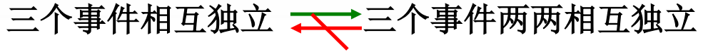
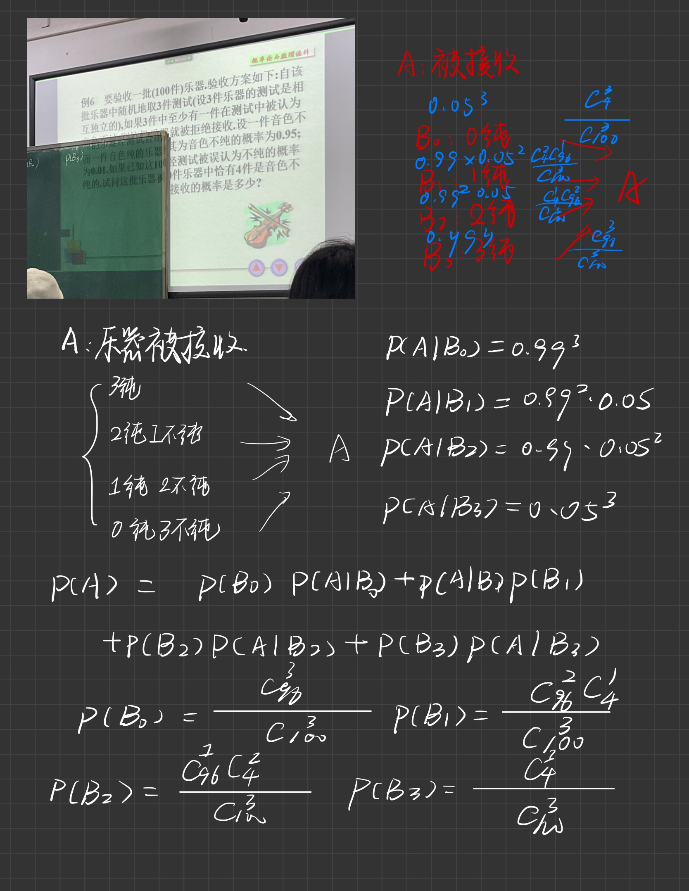
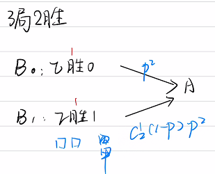
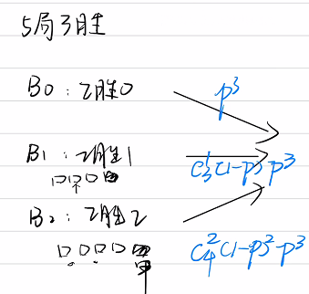

# 独立

## 目录

-   [定义](#定义)
    -   [【连续】](#连续)
    -   [【离散】](#离散)
-   [基本性质](#基本性质)
    -   [1.A 和 B 独立的直接推论](#1A-和-B-独立的直接推论)
    -   [2.A和B相互独立，则A和\bar{B} ， \bar{A} 和 B, \bar{A} 和 \bar{B} 也相互独立.](#2A和B相互独立则A和barB--barA-和-B-barA-和-barB-也相互独立)
    -   [3.三个事件ABC相互独立的条件](#3三个事件ABC相互独立的条件)
    -   [伯恩斯坦反例](#伯恩斯坦反例)
-   [例](#例)
    -   [例1](#例1)
    -   [例2（全概率+独立）](#例2全概率独立)
    -   [例3](#例3)

> ⁉️“独立性”和“互不相容”是概率论中两个具有特色的概念，但它们之间没有必然的联系，前者从概率的角度来考虑，而后者从组成事件的样本点的角度来考虑。
>
> 

## 定义

$设 A, B 为两个事件, 若$

$$
P(A B)=P(A) P(B)
$$

$则称事件 A, B 是相互独立的, 也称为统计独立的。简称独立 (independent) 的。$

> ✒️按定义不难验证, 必然事件 $\Omega$(或概率为1的事件) 及不可能事件 $  \phi  $(或概率 为0的事件) 与任何事件独立。

$$
P\{X \leqslant x, Y \leqslant y\}=P\{X \leqslant x\} P\{Y \leqslant y\}\\F(x, y)=F_{X}(x) F_{Y}(y)
$$

### 【连续】

⇔

$$
f(x, y)=f_{X}(x) f_{Y}(y)
$$

几乎在平面上处处成立

### 【离散】

⇔

$$
P\left\{X=x_{i}, Y=y_{j}\right\}=P\left\{X=x_{i}\right\} P\left\{Y=y_{j}\right\}
$$

## 基本性质

#### 1.A 和 B 独立的直接推论

$\Leftrightarrow P(A B)=P(A)P(B)$

$\Leftrightarrow P(B)=P(B \mid A) \quad(P(A)>0) \\\frac{P(A B)}{P(A)}=\frac{P(A) P(B)}{P(A)}=P(B) \\\\\Leftrightarrow P(B \mid A)=P(B \mid \bar{A}) \quad(0<P(A)<1) . \\\\P(B \mid A)=\frac{P(A B)}{P(A)}=P(B)=\frac{P(\bar{A} B)}{P(\bar{A})}$

#### 2.A和B相互独立，则$A和\bar{B} ， \bar{A} 和 B, \bar{A} 和 \bar{B}$ 也相互独立.

#### 3.三个事件ABC相互独立的条件

$$
P(A B)=P(A) P(B) \\ P(A C)=P(A) P(C) \\ P(B C)=P(B) P(C) 
$$

$$
P(A B C)=P(A) P(B) P(C)
$$

读者自然会提出这样一个问题：三个事件$A,B,C$两两独立（也就是没有蓝色的第三个条件），能否保证它们相互独立呢？

答案是不能，这里有一个经典的反例

#### 伯恩斯坦反例

一个均匀的正四面体, 第一面染上红色, 第二面染上白 色, 第三面染上黑色, 第四面同时染上红, 白, 黑三种颜色。**记 A, B, C 分别表示投一次 均匀的正四面体出现红, 白, 黑颜色的事件, 则容易得到：**

$$
\begin{array}{l}P(A)=P(B)=P(C)=\frac{1}{2} \\ P(A B)=P(A C)=P(B C)=\frac{1}{4}\end{array}
$$

即 A, B, C 两两相互独立

但

$$
P(A B C)=\frac{1}{4} \neq \frac{1}{8}=P(A) P(B) P(C)
$$

由此得到 A, B, C 三事件不相互独立。

## 例

### 例1

$$
\begin{aligned} P(A-B)=P(A \bar{B}) & =P(A) P(\bar{B}) \\ & =P(A) \cdot 0.5 \\ & =0.3 \\ & \therefore P(A)=\frac{3}{5}\end{aligned}
$$

那么

$$
\begin{array}{l}P(B-A) \\ =P(B \bar{A}) \\ =0,5 \times \frac{2}{5} \\ =0.2\end{array}
$$

### 例2（全概率+独立）

### 例3

甲、乙两人进行乒乓球比赛 每局甲胜的概率为$p(p \geq 1 / 2)$，

问对甲而言 采用`三局二胜制`有利 还是采用`五局三胜制`有利 设各局胜负相互独立

$$
p_{1}=p^{2}+2 p^{2}(1-p)
$$

$$
p_{2}=p^{3}+\left(\begin{array}{l}3 \\ 2\end{array}\right) p^{3}(1-p)+\left(\begin{array}{l}4 \\ 2\end{array}\right) p^{3}(1-p)^{2}
$$

$$
\begin{aligned} p_{2}-p_{1} & =p^{2}\left(6 p^{3}-15 p^{2}+12 p-3\right) \\ & =3 p^{2}(p-1)^{2}(2 p-1)\end{aligned}
$$

$$
故当 p>\frac{1}{2} 时, 对甲来说采用五局三胜制有利. \\当 p=\frac{1}{2} 时, 两种赛制甲最终获胜的概率是 相同的, 都是 \frac{1}{2}.
$$
