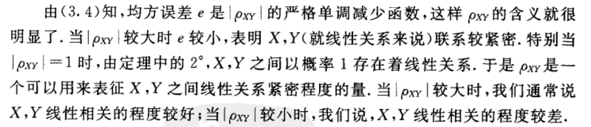
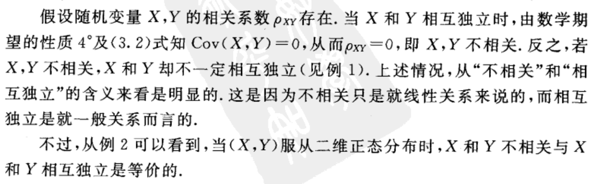
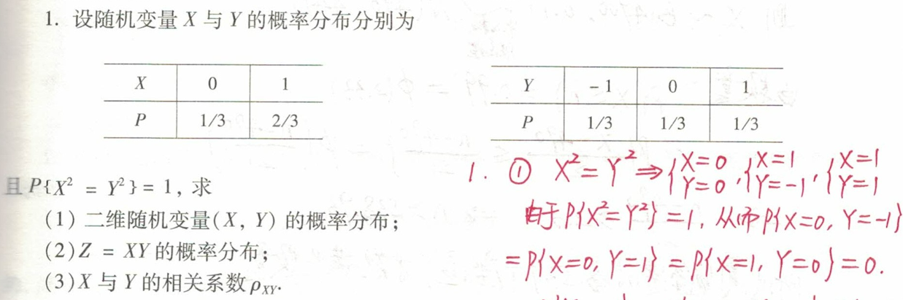
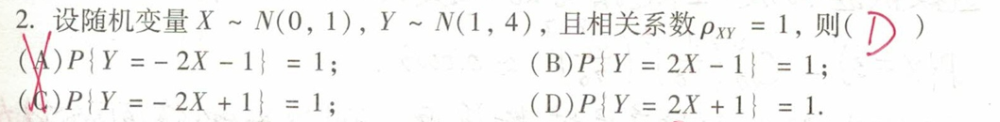
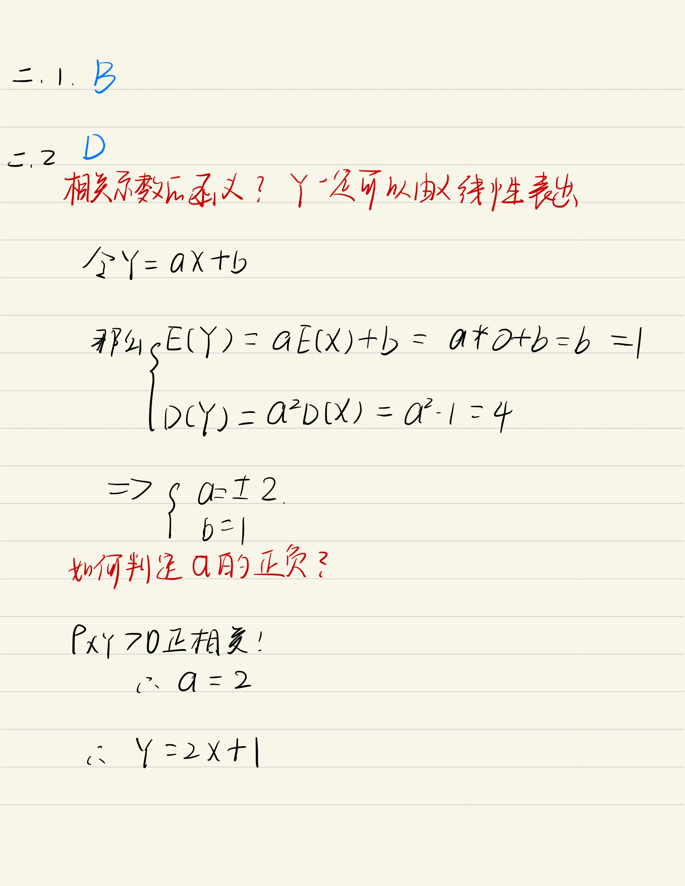

# 相关系数

## 目录

-   [定义](#定义)
-   [定理](#定理)
-   [意义](#意义)
    -   [不相关≠不独立](#不相关不独立)
        -   [例题说明](#例题说明)
-   [X,Y不相关的等价条件](#XY不相关的等价条件)
-   [例题](#例题)

# 定义

$$
\rho_{X Y}=\frac{\operatorname{Cov}(X, Y)}{\sqrt{D(X)} \sqrt{D(Y)}}
$$

# 定理

$1^{\circ}\left|\rho_{X Y}\right| \leqslant 1.\\2^{\circ}\left|\rho_{X Y}\right|=1 的充要条件是, 存在常数 a, b 使\\\\P\{Y=a+b X\}=1 .$

若$\rho_{XY}>0则为正相关,\ \ \rho_{XY}<0则为负相关$

# 意义

特别的

$$
\rho_{XY}=0\Leftrightarrow X和Y不相关
$$

## 不相关≠不独立

### 例题说明

# X,Y不相关的等价条件

$E(X Y)=E(X) E(Y)\\\Leftrightarrow D(X+Y)=D(X)+D(Y)\\\Leftrightarrow \operatorname{Cov}(X, Y)=0\\\Leftrightarrow P_{X Y}=0\\\Leftrightarrow X, Y 不相关$

# 例题

