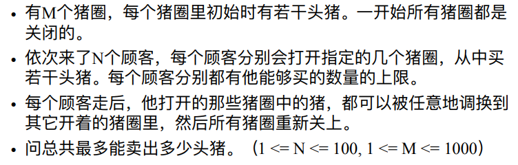

# 1149 PIGS

| OJ   | POJ |
| ---- | --- |
| 解题报告 |     |
| 时间   |     |
| AC   | ☐   |
| 算法   | 最大流 |

<http://poj.org/problem?id=1149>

Mirko works on a pig farm that consists of M locked pig-houses and Mirko can't unlock any pighouse because he doesn't have the keys. **Customers come to the farm one after another.** Each of them has keys to some pig-houses and wants to buy a certain number of pigs. &#x20;
All data concerning customers planning to visit the farm on that particular day are available to Mirko early in the morning so that he can make a sales-plan in order to maximize the number of pigs sold.&#x20;

***

More precisely, the procedure is as following: the customer arrives, opens all pig-houses to which he has the key, Mirko sells a certain number of pigs from all the unlocked pig-houses to him, and, if Mirko wants, he can redistribute the remaining pigs across the unlocked pig-houses. &#x20;
An unlimited number of pigs can be placed in every pig-house. &#x20;
Write a program that will find the maximum number of pigs that he can sell on that day.
Mirko在一个由M个上锁的猪舍组成的养猪场工作，而Mirko无法解锁任何pighhouse，因为他没有钥匙。顾客纷纷来到农场。他们每个人都有一些猪舍的钥匙，并想购买一定数量的猪。
所有有关计划在当天访问农场的客户的数据都可以在清晨提供给Mirko，以便他可以制定销售计划，以最大程度地增加销售的猪数量。
更准确地说，程序如下: 客户到达，打开他拥有钥匙的所有猪舍，Mirko将所有未上锁的猪舍中的一定数量的猪卖给他，如果Mirko愿意，他可以将剩余的猪重新分配到未上锁的猪舍中。
每个猪舍都可以放置无限数量的猪。
编写一个程序，该程序将找到他当天可以出售的最大猪数量。

***

