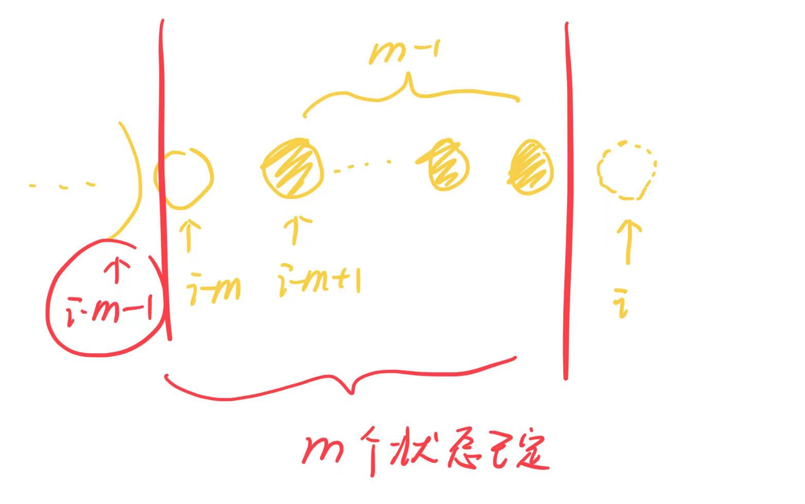
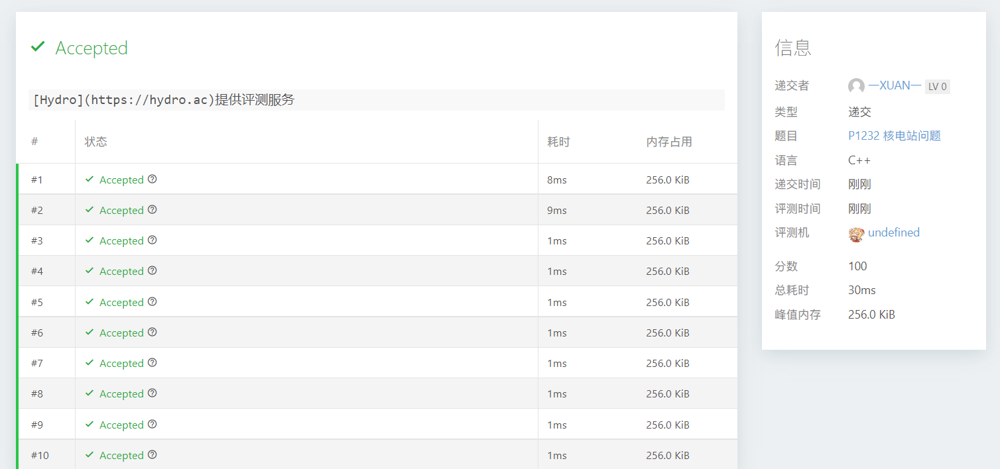

# 1232核电站问题

| OJ   | Vijos      |
| ---- | ---------- |
| 解题报告 |            |
| 时间   | 2022/11/16 |
| AC   | ☑          |
| 算法   | DP         |

## 核电站问题

<https://vijos.org/p/1232>

<https://blog.csdn.net/Jazz_Charles/article/details/50525878?spm=1001.2101.3001.6650.9&utm_medium=distribute.pc_relevant.none-task-blog-2~default~BlogCommendFromBaidu~Rate-9-50525878-blog-105482155.pc_relevant_recovery_v2&depth_1-utm_source=distribute.pc_relevant.none-task-blog-2~default~BlogCommendFromBaidu~Rate-9-50525878-blog-105482155.pc_relevant_recovery_v2&utm_relevant_index=10>

> 用dp\[i]来表示从1\~i的位置能够使炸弹不爆炸的放置核物质的方案总数。在写状态转移方程的时候考虑当i-1已经成功放完的情况下的总数为dp\[i-1],这时第i个有放和不放两种情况，共计2\*dp\[i-1]，而若是放了会爆炸的话则必须是连续放置m个才会引起的爆炸。因此设情况A为：从第i-m+1个一直到第i个（总共有m个）都是放置了核弹的，**这样的话第i-m个一定没有放置核弹**（放了就炸了...) 那么在满足后半部分即A情况这样的布雷前提下的所有情况总数为dp\[i-m-1]



<https://blog.csdn.net/JKR10000/article/details/104930939?spm=1001.2101.3001.6650.5&utm_medium=distribute.pc_relevant.none-task-blog-2~default~BlogCommendFromBaidu~Rate-5-104930939-blog-101099304.pc_relevant_recovery_v2&depth_1-utm_source=distribute.pc_relevant.none-task-blog-2~default~BlogCommendFromBaidu~Rate-5-104930939-blog-101099304.pc_relevant_recovery_v2&utm_relevant_index=6>

### 代码

```c++
#include <iostream>
#include <bits/stdc++.h>
using namespace std;
int main()
{
    int N, M;
    long long int dp[60];
    memset(dp, 0, sizeof(dp));
    cin >> N >> M;
    dp[0] = 1;//初始状态
    for (int i = 1; i <= N; i++)
    {
        if (i >= M + 1)
        {
            dp[i] = dp[i - 1] * 2 - dp[i - M - 1];//代入转移方程
        }            
        else if (i == M)
        {
            dp[i] = dp[i - 1] * 2 - 1;//特殊处理，此时只有一种前m都是炸弹的情况要排除
        }
        else//i<M
        {
            dp[i] = dp[i - 1] * 2;//特出处理，此时没有不合法方案
        }           
    }
    cout << dp[N];
    return 0;
}


```

### 测试



<https://www.luogu.com.cn/problem/P1077>
