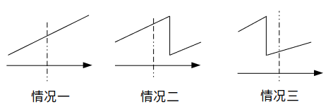

# 33. 搜索旋转排序数组

| OJ   | LeetCode   |
| ---- | ---------- |
| 解题报告 |            |
| 时间   | 2022/10/23 |
| AC   | ☑          |
| 算法   | 二分查找       |

# 解题记录

<https://leetcode.cn/problems/search-in-rotated-sorted-array/submissions/>


# 算法分析

我们用`二分查找`来解决这个问题

对于每次`二分查找`，`旋转数组`有且仅有这三种情况：



### case1 $num[l]<num[mid]<num[r]$

-   此时若

    $ num[mid]==k  $则找到
-   否则
    -   $k<num[mid]$

        $r=mid-1$
    -   $ 
        k>num[mid]  $

        $l=mid+1$

### case2 $num[r]<num[l]<num[mid]$

-   此时若

    $ num[mid]==k  $则找到
-   否则
    -   $num[l]<k<num[mid]$

        $r=mid-1$
    -   $else$

        $l=mid+1$

### case3 $num[mid]<num[r]<num[l]$

-   此时若

    $ num[mid]==k  $则找到
-   否则
    -   $num[mid]<k<num[r]$

        $l=mid+1$
    -   $else$

        $r=mid-1$

# 代码

```c++
class Solution {
public:
    int search(vector<int>& nums, int target) {
        int l=0,r=nums.size()-1;
        int mid=(l+r)/2;
        while(l<=r)
        {
            mid=(l+r)/2;
            if(nums[mid]==target)
            {
                return mid;
            }
            if(nums[l]<=nums[mid]&&nums[mid]<=nums[r])
            {
                if(nums[mid]>target)
                {
                    r=mid-1;
                }
                else
                {
                    l=mid+1;
                }
                continue;
            }
            if(nums[l]<=nums[mid]&&nums[r]<=nums[l])
            {
                if(nums[l]<=target&&target<=nums[mid])
                {
                    r=mid-1;
                }
                else
                {
                    l=mid+1;
                }
                continue;
            }
            if(nums[mid]<=nums[r]&&nums[r]<=nums[l])
            {
                if(nums[mid]<=target&&nums[r]>=target)
                {
                    l=mid+1;
                }
                else
                {
                    r=mid-1;
                }
                continue;
            }
        }
        return -1;
    }
};
```
