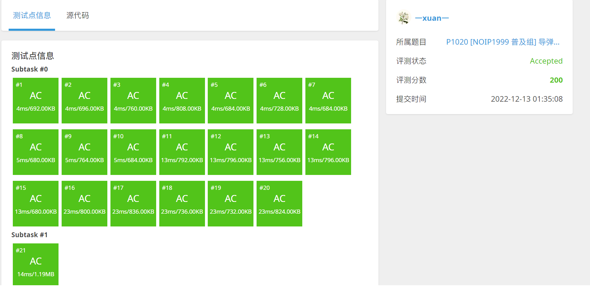

# P1020 \[NOIP1999 普及组] 导弹拦截

| OJ   | 洛谷         |
| ---- | ---------- |
| 解题报告 |            |
| 时间   | 2022/12/13 |
| AC   | ☑          |
| 算法   | LIS,DP     |

## 目录

-   [问题描述](#问题描述)
-   [算法思想](#算法思想)
    -   [这套系统最多能拦截多少导弹？](#这套系统最多能拦截多少导弹)
    -   [至少要配多少套这样的导弹拦截系统？](#至少要配多少套这样的导弹拦截系统)
-   [DP](#DP)
    -   [测试](#测试)
-   [优化：Patience Sorting](#优化Patience-Sorting)
-   [优化的优化：只留下end](#优化的优化只留下end)
-   [优化的优化的优化：二分查找](#优化的优化的优化二分查找)
-   [优化后代码](#优化后代码)
    -   [OJ测试](#OJ测试)

<https://www.luogu.com.cn/problem/P1020>

## 问题描述

某国为了防御敌国的导弹袭击，发展出一种导弹拦截系统。但是这种导弹拦截系统有一个缺陷：**虽然它的第一发炮弹能够到达任意的高度，但是以后每一发炮弹都不能高于前一发的高度。** 某天，雷达捕捉到敌国的导弹来袭。由于该系统还在试用阶段，所以只有一套系统，因此有可能不能拦截所有的导弹。

输入导弹依次飞来的高度，计算这套系统最多能拦截多少导弹，如果要拦截所有导弹最少要配备多少套这种导弹拦截系统。

## 算法思想

### 这套系统最多能拦截多少导弹？

也就是求最长不下降子序列

### 至少要配多少套这样的导弹拦截系统？

这里我们需要使用：

[Dilworth定理](https://www.wolai.com/48h12P4qwPyhnMg31mneuW.md "Dilworth定理")

**偏序集上最小链划分中链的数量等于其反链长度的最大值。**

也就是：

**最少的不上升子序列的个数就是最长上升子序列的长度。**

所以这个问题就被转化为了最长上升序列长度

## DP

```c++
#include <bits/stdc++.h>
using namespace std;
int main()
{
//  freopen("E:\\test.in","r",stdin);
  int in[100010];
  int dp[100010];
  int dp1[100010];
  memset(dp,0,sizeof(dp));
  memset(dp1,0,sizeof(dp1)); 
  int c=0;
  while(scanf("%d",&in[c++])!=EOF);
  int ans=0;
  int ans1=0;
  c--;
  //计算最长不上增子序列 
  //和计算最长严格递增子序列长度 
  //这玩意儿还可以用二分搜索优化 
  dp[0]=1;
  dp1[0]=1;
  for(int i=1;i<c;i++)
  {
    for(int j=0;j<i;j++)
    {
      if(in[j]>=in[i])
        dp[i]=max(dp[i],dp[j]+1);
      if(in[j]<in[i])
        dp1[i]=max(dp1[i],dp1[j]+1);
    
    }
    if(dp[i]==0)
    {
      dp[i]=1;
    }
    if(dp1[i]==0)
      dp1[i]=1;
    ans=max(ans,dp[i]);
    ans1=max(ans1,dp1[i]);
  }
  cout<<ans<<endl<<ans1;
  return 0;
}

```

### 测试

可以发现基础的DP模型解法超时严重


## 优化：Patience Sorting

> In [computer science](https://en.wikipedia.org/wiki/Computer_science "computer science"), **patience sorting** is a [sorting algorithm](https://en.wikipedia.org/wiki/Sorting_algorithm "sorting algorithm") inspired by, and named after, the card game [patience](https://en.wikipedia.org/wiki/Patience_\(game\) "patience"). A variant of the algorithm efficiently computes the length of a [longest increasing subsequence](https://en.wikipedia.org/wiki/Longest_increasing_subsequence "longest increasing subsequence") in a given [array](https://en.wikipedia.org/wiki/Array_data_structure "array").
>
> Patience sorting was named by C. L. Mallows, who attributed its invention to A.S.C. Ross in the early 1960s.[\[1\]](https://en.wikipedia.org/wiki/Patience_sorting#cite_note-Chandramouli-1 "\[1]") According to Aldous and Diaconis,[\[4\]](https://en.wikipedia.org/wiki/Patience_sorting#cite_note-Aldous-4 "\[4]") patience sorting was first recognized as an algorithm to compute the longest increasing subsequence length by Hammersley.[\[5\]](https://en.wikipedia.org/wiki/Patience_sorting#cite_note-5 "\[5]") A.S.C. Ross and independently [Robert W. Floyd](https://en.wikipedia.org/wiki/Robert_W._Floyd "Robert W. Floyd") recognized it as a sorting algorithm. Initial analysis was done by Mallows.[\[6\]](https://en.wikipedia.org/wiki/Patience_sorting#cite_note-6 "\[6]") Floyd's game was developed by Floyd in correspondence with [Donald Knuth](https://en.wikipedia.org/wiki/Donald_Knuth "Donald Knuth").[\[2\]](https://en.wikipedia.org/wiki/Patience_sorting#cite_note-Burstein-2 "\[2]")

-   $我们有一组数列：A[]={0, 8, 4, 12, 2, 10, 6, 14, 1, 9, 5, 13, 3, 11, 7, 15}$
-   $ 我们的算法将会维护一组  $`动态列表active lists`&#x20;
-   $维护方式$：
    -   $for \ i \ form\ 1\ to \ length(A)$
        1.  $ if(A[i] \ is\ largest\ among\  $`all `**`end`**$ of \  $`active lists`）

            **`end`**\[length ++] = A\[i]
        2.  $ if(A[i] \ is\ smallest\ among\  $`all `**`end`**$ of \  $`active lists`）

            **`end`**\[1] = A\[i]
        3.  $if\ (A[i]<=end[j]\&\&A[i]>end[j-1])$

            **`end`**\[j]=A\[i]

## 优化的优化：只留下`end`

我们观察这个算法可以发现，我们真正判断和修改的只有最后一位，也就是我们`end`的那一列

前面的`active lists`中真正有用的数据只有最后一组中记录的答案：一个最长上升子序列！但是很显然这个最长上升子序列并不唯一，我们会发现当我们读取`end`数组时，这里面也记录了一个最长上升子序列

也就是说，如果我们只需要得到`LIS`的数量的话，或者只需要得到一组`LIS`的话，我们只需要`end`这个数组就够了！

## 优化的优化的优化：二分查找

当我们在讨论我们的$ case \ 3
  $时，

-   $if\ (A[i]<=end[j]\&\&A[i]>end[j-1])$

    **`end`**\[j]=A\[i]

我们实际上在寻找一个end\[]中的第一个比这个数字大的数的位置，并且用A\[i]去替换掉他，我们的`二分查找`在找到或者找不到目标数的时候恰好可以做到这个能力！

> ✒️但是这里希望读者可以注意到，二分查找同时具备找下界和找上界的能力，需要处理好这个细节！
>
> 这种写法确保了nums\[l]\<k,而nums\[r]≥k &#x20;
>
> \[     小     ]\[       同        ]\[    大     ]
>
> &#x20;             l r
>
> 而如果写成了v\[m]>key(也就是l的条件换成了v\[m]≤key
>
> 那么 nums\[l]≤k nums\[r]>k
>
> \[     小     ]\[       同        ]\[    大     ]
>
> &#x20;                                 l r
>
> 就变成找右边界了
>
> 其中r-l>1很重要 确保了可以退出

```c++
int CeilIndex(std::vector<int>& v, int l, int r, int key)
{
  while (r - l > 1) 
  {
    int m = (l+r) / 2;
    if (v[m] >= key)
      r = m;
    else
      l = m;
  }
  return r;
}
```

## 优化后代码

```c++
#include <bits/stdc++.h>
using namespace std;
int in[100010];
int end1[100010];
int end2[100010];
int CeilIndex1(int end[], int l, int r, int x)
{
    int mid = (l + r) / 2;
    while (r - l > 1)
    {
        mid = (l + r) / 2;
        if (end[mid] >= x)
        {
            r = mid;
        }
        else
        {
            l = mid;
        }
    }
    return r;
}
int CeilIndex2(int end[], int l, int r, int x)
{
    int mid = (l + r) / 2;
    while (r - l > 1)
    {
        mid = (l + r) / 2;
        if (end[mid] >= x)
        {
            l = mid;
        }
        else
        {
            r = mid;
        }
    }
    return r;
}
int main()
{
    //  freopen("E:\\test.in","r",stdin);


    int c = 0;
    while (scanf("%d", &in[++c]) != EOF);
    c--;//这个很灵性呢

    //也就是 优化算法，求最长上升子序列 和 最长不升子序列
    end1[1] = end2[1] = in[1];
    int c1 = 1;
    int c2 = 1;
    for (int i = 2; i <= c; i++)
    {
        if (in[i] < end1[1])
            end1[1] = in[i];
        else if (in[i] > end1[c1])
            end1[++c1] = in[i];
        else
            end1[CeilIndex1(end1, 0, c1, in[i])] = in[i];

        if (in[i] > end2[1])
            end2[1] = in[i];
        else if (in[i] <= end2[c2])
            end2[++c2] = in[i];
        else
            end2[CeilIndex2(end2, 0, c2, in[i])] = in[i];
    }
    cout << c2 << endl << c1;
    return 0;
}
```

### OJ测试


