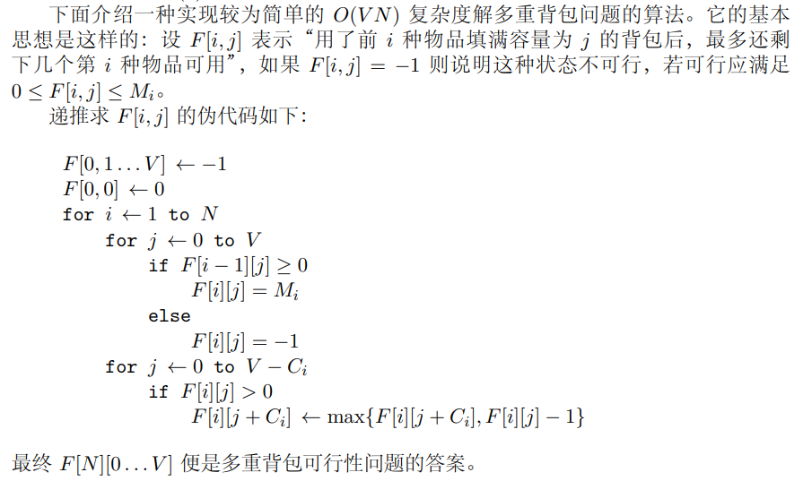
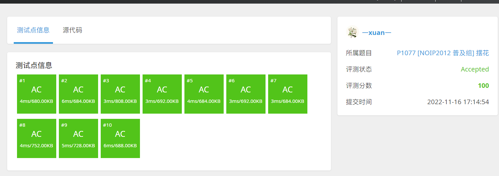
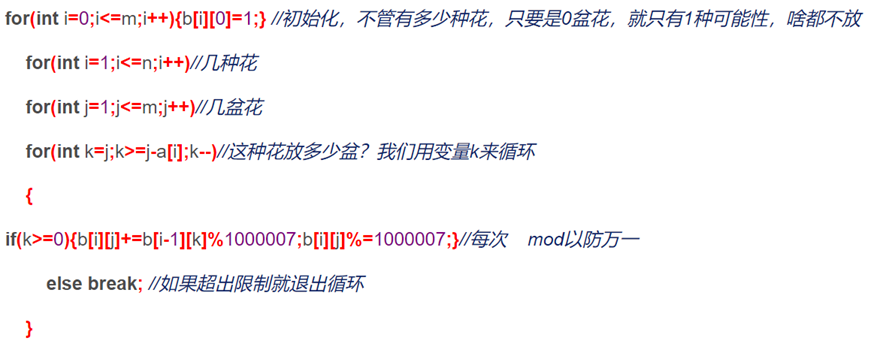

# P1077 \[NOIP2012 普及组] 摆花

| OJ   | 洛谷         |
| ---- | ---------- |
| 解题报告 |            |
| 时间   | 2022/11/16 |
| AC   | ☑          |
| 算法   | DP,背包      |

<https://www.luogu.com.cn/problem/P1077>

# \[NOIP2012 普及组] 摆花

## 题目描述

小明的花店新开张，为了吸引顾客，他想在花店的门口摆上一排花，共 $m$ 盆。通过调查顾客的喜好，小明列出了顾客最喜欢的 $n$ 种花，从 $1$ 到 $n$ 标号。为了在门口展出更多种花，规定第 $i$ 种花不能超过 $a_i$ 盆，摆花时同一种花放在一起，且不同种类的花需按标号的从小到大的顺序依次摆列。

试编程计算，一共有多少种不同的摆花方案。

## 输入格式

第一行包含两个正整数 $n$ 和 $m$，中间用一个空格隔开。

第二行有 $n$ 个整数，每两个整数之间用一个空格隔开，依次表示 $a_1,a_2, \cdots ,a_n$。

## 输出格式

一个整数，表示有多少种方案。注意：因为方案数可能很多，请输出方案数对 $10^6+7$ 取模的结果。

## 样例 #1

### 样例输入 #1

```c++
2 4
3 2
```

### 样例输出 #1

```c++
2
```

## 提示

【数据范围】

对于 $20\%$ 数据，有 $0<n \le 8,0<m \le 8,0 \le a_i \le 8$。

对于 $50\%$ 数据，有 $0<n \le 20,0<m \le 20,0 \le a_i \le 20$。

对于 $100\%$ 数据，有 $0<n \le 100,0<m \le 100,0 \le a_i \le 100$。

NOIP 2012 普及组 第三题

# 多重背包

> 有 N 种物品和一个容量为 V 的背包。**第 i 种物品最多有 Mi 件可用，** 每件耗费的空间是 Ci，价值是 Wi。求解将哪些物品装入背包可使这些物品的耗费的空间总和不超过背包容量，且价值总和最大。

### 基本算法

$$
F[i, v]=\max \left\{F\left[i-1, v-k * C_{i}\right]+k * W_{i} \mid 0 \leq k \leq M_{i}\right\}
$$

> ✒️在完全背包的基础上，枚举该组使用的数量

### 二进制优化

### 可行性问题特别算法：O(VN)

<https://blog.csdn.net/ctsas/article/details/53708712>

**《挑战程序设计竞赛》**

> ❓脑子被驴踢了？？这么奇怪的定义方式

$d p[i+1][j]= 用前 i 种数加和得到 j 时第 i 种数最多能剩余多少个 \\{(不能加和得到 i 的情况下为 -1)}$

$$
d p[i+1][j]=\left\{\begin{array}{ll}m_{i} & (d p[i][j] \geqslant 0) \\ -1 & \left(j<a_{i} \text { 或者 } d p[i+1]\left[j-a_{i}\right] \leqslant 0\right) \\ d p[i+1]\left[j-a_{i}\right]-1 & (\text { 其他 })\end{array}\right.
$$

-   $if\ d p[i][j] \geqslant 0$

    $ d p[i+1][j]=m_{i}  $

    如果前面第i-1种物品都没有用完的话，那么当前第i种物品也塞不进去了，所以直接剩下全部，即$ m_i个
      $
    > ❓这东西对物品占的容量做升序排序了吗？？万一后面的元素所占的背包容量比较小，不是挤挤还可以塞进去？
-   $if\ \ j<a_{i} \text\ \ ||\ \ d p[i+1]\left[j-a_{i}\right] \leqslant 0$

    $ 
     $$d p[i+1][j]=-1 $

    如果 当前的背包容量 < 一个i所需要的空间 或者 前面的方案不可行 那么当前方案不可行
-   $ else
      $

    $ 
    d p[i+1]\left[j-a_{i}\right]-1  $

    方案可行 数量少1

```c++
#include<stdio.h>
#include<string.h>
int dp[1000],a[1000],m[1000];
int main()
{
    int n,k;
    scanf("%d%d",&n,&k);
    for(int i=0;i<n;i++)
        scanf("%d%d",&a[i],&m[i]);
    memset(dp,-1,sizeof(dp));
    dp[0]=0;
    for(int i=0;i<n;i++)
        for(int j=0;j<=k;j++)
            if(dp[j]>=0)
                dp[j]=m[i];
            else if(j<a[i]||dp[j-a[i]]<=0)
                dp[j]=-1;
            else
                dp[j]=dp[j-a[i]]-1;
    puts(dp[k]>=0?"Yes":"No");
    return 0;
}
```

《背包九讲》



#### 代码

```c++
#include <bits/stdc++.h>
using namespace std;
#define X 1000007
int main()
{
  int n, m;
  long long int dp[110];
  long long int a[110];
  cin >> n >> m;
  memset(dp, 0, sizeof(dp));
  for (int i = 1; i <= n; i++)
  {
    cin >> a[i];
  }
  dp[0] = 1;//初始化第0行，0种花放0盆，什么都不放也是一种方案
  for (int i = 1; i <= n; i++)//考虑前i件物品
  {
    for (int j = m; j >= 1; j--)//从高到低考虑物品容量 降低维数的同时保证数据的正常
    {
      for (int k = 1; k <= a[i]; k++)//考虑第i种花放多少盆
      {
        if (j >= k)
          dp[j] = (dp[j] % X + dp[j - k] % X) % X;//在选取第n种中的k盆花，累加方案数
      }
    }
  }
  cout << dp[m];
  return 0;
}

```

#### 测试



#### PPT解法



> ✒️感觉注释写错了,应该是这种花放j-k盆，然后其他花放K盆‘
