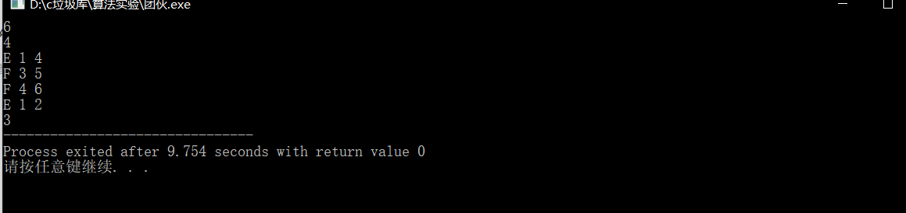
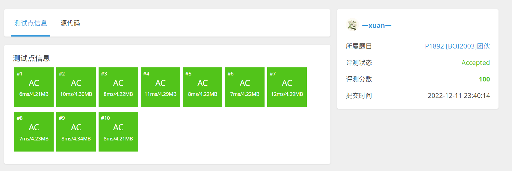

# P1892 \[BOI2003]团伙

| OJ   | 洛谷         |
| ---- | ---------- |
| 解题报告 |            |
| 时间   | 2022/12/11 |
| AC   | ☑          |
| 算法   | 并查集        |

<https://www.luogu.com.cn/problem/P1892>

## 问题重述：

现在有 n 个人，他们之间有两种关系：朋友和敌人。我们知道：

-   一个人的朋友的朋友是朋友
-   一个人的敌人的敌人是朋友

现在要对这些人进行组团。两个人在一个团体内当且仅当这两个人是朋友。请求出这些人中最多可能有的团体数。

## 算法思想：并查集

1、用集合中的某个元素来代表这个集合，则该元素称为此集合的代表元；

2 、一个集合内的所有元素组织成以代表元为根的树形结构；

3 、对于每一个元素 x，pre\[x] 存放 x 在树形结构中的父亲节点（如果 x 是根节点，则令pre\[x] = x）；

4 、对于查找操作，假设需要确定 x 所在的的集合，也就是确定集合的代表元。可以沿着pre\[x]不断在树形结构中向上移动，直到到达根节点。

## 初始化

```c++
void DSU::Init()
{
  for (int i = 0; i <= this->N; i++)
  {
    this->pre[i] = i;
    this->rank[i] = 1;
  }
  return;
}
```

## 查找

```c++
int DSU::Find(int x)
{
  while (this->pre[x] != x) x = this->pre[x];
  return x;
}

```

## 优化1查找且路径压缩

```c++
int Find(int x)
{
  if(f(x)!=x)
  {
    f(x)=Find(f(x));
  }
  return f(x);
}
```

## 优化2按秩合并

```c++
void DSU::Join(int x, int y)
{
  int fx, fy;
  fx = this->Find(x);
  fy = this->Find(y);
  if (fx == fy) return;
  if (rank[fx] < rank[fy])
  {
    pre[fx] = fy;
  }
  else
  {
    pre[fy] = fx;
    if (rank[fx] == rank[fy]) rank[fx]++;
  }
  return;
}
```

## 代码

```c++
//P1892 [BOI2003]团伙
#include <bits/stdc++.h>
using namespace std;
int pre[1005];
int Rank[1005];
int en[1005][1005];
void init(int n)
{
  for (int i = 1; i <= n; i++)
  {
    Rank[i] = 1;
    pre[i] = i;
  }
  return;
}
int find(int n)
{
  int x;
  x = n;
  while (pre[x] != x)
  {
    x = pre[x];
  }
  return x;
}
void join(int x, int y)
{
  int fx = find(x);
  int fy = find(y);
  if (fx == fy)
  {
    return;
  }
  else
  {
    if (Rank[fx] > Rank[fy])
    {
      pre[fy] = fx;
    }
    else
    {
      pre[fx] = fy;
      if (Rank[fx] == Rank[fy])
      {
        Rank[fy]++;
      }
    }
  }
  return;
}
int main()
{
  int n, m;
  cin >> n >> m;
  init(n);
  memset(en, 0, sizeof(en));
  for (int i = 1; i <= m; i++)
  {
    char c;
    cin >> c;
    int p, q;
    cin >> p >> q;
    if (c == 'E')
    {
      //访问当前的仇人列表  感觉这里还可以优化 
      for (int j = 1; j <= en[p][0]; j++)
      {
        join(en[p][j], q);

      }
      en[p][++en[p][0]] = q;
      for (int j = 1; j <= en[q][0]; j++)
      {
        join(en[q][j], p);
      }
      en[q][++en[q][0]] = p;
    }
    else
    {
      join(p, q);
    }
  }

  int ans = 0;
  for (int i = 1; i <= n; i++)
  {
    if (pre[i] == i)
    {
      ans++;
    }
  }
  cout << ans;
  return 0;
}
```

## 测试

input

```c++
6
4
E 1 4
F 3 5
F 4 6
E 1 2
```

output

```c++
3
```





也有给出拆点思路的

<https://www.cnblogs.com/henry-1202/p/BZOJ1370.html>
