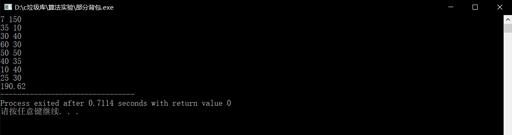

# P2240 部分背包问题

| OJ   | 洛谷         |
| ---- | ---------- |
| 解题报告 |            |
| 时间   | 2022/12/13 |
| AC   | ☑          |
| 算法   | 贪心         |

## OJ地址

<https://www.luogu.com.cn/problem/P2240>

## 题目描述

阿里巴巴走进了装满宝藏的藏宝洞。藏宝洞里面有 $N(N \le 100)$ 堆金币，第 $i$ 堆金币的总重量和总价值分别是 $m_i,v_i(1\le m_i,v_i \le 100)$。阿里巴巴有一个承重量为 $T(T \le 1000)$ 的背包，但并不一定有办法将全部的金币都装进去。他想装走尽可能多价值的金币。所有金币都可以随意分割，分割完的金币重量价值比（也就是单位价格）不变。请问阿里巴巴最多可以拿走多少价值的金币？

## 输入格式

第一行两个整数 $N,T$。

接下来 $N$ 行，每行两个整数 $m_i,v_i$。

## 输出格式

一个实数表示答案，输出两位小数

## 代码

```c++
#include <bits/stdc++.h>
using namespace std;
struct node 
{
  float w;
  int m;
  int v;
}s[110];
bool cmp(node x,node y)
{
  if(x.w>y.w)
  {
    return true;  
  }
  else
    return false;  
}
int main()
{
  
  int N,T;
  cin>>N>>T;
  for(int i=1;i<=N;i++)
  {
    cin>>s[i].m>>s[i].v;
    s[i].w=(float)s[i].v/(float)s[i].m;//计算总的性价比 
  }
  sort(s+1,s+N+1,cmp);
  int now=1;
  float ans=0;
  while(T&&now<=N)
  {
    if(T>=s[now].m)
    {
      ans+=s[now].v;
      T-=s[now].m;
      now++;
    }
    else
    {
      ans+=s[now].w*T;
      break;
    }
  }
  printf("%.2f",ans);
  return 0;
}
```

## 输入测试

```c++
7 150
35 10
30 40 
60 30
50 50
40 35
10 40
25 30
```

## 输出



## OJ测试


## Reference

[<https://blog.csdn.net/hy6688> \_/article/details/15427943](https://blog.csdn.net/hy6688_/article/details/15427943)
