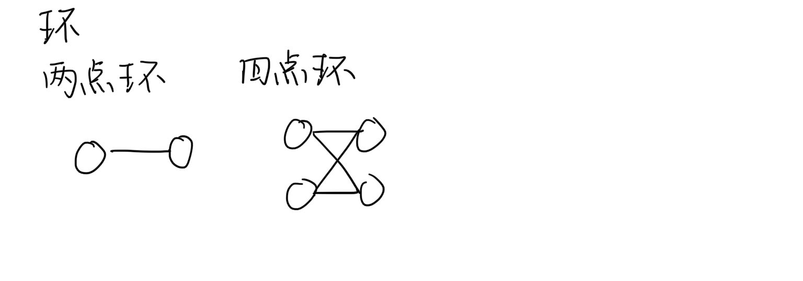
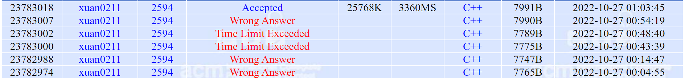

# P2594 Treasure Exploration

| OJ   | POJ        |
| ---- | ---------- |
| 解题报告 |            |
| 时间   | 2022/10/27 |
| AC   | ☑          |
| 算法   | 二分图,路径覆盖   |

<http://poj.org/problem?id=2594>

## Description

Have you ever read any book about treasure exploration? Have you ever see any film about treasure exploration? Have you ever explored treasure? If you never have such experiences, you would never know what fun treasure exploring brings to you. &#x20;
Recently, a company named EUC (Exploring the Unknown Company) plan to explore an unknown place on Mars, which is considered full of treasure. For fast development of technology and bad environment for human beings, EUC sends some robots to explore the treasure. &#x20;
To make it easy, we use a graph, which is formed by N points (these N points are numbered from 1 to N), to represent the places to be explored. And some points are connected by one-way road, which means that, through the road, a robot can only move from one end to the other end, but cannot move back. For some unknown reasons, there is no circle in this graph. The robots can be sent to any point from Earth by rockets. After landing, the robot can visit some points through the roads, and it can choose some points, which are on its roads, to explore. You should notice that the roads of two different robots may contain some same point. &#x20;
For financial reason, EUC wants to use minimal number of robots to explore all the points on Mars. &#x20;
As an ICPCer, who has excellent programming skill, can your help EUC?
你读过关于宝藏探索的书吗？你看过关于宝藏探索的电影吗？你探索过宝藏吗？如果你从来没有这样的经历，你永远不会知道宝藏探索给你带来了什么乐趣。
最近，一家名为EUC (探索未知公司) 的公司计划在火星上探索一个被认为充满宝藏的未知地方。为了技术的快速发展和人类的恶劣环境，EUC派出一些机器人来探索宝藏。
为了简单起见，我们使用由N个点 (这N个点从1到N编号) 组成的图来表示要探索的地方。有些点通过单向道路相连，这意味着，通过道路，机器人只能从一端移动到另一端，而不能向后移动。由于某些未知原因，该图中没有圆。机器人可以通过火箭从地球发送到任何地点。着陆后，机器人可以通过道路访问一些点，并且可以选择道路上的一些点进行探索。你应该注意到，两个不同机器人的道路可能包含一些相同的点。
出于经济原因，EUC希望使用最少数量的机器人来探索火星上的所有点。
作为一名具有出色编程技能的ICPCer，您能帮助EUC吗？

## Input

The input will consist of several test cases. For each test case, two integers N (1 <= N <= 500) and M (0 <= M <= 5000) are given in the first line, indicating the number of points and the number of one-way roads in the graph respectively. Each of the following M lines contains two different integers A and B, indicating there is a one-way from A to B (0 < A, B <= N). The input is terminated by a single line with two zeros.
输入将由几个测试用例组成。对于每个测试用例，在第一行中给出两个整数N (1 <= N <= 500) 和M (0 <= M <= 5000)，分别表示图中的点的数量和单向道路的数量。以下M行中的每一行都包含两个不同的整数A和B，表明从a到B存在单向 (0 \<A，B <= N)。输入由带有两个零的单行端接。

## Output

For each test of the input, print a line containing the least robots needed.
对于输入的每个测试，打印一行，其中包含所需的最少机器人。

## Sample Input

1 0
2 1
1 2
2 0
0 0

## Sample Output

1
1
2

#### 更多数据

```c++
5 4
1 3
2 3
3 4
3 5
```

```c++
2

```

```c++
4 3
1 3
2 3
3 4
```

```c++
2
```

```c++
8 8
1 3
2 3 
3 4 
3 5 
4 6 
5 6 
6 7 
6 8 
0 0
```

```c++
2
```

## Source

[POJ Monthly--2005.08.28](http://poj.org/searchproblem?field=source\&key=POJ+Monthly--2005.08.28 "POJ Monthly--2005.08.28"),Li Haoyuan

## 算法思想：最小可相交路径覆盖

# 定义：

> 二分图又称作二部图，是图论中的一种特殊模型。

> 设G=(V,E)是一个\*\*`无向图`\*\*。如果顶点集 V可分割为两个互不相交的子集X和Y，并且图中每条边连接的两个顶点一个在 X中，另一个在Y中，则称图G为二分图。

# 性质

> 当且仅当无向图G的**每一个环的结点数均是偶数时**，图G才是一个二分图。

> 如果无环，相当于每的结点数为0，故也视为二分图



# 最小可相交路径覆盖

### 算法：&#x20;

先用`floyd`求出原图的传递闭包，即如果a到b有路径，那么就加边a->b。

然后就转化成了最小不相交路径覆盖问题。

### **证明**：

为了连通两个点，某条路径可能经过其它路径的中间点。比如1->3->4，2->4->5。**但是如果两个点a和b是连通的，只不过中间需要经过其它的点，那么可以在这两个点之间加边，那么a就可以直达b，不必经过中点的**，那么就转化成了最小不相交路径覆盖。

## 解题记录



## 代码：

```c++
int minGVcover_inter()
    {
        if (this->n == 0) return 0;
        BiPartGraph BG;
        BG.init(this->n, this->n, 0);
        bool G[550][550];
        memset(G, 0, sizeof(G));
        for (int i = 1; i <= this->n; i++)
        {
            for (Edge* now = this->head[i]->next; now != NULL; now = now->next)
            {
                G[i][now->to] = 1;
            }
        }
        //利用弗洛伊德求传递闭包
        for (int k = 1; k <= this->n; k++)
            for (int i = 1; i <= this->n; i++)
                for (int j = 1; j <= this->n; j++)
                {
                    if (G[i][j]) continue;
                    if (i == j)
                    {
                        G[i][j] = 1;
                        continue;
                    }
                    if (G[i][k] && G[k][j])
                        G[i][j] = 1;
                }
        //建二分图
        for (int i = 1; i <= this->n; i++)
        {
            for (int j = 1; j <= this->n; j++)
            {
                if (G[i][j] && i != j)
                {
                    BG.addedge(i, j, 0);//二部图左侧序号 二部图右侧序号 这玩意儿自己会拆点
                }
            }
        }
        return this->n - BG.MaxMatch();
    }
```

```c++
int main()
{    
    int m, n;
    while (1)
    {
        cin >> n >> m;
        if (n == 0 && m == 0)
        {
            break;
        }
        DAG G;
        G.init(n, m);
        cout << G.minGVcover_inter() << endl;
    }
    return 0;
}
```

## 完整代码（含有调用的自写板子）

```c++
#include <iostream>
#include <vector>
#define N 1100
#define INF 
using namespace std;
struct Edge
{
    int to;
    Edge* next;
    int w;//权值
};
class BiPartGraph
{
private:
    int visit[N];
    int match[N];
    bool maxmatch(int v);
    
public:
    Edge* head[N];
    int n;
    int m;
    int e;
    void init(int n,int m,int e);
    int MaxMatch();
    void addedge(int s, int t, int w)
    {
        t = this->n + t;
        Edge* now1;
        Edge* now2;
        now1 = (Edge*)malloc(sizeof(Edge));
        now2 = (Edge*)malloc(sizeof(Edge));
        now1->to = t;
        now2->to = s;
        now1->w = now2->w = w;
        now1->next = this->head[s]->next;
        this->head[s]->next = now1;
        now2->next = this->head[t]->next;
        this->head[t]->next = now2;
        //去重边
        /*
        now1->next = now2->next = NULL;
        Edge* now = this->head[s];
        
        while (now->next != NULL)
        {
            if (now->to == t)
                break;
            else
                now = now->next;
        }
        if (now->to != t && now->next == NULL)
        {
            now->next = now1;
        }
        now = this->head[t];
        while (now->next != NULL)
        {
            if (now->to == s)
                break;
            else
                now = now->next;
        }
        if (now->to != s && now->next == NULL)
        {
            now->next = now2;
        }
        */
        return;
    }
};
int BiPartGraph::MaxMatch()
{
    int ans = 0;
    memset(this->visit, 0, sizeof(this->visit));
    memset(this->match, 0, sizeof(this->match));
    for (int i = 1; i <= this->n; i++)
    {
        memset(this->visit, 0, sizeof(this->visit));
        if (maxmatch(i))
            ans++;
    }
    return ans;
}
bool BiPartGraph::maxmatch(int v)
{
    
    for (Edge* now = this->head[v]->next; now != NULL; now = now->next)
    {
        if (!this->visit[now->to])
        {
            visit[now->to] = 1;
            if (!this->match[now->to] || this->maxmatch(this->match[now->to]))
            {
                match[now->to] = v;
                return true;
            }
        }
    }
    return false;
}
void BiPartGraph::init(int n,int m,int e)
{
    //n代表左部点的个数，m代表右部点的个数,e代表边的条数
    this->n = n;
    this->m = m;
    this->e = e;
    for (int i = 0; i < n + m + 5; i++)
    {
        head[i] = (Edge*)malloc(sizeof(Edge));
        this->head[i]->to = 0;
        this->head[i]->next = NULL;        
    }
    while (e--)
    {
        //把n个点存在前面，m个点存在后面
        int s, t;
        cin >> s >> t;
        t = this->n + t;
        Edge* now1;
        Edge* now2;
        now1 = (Edge*)malloc(sizeof(Edge));
        now2 = (Edge*)malloc(sizeof(Edge));
        now1->to = t;
        now2->to = s;
        now1->next = now2->next = NULL;
        Edge* now = this->head[s];
        while (now->next != NULL)
        {
            if (now->to == t)
                break;
            else
                now=now->next;
        }
        if (now->to != t && now->next == NULL)
        {
            now->next = now1;
        }
        now = this->head[t];
        while (now->next != NULL)
        {
            if (now->to == s)
                break;
            else
                now=now->next;
        }
        if (now->to != s && now->next == NULL)
        {
            now->next = now2;
        }
    }
    return;
}
class UndirectedGraph
{
public:
    int n;
    Edge* head[N];
    void init(int n,int e)
    {
        //n代表点的个数,e代表边的条数
        this->n = n;
        for (int i = 0; i < n; i++)
        {
            head[i] = (Edge*)malloc(sizeof(Edge));
            head[i]->next = NULL;
            head[i]->to = 0;
        }
        while (e--)
        {
            int s, t;
            cin >> s >> t;
            Edge* now1;
            Edge* now2;
            now1 = (Edge*)malloc(sizeof(Edge));
            now2 = (Edge*)malloc(sizeof(Edge));
            now1->to = t;
            now2->to = s;
            now1->next = this->head[s]->next;
            now2->next = this->head[t]->next;
            this->head[s]->next = now1;
            this->head[t]->next = now2;
        }
        return;
    }
};
bool DFS(UndirectedGraph G, vector<int>& color, int v)
{
    //对联通子图进行染色检查
    for (Edge* now = G.head[v]->next; now != NULL; now = now->next)
    {
        if (color[now->to] == 0)
        {              
            color[now->to] = color[v] % 2 + 1;//染上不同的颜色
            if (!DFS(G, color, now->to))
                return false;
        }
        else
        {
            if (now->to != v && color[now->to] == color[v])//如果搜到一条颜色相同的边
            {
                return false;
            }
        }

    }
    return true;
}
bool Is_BiPartGraph(UndirectedGraph G)
{
    //染色法判断二分图
    //用DPS搜
    vector<int> color(G.n);
    for (int i = 0; i < G.n; i++)
        color[i] = 0;
    for (int i = 0; i < G.n; i++)
    {
        if (color[i] == 0)
        {
            color[i] = 1;
            if (!DFS(G, color, i))
                return false;
        }
    }
    return true;
}
class DAG
{
private:

public:
    int n;
    int e;
    Edge* head[N];
    void init(int n, int e)
    {
        //n代表点的个数,e代表边的条数
        this->n = n;
        this->e = e;
        for (int i = 0; i <= n; i++)
        {
            head[i] = (Edge*)malloc(sizeof(Edge));
            head[i]->next = NULL;
            head[i]->to = 0;
        }
        while (this->e--)
        {
            int s, t;
            cin >> s >> t;
            Edge* now1;
            now1 = (Edge*)malloc(sizeof(Edge));
            now1->to = t;
            now1->w = 0;
            now1->next = this->head[s]->next;
            this->head[s]->next = now1;
        }
        return;
    }
    int minGVcover_uninter()
    {
        if (this->n == 0) return 0;
        BiPartGraph BG;
        BG.init(this->n,this->n,0);
        //根据有向图拆分点位构造二分图
        for (int i = 1; i <= this->n; i++)
        {
            for (Edge* now = this->head[i]->next; now != NULL; now = now->next)
            {
                BG.addedge(i, now->to, 0);
            }
        }
        return this->n - BG.MaxMatch();
        
    }
    int minGVcover_inter()
    {
        if (this->n == 0) return 0;
        BiPartGraph BG;
        BG.init(this->n, this->n, 0);
        bool G[550][550];
        memset(G, 0, sizeof(G));
        for (int i = 1; i <= this->n; i++)
        {
            for (Edge* now = this->head[i]->next; now != NULL; now = now->next)
            {
                G[i][now->to] = 1;
            }
        }
        //利用弗洛伊德求传递闭包
        for (int k = 1; k <= this->n; k++)
            for (int i = 1; i <= this->n; i++)
                for (int j = 1; j <= this->n; j++)
                {
                    if (G[i][j]) continue;
                    if (i == j)
                    {
                        G[i][j] = 1;
                        continue;
                    }
                    if (G[i][k] && G[k][j])
                        G[i][j] = 1;
                }
        //建二分图
        for (int i = 1; i <= this->n; i++)
        {
            for (int j = 1; j <= this->n; j++)
            {
                if (G[i][j] && i != j)
                {
                    BG.addedge(i, j, 0);//二部图左侧序号 二部图右侧序号 这玩意儿自己会拆点
                }
            }
        }
        return this->n - BG.MaxMatch();
    }
};
int main()
{    
    int m, n;
    while (1)
    {
        cin >> n >> m;
        if (n == 0 && m == 0)
        {
            break;
        }
        DAG G;
        G.init(n, m);
        cout << G.minGVcover_inter() << endl;
    }
    return 0;
}

// 运行程序: Ctrl + F5 或调试 >“开始执行(不调试
```

## Reference

<https://blog.csdn.net/vocaloid01/article/details/82349785>

# 数据
