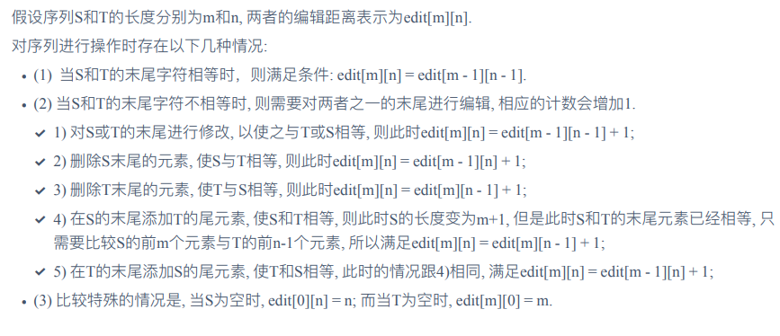
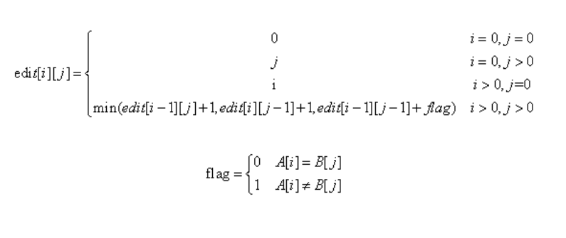

# P2758 编辑距离

| OJ   | 洛谷 |
| ---- | -- |
| 解题报告 |    |
| 时间   |    |
| AC   | ☐  |
| 算法   |    |

<https://www.luogu.com.cn/problem/P2758>

# 编辑距离

## 题目描述

设 $A$ 和 $B$ 是两个字符串。我们要用最少的字符操作次数，将字符串 $A$ 转换为字符串 $B$。这里所说的字符操作共有三种：

1.  删除一个字符；
2.  插入一个字符；
3.  将一个字符改为另一个字符。

$A, B$ 均只包含小写字母。

## 输入格式

第一行为字符串 $A$；第二行为字符串 $B$；字符串 $A, B$ 的长度均小于 $2000$。

## 输出格式

只有一个正整数，为最少字符操作次数。

## 样例 #1

### 样例输入 #1

```c++
sfdqxbw
gfdgw
```

### 样例输出 #1

```c++
4
```

## 提示

对于 $100 \%$ 的数据，$1 \le |A|, |B| \le 2000$。




