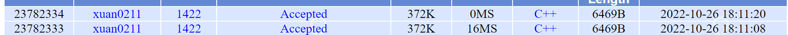

# POJ 1422 Air Raid

| OJ   | POJ        |
| ---- | ---------- |
| 解题报告 |            |
| 时间   | 2022/10/26 |
| AC   | ☑          |
| 算法   | 路径覆盖       |

<http://poj.org/problem?id=1422>

## Description

Consider a town where all the streets are one-way and each street leads from one intersection to another. It is also known that starting from an intersection and walking through town's streets you can never reach the same intersection i.e. the town's streets form no cycles. &#x20;
考虑一个城镇，所有街道都是单向的，每条街道都从一个十字路口通向另一个十字路口。众所周知，从一个十字路口开始，穿过城镇的街道，你永远无法到达同一个十字路口，即城镇的街道没有形成周期。

With these assumptions your task is to write a program that finds the minimum number of paratroopers that can descend on the town and visit all the intersections of this town in such a way that more than one paratrooper visits no intersection. Each paratrooper lands at an intersection and can visit other intersections following the town streets. There are no restrictions about the starting intersection for each paratrooper. &#x20;
有了这些假设，你的任务是编写一个程序，找到可以在镇上下降的伞兵的最小数量，并以这样的方式访问这个镇的所有十字路口，即一个以上的伞兵访问没有十字路口。每个伞兵都降落在一个十字路口，可以参观城镇街道之后的其他十字路口。每个伞兵的起始点没有限制。

## Input

Your program should read sets of data. The first line of the input file contains the number of the data sets. Each data set specifies the structure of a town and has the format: &#x20;
您的程序应该读取数据集。输入文件的第一行包含数据集的编号。每个数据集指定城镇的结构，并具有以下格式:

no\_of\_intersections &#x20;

no\_of\_streets &#x20;

S1 E1 &#x20;

S2 E2 &#x20;

...... &#x20;

Sno\_of\_streets Eno\_of\_streets &#x20;

The first line of each data set contains a positive integer no\_of\_intersections (greater than 0 and less or equal to 120), which is the number of intersections in the town. The second line contains a positive integer no\_of\_streets, which is the number of streets in the town. The next no\_of\_streets lines, one for each street in the town, are randomly ordered and represent the town's streets. The line corresponding to street k (k <= no\_of\_streets) consists of two positive integers, separated by one blank: Sk (1 <= Sk <= no\_of\_intersections) - the number of the intersection that is the start of the street, and Ek (1 <= Ek <= no\_of\_intersections) - the number of the intersection that is the end of the street. Intersections are represented by integers from 1 to no\_of\_intersections. &#x20;
每个数据集的第一行包含一个正整数no\_of\_intersections (大于0且小于或等于120)，它是城镇中的交叉点的数量。第二行包含正整数no\_of\_streets，即城镇中的街道数量。接下来的no\_of\_streets线 (城镇中的每条街道一条) 是随机排序的，代表城镇的街道。与街道k (k <= no\_of\_streets) 相对应的线由两个正整数组成，由一个空白分隔: Sk (1 <= Sk <= no\_of\_intersections) -作为街道起点的路口的编号，和Ek (1 <= Ek <= no\_of\_intersections) -街道尽头的交叉路口编号。交点用从1到no\_of\_intersections的整数表示。

There are no blank lines between consecutive sets of data. Input data are correct. &#x20;

## Output

The result of the program is on standard output. For each input data set the program prints on a single line, starting from the beginning of the line, one integer: the minimum number of paratroopers required to visit all the intersections in the town. &#x20;
程序的结果是在标准输出上。对于每个输入数据集，程序从一行的开头开始在一行上打印一个整数: 访问镇上所有路口所需的伞兵的最小数量。

## Sample Input

2
4
3
3 4
1 3
2 3
3
3
1 3
1 2
2 3

## Sample Output

2
1

# 最小不相交路径覆盖


# 最小点覆盖

> **点覆盖的概念定义**：
>
> 对于图G=(V,E)中的一个点覆盖是一个[集合](https://so.csdn.net/so/search?q=集合\&spm=1001.2101.3001.7020 "集合")S⊆V使得每一条边至少有一个端点在S中。

> **最小点覆盖：**
>
> **就是**点覆盖中**点的个数**最少的集合S。

## 定理1（Konig 定理）

最大匹配边数 = 最小点覆盖数

## 定理2

最大独立数 = 顶点数 -最小点覆盖数

## 定理3

最大独立数 = 顶点数 - 最大匹配数

```c++
class DAG
{
private:
public:
    int n;
    int e;
    Edge* head[N];
    void init(int n, int e)
    {
        //n代表点的个数,e代表边的条数
        this->n = n;
        this->e = e;
        for (int i = 0; i <= n; i++)
        {
            head[i] = (Edge*)malloc(sizeof(Edge));
            head[i]->next = NULL;
            head[i]->to = 0;
        }
        while (this->e--)
        {
            int s, t;
            cin >> s >> t;
            Edge* now1;
            now1 = (Edge*)malloc(sizeof(Edge));
            now1->to = t;
            now1->next = this->head[s]->next;
            this->head[s]->next = now1;
        }
        return;
    }
    int minGVcover_uninter()
    {
        if (this->n == 0) return 0;
        BiPartGraph BG;
        BG.init(this->n,this->n,0);
        //根据有向图拆分点位构造二分图
        for (int i = 1; i <= this->n; i++)
        {
            for (Edge* now = this->head[i]->next; now != NULL; now = now->next)
            {
                BG.addedge(i, now->to);
            }
        }
        return this->n - BG.MaxMatch();
        
    }
};
```

```c++
int main()
{    
    int T;
    cin >> T;
    while (T--)
    {
        DAG G;
        int n, e;
        cin >> n >>e;
        G.init(n, e);
        cout << G.minGVcover_uninter() << endl;
    }
    
    return 0;
}
```



> ✒️一直RE 看了discuss才发现数据范围其实是错的！！应该开到300以上
>
> 脏话
