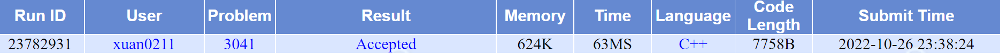

# POJ 3041 Asteroids

| OJ   | POJ        |
| ---- | ---------- |
| 解题报告 |            |
| 时间   | 2022/10/26 |
| AC   | ☑          |
| 算法   | 二分图        |

### ✅POJ 3041 Asteroids

<http://poj.org/problem?id=3041>



#### Problem：

假如你现在正处在一个N\*N的矩阵中，这个矩阵里面有K个障碍物,你拥有一把武器，一发弹药一次能消灭一行或一列的障碍物，求最小的弹药消灭全部障碍物

#### Input：

N K

接下来有K行,每行包含障碍物的坐标，r行c列。

#### Output：

花费最小的弹药数

#### Sample Input

3 4
1 1
1 3
2 2
3 2

#### Sample Output

2

#### 思路

构建二分图：

•左边一列点表示行（x），

•右边一列点表示列（y），

•当r行c列有障碍时，将xr与yc连一条线。

•用最少的炮消除所有障碍物等价于在二分图中选尽量少的点使得每条边至少有一个端点被覆盖。

•求一个二分图的最小点覆盖。

> ✒️本质就是选择N行M列，也就是选N+M个点，所以称为最小点覆盖

```c++
int main()
{
  int r, c;
  while(cin>>n>>k)
  {
    memset(lin, false , sizeof(lin));
    memset(arr, 0, sizeof(arr));
    for(int i = 1; i <= k; i++)
    {
      scanf("%d%d", &r, &c);
      lin[r][c] = true;
    }
    int all = 0;
    for(int i = 1; i <= n; i++)
    {
      memset(used, 0, sizeof(used));
      if(find(i))
        all++;
    }
    printf("%d\n", all);
  }
  return 0;
}
```
