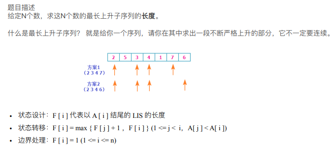

# 【LIS】最长上升子序列问题

| OJ   | LeetCode                                                                                                                                                            |
| ---- | ------------------------------------------------------------------------------------------------------------------------------------------------------------------- |
| 解题报告 | [https://www.wolai.com/mawxuan/8BqAu59XDUvJkft7LqnsZP](https://www.wolai.com/mawxuan/8BqAu59XDUvJkft7LqnsZP "https://www.wolai.com/mawxuan/8BqAu59XDUvJkft7LqnsZP") |
| 时间   | 2022/11/05                                                                                                                                                          |
| AC   | ☑                                                                                                                                                                   |
| 算法   | DP,LIS                                                                                                                                                              |

<https://leetcode.cn/problems/longest-increasing-subsequence/>

## 解题报告

[电路布线问题](https://www.wolai.com/8BqAu59XDUvJkft7LqnsZP.md "电路布线问题")

## 基本思想



## 优化后版本$nlogn$

```c++
class Solution {
public:
  int CeilIndex(std::vector<int>& v, int l, int r, int key)
{
  while (r - l > 1) 
  {
    int m = (l+r) / 2;
    if (v[m] >= key)
      r = m;
    else
      l = m;
  }
  return r;
}
   int lengthOfLIS(vector<int>& nums) 
    {
        if (nums.size() == 0)
            return 0;
        std::vector<int> end(nums.size(), 0);
        int length = 1; 
        end[0] = nums[0];
        for (size_t i = 1; i < nums.size(); i++) 
        {
            if (nums[i] < end[0])
            end[0] = nums[i];
            else if (nums[i] > end[length - 1])
                end[length++] = nums[i];
            else
            end[CeilIndex(end, -1, length - 1, nums[i])] = nums[i];
        }
        return length;
    }

};
```

## 变形：

[P1020 \[NOIP1999 普及组\] 导弹拦截](<../P1020 \[NOIP1999 普及组] 导弹拦截/P1020 \[NOIP1999 普及组] 导弹拦截.md> "P1020 \[NOIP1999 普及组] 导弹拦截")
