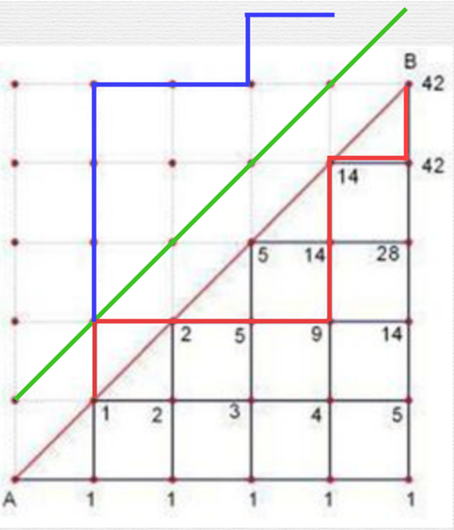

# 【卡特兰数】栈

| OJ   | 洛谷         |
| ---- | ---------- |
| 解题报告 |            |
| 时间   | 2022/11/09 |
| AC   | ☑          |
| 算法   | 数论         |

# 重点速览

递推关系的解为：

$$
H_{n}=\frac{\left(\begin{array}{c}2 n \\ n\end{array}\right)}{n+1}\left(n \geq 2, n \in \mathbf{N}_{+}\right)
$$

$$
C(n, m)=n ! /((n-m) ! \star m !)
$$

关于 Catalan 数的常见公式：

$$
H_{n}=\left\{\begin{array}{ll}\sum_{i=1}^{n} H_{i-1} H_{n-i} & n \geq 2, n \in \mathbf{N}_{+} \\ 1 & n=0,1\end{array}\right.\\H_{n}=\frac{H_{n-1}(4 n-2)}{n+1}\\H_{n}=\left(\begin{array}{c}2 n \\ n\end{array}\right)-\left(\begin{array}{c}2 n \\ n-1\end{array}\right)
$$

<https://oi-wiki.org/math/combinatorics/catalan/>

# +1-1

## 提出

这类问题多半是一进一出的问题，《竞赛一本通：初赛篇》对这类问题有过这样的一个归纳

$有这样一组数列:$

1.  $由n个+1和n个-1组成$
2.  $前缀和始终≥0$

$ 
比如：  $

$+1,-1,+1,+1,+1,-1,-1,-1$

\*\*`卡特兰数列`\*\*可以解决这样一个问题：这样$n$规模的数列有多少个?

## 求解

### 【引入】

这个问题的求解可以转换为一个可视化的小学奥数问题

从$(0,0)$这个点出发到$ (n,n)  $这个点，以$+1$为向右走，以$-1$为向上走（只能向右或者向上走），要求不能超过中间这条线，问走到$(n,n)$点有多少种走法？

小学奥数老师给出过这样一种解法：

-   一种记录方法：在每个交叉点上记录一个数字，这个数字代表着到达这个位置的不同路线数量。
-   第0排点：我们现在仅考虑最先下面这一排点，也就是$ (0,0),(0,1)\dots(0,n)  $这一排点，由于这一排点只能向右走而不能向上走，所以到达第0排的任何一个点实际上只有一种路线：从$(0,n-1)$这个点往右走一步（就是一直往右走）
-   第1排点：考虑第一排点，比如$ (1,1)  $这个点，观察图就可以发现，我们可以从$(0,1)$这个点向上走一格到这个位置。而对于$(1,2)$这个点，我们可以从$(0,2)$向上或者从$(1,1)$向右。是$1+1=2$

我们不难发现这其实是一种dp，转移方程为$ dp[i][j]=dp[i-1][j]+dp[i][j-1]  $，而当$i=j=n$时，$ dp[n][n]=catalan(n)
  $

SC\~0_i-5P8qDXZM.jpg)

Q\~4]1D1\)E0QZZJ_oNQ9LL51w_.jpg)

\)7{C_YeCyCVRfFe.jpg)

### 通项公式推导

-   不考虑第一象限平分线的限制，方案数为
    $$
    \left(\begin{array}{c}2 n \\ n\end{array}\right)
    $$
-   任何一种非法的方案，都至少有一个点p碰到了直线y=x+1，

    将这条路径在p点以上的在直线y=x+1以下的部分沿直线y=x+1镜像到直线y=x+1上。

    图中的绿线为y=x+1，红线为原非法路径在p上的部分，蓝线为镜像后的结果。&#x20;

    任何一种非法方案都可以变换成(0,0)到(n-1,n+1)的一条路径，且存在一一映射关系，
-   所以总方案数为:
    $$
    C(n)=\left(\begin{array}{c}2 n \\ n\end{array}\right)-\left(\begin{array}{c}2 n \\ n+1\end{array}\right)
    $$



### 栈

$一个栈 (无穷大) 的进栈序列为 1,2,3, \cdots, n 有多少个不同的出栈序列?$

```c++
#include <iostream>
#include <cstring>
using namespace std;
int main()
{
    long long int f[25];
    int n;
    memset(f, 0, sizeof(f));
    cin >> n;
    f[0] = 1;
    for (int i = 1; i <= n; i++)
    {
        f[i] = f[i - 1] * (4 * i - 2) / (i + 1);
    }
    cout << f[n] << endl;
    return 0;
}
```

<https://www.luogu.com.cn/problem/P1044>


