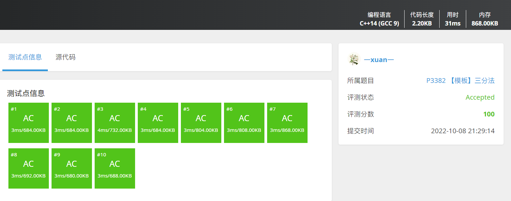

# 【模板】三分法

| OJ   | 洛谷         |
| ---- | ---------- |
| 解题报告 |            |
| 时间   | 2022/10/08 |
| AC   | ☑          |
| 算法   |            |

## 解题记录

<https://www.luogu.com.cn/problem/P3382>



### 三分查找

> ✒️Say 这个函数先增后减（凸函数）

```c++
    double find(vector<double>& ploy,double left,double right)
    {
        //给出一个 N 次函数，保证在范围[l,r] 内存在一点 x，使得 [l,x] 上单调增，[x,r] 上单调减。试求出 x 的值。
        this->myploy = ploy;
        double midl, midr;
        while (left < right)
        {
            if (fabs(right - left) < 0.000001)
                break;
            midl = left + (right - left) / 3.0;     
            midr = right - (right - left) / 3.0;
            double ansl, ansr;
            ansl = fun(midl);
            ansr = fun(midr);
            if (ansl >= ansr)
            {
                right = midr;                
            }
            else
            {
                left = midl;
            }
        }
        return left;
    }

```
