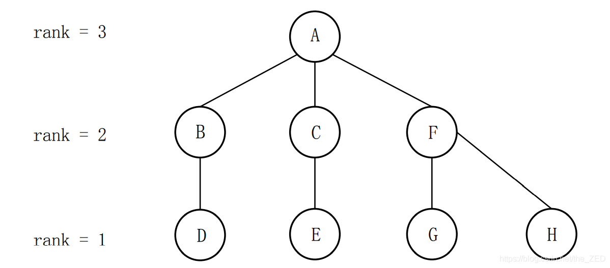

# 【模板并查集】亲戚

| OJ   | 洛谷         |
| ---- | ---------- |
| 解题报告 |            |
| 时间   | 2022/12/13 |
| AC   | ☑          |
| 算法   | 并查集        |

<https://www.luogu.com.cn/problem/P1551>

# 亲戚

## 题目背景

若某个家族人员过于庞大，要判断两个是否是亲戚，确实还很不容易，现在给出某个亲戚关系图，求任意给出的两个人是否具有亲戚关系。

## 题目描述

规定：$x$ 和 $y$ 是亲戚，$y$ 和 $z$ 是亲戚，那么 $x$ 和 $z$ 也是亲戚。如果 $x$，$y$ 是亲戚，那么 $x$ 的亲戚都是 $y$ 的亲戚，$y$ 的亲戚也都是 $x$ 的亲戚。

## 输入格式

第一行：三个整数 $n,m,p$，（$n,m,p \le 5000$），分别表示有 $n$ 个人，$m$ 个亲戚关系，询问 $p$ 对亲戚关系。

以下 $m$ 行：每行两个数 $M_i$，$M_j$，$1 \le M_i,~M_j\le N$，表示 $M_i$ 和 $M_j$ 具有亲戚关系。

接下来 $p$ 行：每行两个数 $P_i,P_j$，询问 $P_i$ 和 $P_j$ 是否具有亲戚关系。

## 输出格式

$p$ 行，每行一个 `Yes` 或 `No`。表示第 $i$ 个询问的答案为“具有”或“不具有”亲戚关系。

## 样例 #1

### 样例输入 #1

```c++
6 5 3
1 2
1 5
3 4
5 2
1 3
1 4
2 3
5 6
```

### 样例输出 #1

```c++
Yes
Yes
No
```

## 算法分析：并查集

1、用集合中的某个元素来代表这个集合，则该元素称为此集合的代表元；

2 、一个集合内的所有元素组织成以代表元为根的树形结构；

3 、对于每一个元素 x，pre\[x] 存放 x 在树形结构中的父亲节点（如果 x 是根节点，则令pre\[x] = x）；

4 、对于查找操作，假设需要确定 x 所在的的集合，也就是确定集合的代表元。可以沿着pre\[x]不断在树形结构中向上移动，直到到达根节点。

```c++
//并查集.h
#define MAX_NODE 20
class DSU
{
private:
  int pre[MAX_NODE+1];
  int rank[MAX_NODE+1];

public:
  int N = MAX_NODE;
  void Init();
  int Find(int x);
  void Join(int x, int y);
};

```

## 初始化

```c++
void DSU::Init()
{
  for (int i = 0; i <= this->N; i++)
  {
    this->pre[i] = i;
    this->rank[i] = 1;
  }
  return;
}
```

## 查找

```c++
int DSU::Find(int x)
{
  while (this->pre[x] != x) x = this->pre[x];
  return x;
}

```

## 优化1查找且路径压缩

```c++
int Find(int x)
{
  if(f(x)!=x)
  {
    f(x)=Find(f(x));
  }
  return f(x);
}
```

> ✒️感觉我这里没有更新rank函数唉？真的不会有事吗
>
> 哦没事了，我跟本没有联合按秩合并一起写
>
> 也就是这两种优化没必要一起搞？？
>
> 那种更优秀一点啊
>
> 我的脑子好像解决不了这个问题

## 优化2按秩合并

### version 1(感觉不太对）

```c++
void DSU::Join(int x, int y)
{
  int fx, fy;
  fx = this->Find(x);
  fy = this->Find(y);
  if (fx == fy) return;
  if (rank[x] < rank[y])
  {
    pre[fx] = fy;
  }
  else
  {
    pre[fy] = fx;
    if (rank[x] == rank[y]) rank[y]++;
  }
  return;
}
```

### version 2

```c++
void DSU::Join(int x, int y)
{
  int fx, fy;
  fx = this->Find(x);
  fy = this->Find(y);
  if (fx == fy) return;
  if (rank[fx] < rank[fy])
  {
    pre[fx] = fy;
  }
  else
  {
    pre[fy] = fx;
    if (rank[fx] == rank[fy]) rank[fx]++;
  }
  return;
}
```

> ✒️感觉我的脑子又不好了。。
>
> 难道把fx挂在fy下面的时候，fx下面的rank不会全部++ 的吗？
>
> ***
>
> 所以我感觉。。之前的算法写错了。。
>
> 至少rank的意思是树高不是树深
>
> 所以改脑袋就行了不用改下面的
>
> ***
>
> 而且只要保证代表元的高度是整棵树的高度就可以了
>
> 下面的树高可以不连续
>
> 比如一棵
>
> &#x20;        4
>
> &#x20;  3          2
>
> &#x20;2    1    1    1
>
> 1  1




## 第一次AC

```c++
int main()
{
  int a,b,c,d;
  cin>>n>>m>>p;
  DSU D;
  D->N=n;
  D->Init();
  for(int i=1;i<=m;i++)
  {
      cin>>c>>d;
      D->Join(c,d);
  }
  for(int i=1;i<=p;i++)
  {
    cin>>a>>b;
    if(D->Find(a)==D->Find(b))
      cout<<"Yes"<<endl;
    else
      cout<<"No"<<endl;
  }
  return 0;
}
```

## 第二次AC

```c++
#include <bits/stdc++.h>
using namespace std;
int pre[5050];
int Rank[5050];
void init(int n)
{
  for(int i=1;i<=n;i++)
  {
    pre[i]=i;
    Rank[i]=1;
  }
  return;
}
int find(int x)
{
  while(x!=pre[x])
  {
    x=pre[x];
  }
  return x;
}
void join(int x,int y)
{
  int fx,fy; 
  fx=find(x);
  fy=find(y);
  if(fx==fy)
  {
    return;
  }
  if(Rank[fx]<Rank[fy])
  {
    pre[fx]=fy;
  }
  else
  {
    pre[fy]=fx;
    if(Rank[fx]==Rank[fy])
    {
      Rank[fx]++; 
    }
  }
  return;
}
int main()
{
  int n,m,p;
  cin>>n>>m>>p;
  init(n);
  for(int i=1;i<=m;i++)
  {
    int xx,yy;
    cin>>xx>>yy;
    join(xx,yy);
  }
  for(int i=1;i<=p;i++)
  {
    int xx,yy;
    cin>>xx>>yy;
    if(find(xx)!=find(yy))
      cout<<"No"<<endl;
    else
      cout<<"Yes"<<endl;
  }
  return 0;
} 
```


