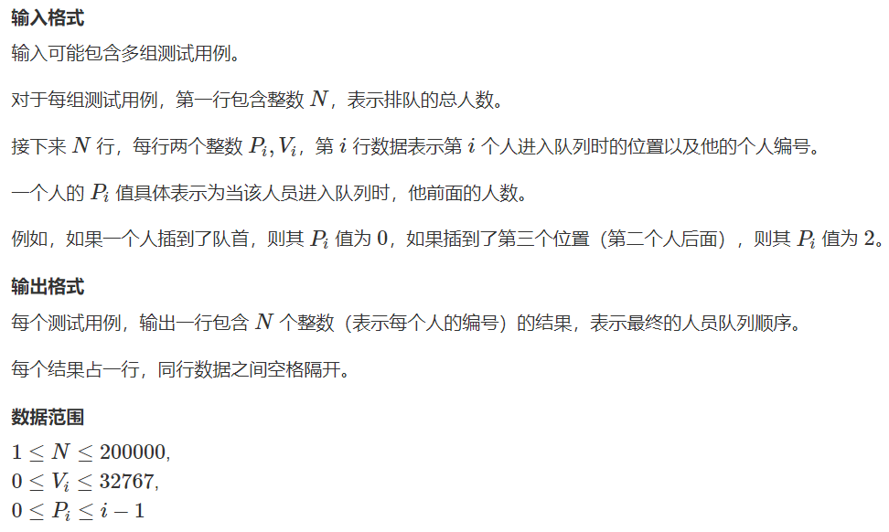
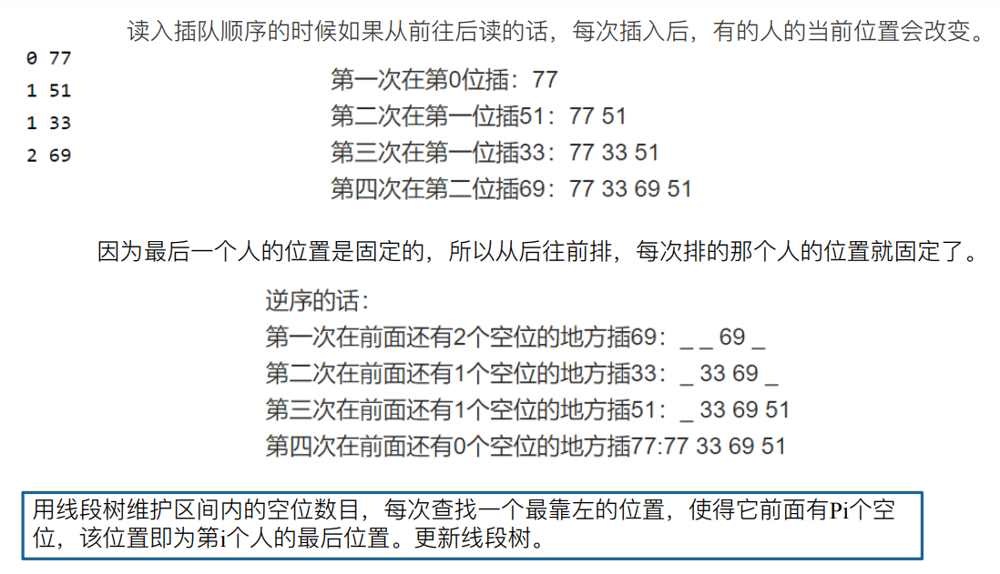
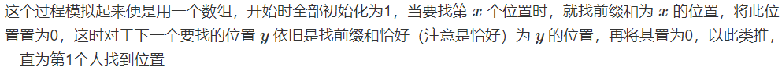

# 买票

| OJ   | AcWing |
| ---- | ------ |
| 解题报告 |        |
| 时间   |        |
| AC   | ☐      |
| 算法   |        |

## 目录

-   [输入样例：](#输入样例)
-   [输出样例：](#输出样例)
-   [样例解释](#样例解释)
-   [解题思路](#解题思路)

<https://www.acwing.com/problem/content/description/262/>

<https://cdn.acwing.com/solution/content/59400/>

达达在买回家的火车票，因为正值春运，售票处排起了长队。

因为晚上室内光线很暗，所以很多人趁机插队。

现在给每个人赋予一个整数作为编号，告诉你每一个排队的人的编号，和他进入队列时的具体位置。

请你确定最终的队列顺序。



#### 输入样例：

```c++
4
0 77
1 51
1 33
2 69
4
0 20523
1 19243
1 3890
0 31492
```

#### 输出样例：

```c++
77 33 69 51
31492 20523 3890 19243
```

#### 样例解释

下图描述了输入样例中第一组测试用例的场景。


## 解题思路





```c++
const int M=200005;
struct node
{
    int vac,val,le,ri;
};
node tree[M<<2];
int n,data[M][2];
void pushup(int v)
{
    tree[v].vac=tree[v<<1].vac+tree[v<<1|1].vac;
}
void build(int v,int le,int ri)
{
    tree[v].le=le;
    tree[v].ri=ri;
    if(le==ri)
    {
        tree[v].vac=1;
        return;
    }
    int mid=(le+ri)>>1;
    build(v<<1,le,mid);
    build(v<<1|1,mid+1,ri);
    pushup(v);
}
void insert(int v,int pos,int val)
{
    if(tree[v].le==tree[v].ri)
    {
        tree[v].val=val;
        tree[v].vac=0;
        return;
    }
    if(pos<=tree[v<<1].vac)
      insert(v<<1,pos,val);
    else
      insert(v<<1|1,pos-tree[v<<1].vac,val);
    pushup(v);
}
int queue(int v,int pos)
{
    if(tree[v].le==tree[v].ri)
      return tree[v].val;
    int mid=(tree[v].le+tree[v].ri)>>1;
    if(pos<=mid)
      queue(v<<1,pos);
    else 
      queue(v<<1|1,pos);
}
int main()
{
    while(scanf("%d",&n)!=EOF)
    {
      for(int i=1;i<=n;++i)
        scanf("%d%d",&data[i][0],&data[i][1]);
       build(1,1,n);
       for(int i=n;i>=1;--i)
         insert(1,data[i][0]+1,data[i][1]);
       for(int i=1;i<=n;++i)
         printf("%d ",queue(1,i));
    }
    return 0;
}
```
