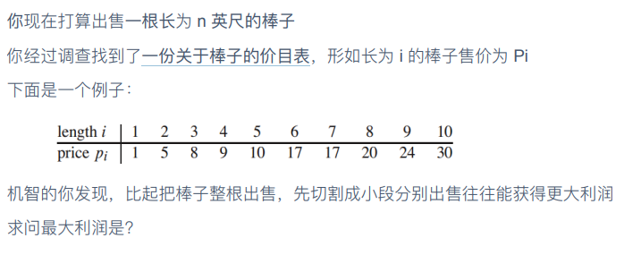

# 出售棒子？

| OJ   |    |
| ---- | -- |
| 解题报告 |    |
| 时间   |    |
| AC   | ☐  |
| 算法   | DP |



```c++
int cutting(int[] prices,int n)
{
  int[] dp new int[n+1];//建立DP数组
  for(int i=1;i<=n;i++)
  {
    int cur=minn;
    for(int j=1;j<i/2;j++)
    {
      cur=max(cur,dp[j]+dp[i-j]);
      //枚举断点，寻找最大利润的分段方式
    }
    dp[i]=max(cur,prices[i-1]);
  }
  return dp[n]
}
```

> ✒️总觉得代码不是很对劲
