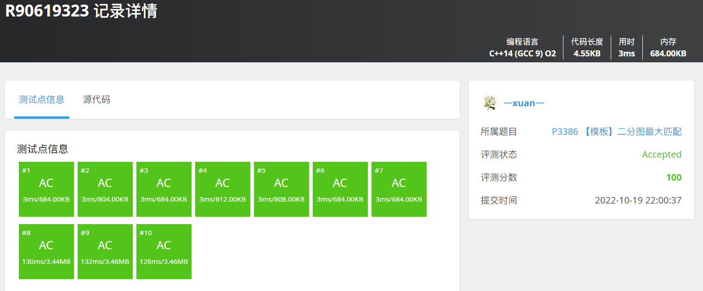

# 最大匹配 洛谷P3386

| OJ   | 洛谷         |
| ---- | ---------- |
| 解题报告 |            |
| 时间   | 2022/10/20 |
| AC   | ☑          |
| 算法   | 二分图        |

#### ✅【模板题】最大匹配 洛谷P3386

<https://www.luogu.com.cn/problem/P3386>



```c++
int main()
{
    BiPartGraph G;
    int n, m, e;
    cin >> n >> m >> e;
    G.init(n, m, e);
    cout << G.MaxMatch();
    return 0;
}
```
