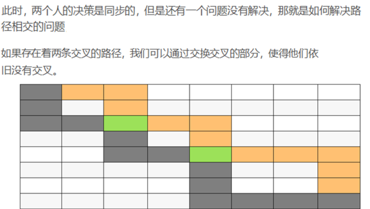
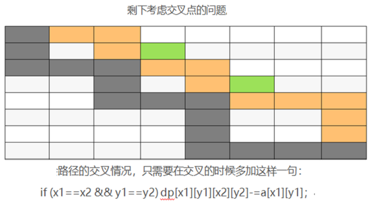

# 棋盘

| OJ   |    |
| ---- | -- |
| 解题报告 |    |
| 时间   |    |
| AC   | ☐  |
| 算法   | DP |

可以理解为有两个人同时一起走

其中一个人的坐标为$[x1,y1]$,另一个人的坐标为$ [x2,y2]  $

显然有转移方程

```c++
dp[x1][y1][x2][y2]=max(dp[x1-1][y1][x2][y2],dp[x1][y1-1][x2][y2],dp[x1][y1][x2-1][y2],
                       dp[x1][y1][x2][y2-1])+map[x1][y1]+map[x2][y2];
```

这显然是一个$O(n^4)$的方程

我们可以想办法减少一个维度，也就是

定义变量k为一共走的步数

也就是有

$$
x1+y1=k\\x2+y2=k
$$

所以有

$$
y1=k-x1\\y2=k-x2
$$

那么新的状态转移方程就是

```c++
dp[k][x1][x2]=max(dp[k-1][x1-1][x2],dp[k-1][x1][x2],dp[k-1][x1][x2-1],
              dp[k-1][x1-1][x2-1])+map[x1][k-x1]+map[x2][k-x2];
```

所以方程的时间复杂度简化为$O(n^3)$

利用滚动数组，我们可以进一步优化方程为

```c++
dp[x1][x2]=max(dp[x1-1][x2],dp[x1][x2],
          dp[x1][x2-1],dp[x1-1][x2-1])+map[x1][k-x1]+map[x2][k-x2];
```

此时空间复杂度简化到了$O(n^2)$

但是这个思路还有一个BUG，无法解决路径重叠的问题

PPT上采用了替换的策略





所以还要再交叉的时候再加上一句

```c++
if(x1==x2&&y1==y2)
  dp[x1][y1][x2][y2]-=map[x1][y1]

```

> ✒️说实话这段没看懂，也就是这个其实是不合法答案，不是只要排除就可以了吗？交换不交换的不重要吧

## 老干部的代码

```c++
#include<bits/stdc++.h>
#define ll long long
const ll MAXN=2e2+5;
ll a[MAXN][MAXN],dp[MAXN][MAXN][MAXN];
ll solve(void)
{
    ll n,m;
    scanf("%lld %lld",&n,&m);
    for(ll i=1;i<=n;i++)
        for(ll j=1;j<=m;j++)
            scanf("%lld",&a[i][j]);
    for(ll i=2;i<=n+m;i++)
        for(ll j=1;j<=n+m;j++)
            for(ll k=1;k<=n+m;k++)
                dp[i][j][k]=0;
    dp[2][1][1]=a[1][1];
    dp[3][1][2]=a[1][1]+a[1][2]+a[2][1];
    for(ll i=4;i<=n+m;i++)
    {
        for(ll j=i>std::min(n,m)+1?i-std::min(n,m)-1:1;j<i&&j<n;j++)
        {
            for(ll k=j+1;k<=i&&k<=n;k++)
            {
                if(j<k&&j>0&&k<=i-1)
                    dp[i][j][k]=std::max(dp[i][j][k],dp[i-1][j][k]);
                if(j-1<k&&j-1>0&&k<=i-1)
                    dp[i][j][k]=std::max(dp[i][j][k],dp[i-1][j-1][k]);
                if(j<k-1&&j>0&&k-1<=i-1)
                    dp[i][j][k]=std::max(dp[i][j][k],dp[i-1][j][k-1]);
                if(j<k&&j-1>0&&k-1<=i-1)
                    dp[i][j][k]=std::max(dp[i][j][k],dp[i-1][j-1][k-1]);
                dp[i][j][k]+=a[j][i-j]+a[k][i-k];
            }
        }
    }

    return dp[n+m-1][n-1][n]+a[n][m];

}

int main()
{
    ll t;
    scanf("%lld",&t);
    while(t--)
        printf("%lld\n",solve());
    return 0;
}
```
