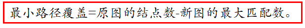
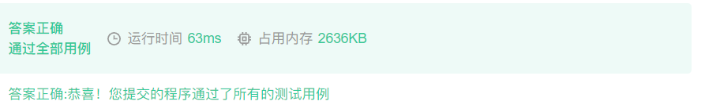

# 棋盘覆盖

| OJ   | 牛客         |
| ---- | ---------- |
| 解题报告 |            |
| 时间   | 2022/10/26 |
| AC   | ☑          |
| 算法   | 二分图        |

链接：[https://ac.nowcoder.com/acm/contest/1062/B](https://ac.nowcoder.com/acm/contest/1062/B "https://ac.nowcoder.com/acm/contest/1062/B") &#x20;

来源：牛客网 &#x20;

时间限制：C/C++ 1秒，其他语言2秒 &#x20;
空间限制：C/C++ 32768K，其他语言65536K &#x20;
64bit IO Format: %lld &#x20;

## 题目描述

给定一个N行N列的棋盘，已知某些格子禁止放置。求最多能往棋盘上放多少块的长度为2、宽度为1的骨牌。骨牌的边界与格线重合(骨牌占用两个格子),并且任意两张骨牌都不重叠。N,M≤100。

## 输入描述:

第一行为n，m（表示有m个删除的格子） &#x20;
第二行到m+1行为x,y，分别表示删除格子所在的位置 &#x20;
x为第x行 &#x20;
y为第y列

## 输出描述:

一个数，即最大覆盖格数

示例1

## 输入

8 0

## 输出

32

# 最小不相交路径覆盖



### ✅棋盘覆盖

<https://ac.nowcoder.com/acm/contest/1062/B>



#### 思路

构建二分图：

•把每个位置的点进行重新编号，相邻的两点具有不同的性质。

•比如说在2×2的图内第一个点(1,1)标记为1，它是奇数，那么与它相邻的 (1,2), (2,1)就要标记成偶数。

•两两建边，奇数点->偶数点 or 偶数点->奇数点（当然如果是被删除的点，则不能建边）。

•求二分图最大匹配即可。

```c++
int main()
{    
    int G[110][110];
    int dir[4][2] = { {0,1},{0,-1},{-1,0},{1,0} };
    memset(G, 0, sizeof(G));
    int n, m;
    cin >> n >> m;
    int x, y;
    for (int i = 0; i <= n + 1; i++)
    {
        G[0][i] = G[i][0] = 1;
        G[n + 1][i] = G[i][n + 1] = 1;
    }
    while (m--)
    {
        cin >> x >> y;
        G[x][y] = 1;
    }
    BiPartGraph BG;
    BG.init(n * n, n * n, 0);
    //建图
    for (int i = 1; i <= n; i++)
    {
        for (int j = 1;j <= n; j++)
        {
            if (G[i][j] || (i + j) % 2 == 1) continue;
            for (int t = 0; t < 4; t++)
            {
                int xx, yy;
                xx = i + dir[t][0];
                yy = j + dir[t][1];
                if (!G[xx][yy])
                {
                    int s = (i - 1) * n + j;
                    int t = (xx - 1) * n + yy;
                    BG.addedge(s, t);
                }
            }
        }
    }
    cout << BG.MaxMatch();
    return 0;
}
```
