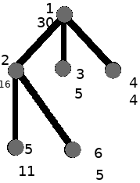
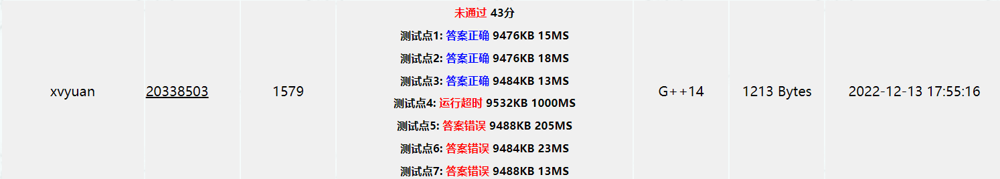
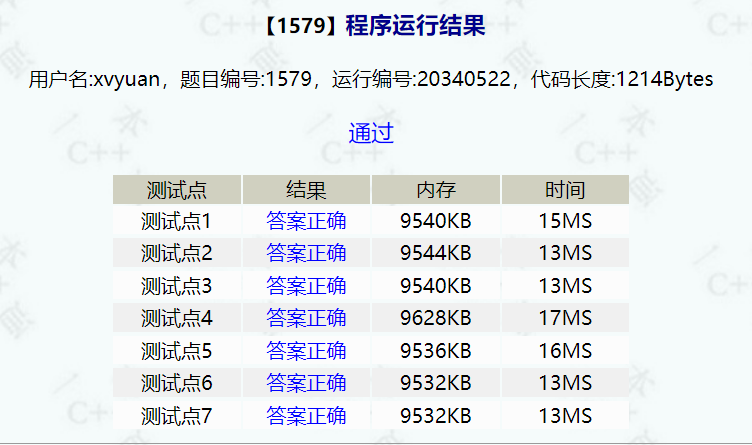

# 皇宫看守

| OJ   | 一本通        |
| ---- | ---------- |
| 解题报告 |            |
| 时间   | 2022/12/13 |
| AC   | ☑          |
| 算法   | 树形DP,DP    |

## 目录

-   [OJ地址:](#OJ地址)
-   [问题重述：](#问题重述)
-   [输入：](#输入)
-   [输出：](#输出)
-   [数据结构](#数据结构)
-   [算法分析：](#算法分析)
    -   [贪心搜索](#贪心搜索)
-   [树形DP](#树形DP)
    -   [状态定义](#状态定义)
        -   [f\[u\]\[0\]](#fu0)
        -   [f\[u\]\[1\]](#fu1)
        -   [f\[u\]\[2\]](#fu2)
    -   [Base Case](#Base-Case)
        -   [f\[u\]\[0\] = 0;    ](#fu0--0----)
        -   [f\[u\]\[1\] = INF;  ](#fu1--INF--)
        -   [f\[u\]\[2\] = w\[u\]; ](#fu2--wu-)
    -   [状态转移方程](#状态转移方程)
    -   [参考代码](#参考代码)
    -   [代码：](#代码)
-   [OJ测试结果](#OJ测试结果)

## OJ地址:

<http://ybt.ssoier.cn:8088/problem_show.php?pid=1579>

## 问题重述：

太平王世子事件后，陆小凤成了皇上特聘的御前一品侍卫。

皇宫以午门为起点，直到后宫嫔妃们的寝宫，呈一棵树的形状，某些宫殿间可以互相望见。大内保卫森严，三步一岗，五步一哨，每个宫殿都要有人全天候看守，在不同的宫殿安排看守所需的费用不同。

可是陆小凤手上的经费不足，无论如何也没法在每个宫殿都安置留守侍卫。

帮助陆小凤布置侍卫，在看守全部宫殿的前提下，使得花费的经费最少。



## 输入：

输入中数据描述一棵树，描述如下：

第一行 n，表示树中结点的数目。

第二行至第n+1 行，每行描述每个宫殿结点信息，依次为：该宫殿结点标号 i(0\<i≤n)，在该宫殿安置侍卫所需的经费 k，**该边的儿子数 m**，接下来 m 个数，分别是这个节点的 m 个儿子的标号r1,r2,⋯,rm。

对于一个 n 个结点的树，结点标号在 1 到 n 之间，且标号不重复。

```c++
8
1 100 3 2 3 4
2 100 3 5 6 7
3 1 0
4 2 0
5 1 1 8
6 2 0 
7 100 0
8 100 0
```

## 输出：

输出最少的经费

```c++
104
```

## 数据结构

直接邻接矩阵存树

并且存成有向图

## 算法分析：

> ✒️理解了一下，就是求树上的最小支配？

***

可以转换成二分图 然后点着色吗？

***

### 贪心搜索

考虑一棵树

1.要所有的孩子

孩子的孩子就不要了，要他们的孩子 也就是孩子的孩子的孩子

2.要父亲

要孩子的孩子

```c++
#include <bits/stdc++.h>
#define INF 0x3f3f3f
using namespace std;
int n;
int g[1510][1510];
//应该是自下而上的 
//但是我这里先编一个自上而下的
int search(int x)
{
  int minn=INF;
  int ans=0;
  //要所有的孩子 
  for(int i=1;i<=n;i++)
  {
    if(g[x][i]==1)
    {
      ans+=g[i][0];
      for(int j=1;j<=n;j++)
      {
        if(g[i][j]==1)
          ans+=search(j);
      }
    }
  }
  minn=min(ans,minn);
  //要父亲
  ans=g[x][0];
  for(int i=1;i<=n;i++)
  {
    if(g[x][i]==1)
      ans+=search(i);
  } 
  minn=min(ans,minn);
//  cout<<1<<endl;
  return minn;
 } 
 int findroot()
 {
   for(int i=1;i<=n;i++)
   {
     //只有出度没有入度的就是树根
    int t=0;
    for(int j=1;j<=n;j++)
    {
      if(g[j][i]==1)
      {
        t++;
      }  
    }  
    if(t==0)
    {
      return i;
    }
  }
  return n;
 }
int main()
{
  memset(g,0,sizeof(g));
  cin>>n;
  for(int i=1;i<=n;i++)
  {
    int k,m;
    cin>>k;
    cin>>g[k][0]>>m;
    //在k,0位置储存花费 
    for(int j=1;j<=m;j++)
    {
      int t;
      cin>>t;
      g[k][t]=1;
    //  g[t][k]=1;
    }
    //输入树 其实当图来存了呢 
  }
  if(n==1)
  {
    cout<<g[1][0];
  }
  else
  {
    cout<<search(findroot());
  }
  return 0;
} 

```



## 树形DP

<https://www.cnblogs.com/littlehb/p/15788813.html>

### 状态定义

#### **`f[u][0]`**

第u号结点**没有放守卫**，并且第u号结点被他的父结点安排的守卫看住的方案 最小值

#### **`f[u][1]`**

第u号结点没有放守卫，并且第u号结点被他的子结点安排的守卫看住的方案 最小值

#### **`f[u][2]`**

第u号结点自己安排守卫看住的方案 最小值

### Base Case

#### **`f[u][0]`** = 0;   &#x20;

&#x20;u点由父亲看着，**此状态从u点为根的子树来看，代价为0。**

#### **`f[u][1]`** = INF; &#x20;

&#x20;u被某个子节点看守，但还没有评选中由哪个来看守更合适，初始值是INF

#### **`f[u][2]`** = w\[u];&#x20;

&#x20;u点由自己看着，此状态从u点为根的子树来看，代价为w\[u]。

***

> ✒️这里都还没有算上 自己的孩子被看住的代价，会在后面更新加上的&#x20;

### 状态转移方程

**对于当前结点**\*\*`u`\*\*，$ 
j  $**是**$u$**的儿子的标号**

-   **不放守卫**
    1.  **父结点放了，记**\*\*`f[u][0]`\*\*$ 
        f[u][0]=∑min\{f[j][1],f[j][2]\}  $

        含义：当前结点`u`不放且被父节点看到，那么子结点`j`只能放或者被其子结点看到。

        因为`u`不放所以不能拿`f[j][0]`来更新
    2.  **子节点放了，记**\*\*`f[u][1]`\*\*$f[u][1]=f[k][2]+\sum \min \{f[j][1], f[j][2]\} \quad k \neq j$

        含义：

        如果当前结点u没用放，u的父节点也没放，那么u至少有一个子结点（k）放了

        当前结点`u`不放，`u`的子结点`k`放了，`u`的其他子结点`j`放（`f[j][2]`）或者不放（即`f[j][1]`）。没有`f[j][0]`的原因也是因为`u`不放，且需要枚举`k`。
        ***
        这里为了简化重复计算，采取另一种计算方法

        $f[u][1]=min\{f[k][2]+\sum\{min(f[j][1],f[j][2])\} - min(f[k][1],f[k][2])\}$

        这里可以有$ 
        f[u][0]=∑min\{f[j][1],f[j][2]\}  $

        那么：

        $ 
        f[u][1]=min\{f[k][2]+f[u][0] - min(f[k][1],f[k][2])\}  $
-   **放置守卫，记**\*\*`f[u][2]`\*\*​$f[u][2]=w[u]+\sum \min \{f[j][0], f[j][1], f[j][2]\}$

    含义：当前结点放了，那么子结点取哪种状态都可以

### 参考代码

```c++
#include <bits/stdc++.h>

using namespace std;
const int INF = 0x3f3f3f3f;

/*
 树形DP问题总结：
 （1）如果是看“边”，那么状态一般是两个，这个点放:f(i, 1),还是不放:f(i, 0)。
 （2）如果是看“点”，那么状态应该是三个:
    f(i, 0)：第i号结点没有放守卫，并且第i号结点被他的父结点安排的守卫看住的方案 最小值
    f(i, 1)：第i号结点没有放守卫，并且第i号结点被他的子结点安排的守卫看住的方案 最小值
    f(i, 2)：第i号结点自己安排守卫看住的方案 最小值

讨论父亲与儿子的关系，i是父亲，j是儿子
状态计算:(j是i的子结点)
    f(i, 0) = sum{min(f(j,1), f(j,2))}
        i是被他父结点看住的，那他的子结点要么自己看自己，要么被自己的子结点看住

    f(i, 1) = min{ f(k, 2) + sum{min(f(j,1), f(j,2))}} (j≠k)
        i如果是被某个子结点看住的，需要枚举子结点k，对所有方案求最小值
        此种情况下，k这个结点必须放一个守卫，所以 + f(k, 2)
        k这个点上出了一个守卫，那么其它子结点可以出守卫也可以不出守卫，但指望不上父结点给它提供守卫了。

    f(i, 2) = sum{min(f(j,0), f(j,1), f(j,2))}
        i是被自己看住的，那他的子结点j可以被父结点i看住，可以自己看自己，也可以被自己的子结点看住.

*/
const int N = 1510;
int n;
int h[N], e[N], ne[N], idx;
int w[N]; //这个是点的权值，不是边，不是边，不是边！
/*
f[u][0]：u号结点没有放守卫，并且第i号结点被他的父结点安排的守卫看住的方案 最小值
f[u][1]：u号结点没有放守卫，并且第i号结点被他的子结点安排的守卫看住的方案 最小值
f[u][2]：u号结点自己安排守卫看住的方案 最小值
*/
int f[N][3];
int in[N]; //入度

//邻接表
void add(int a, int b) {
    e[idx] = b, ne[idx] = h[a], h[a] = idx++;
}

void dfs(int u) {
    f[u][0] = 0;    // u点由父亲看着，此状态从u点为根的子树来看，代价为0。
    f[u][1] = INF;  // u被某个子节点看守，但还没有评选中由哪个来看守更合适，初始值是INF
    f[u][2] = w[u]; // u点由自己看着，此状态从u点为根的子树来看，代价为w[u]。

    //枚举u的每个儿子，刷新儿子的所有信息，并且，用儿子们的信息来更新自己的信息
    for (int i = h[u]; ~i; i = ne[i]) {
        int son = e[i];
        dfs(son); //先填充子孙后代信息，再用这些信息来更新u的相关信息

        // u不放守卫，son可以放，也可以不放，取代价小的。联想一下数字三角形，f[u][0]汇集了最优解
        f[u][0] += min(f[son][1], f[son][2]);

        // u放守卫，那么son可以靠父节点u看守，也可以自己放守卫，还可以找自己的某个子节点放守卫
        //写法1：【推荐写法】
        f[u][2] += min({f[son][0], f[son][1], f[son][2]});
        //写法2：
        // f[u][2] += min(min(f[son][0], f[son][1]), f[son][2]);
    }
    /* Q:上面的代码中，没有体现出自己不放守卫，而是挑选出一个儿子放守卫，其它儿子不放守卫的路径！
     要是不计算，不就丢失了一些路径导致结果不对吗？
     A:肯定是需要计算的。上面之所以没有计算，是因为每个枚举到的son节点，都可能成为被u挑选出来的好
     儿子，它的代价也很好表示，就是w[son]嘛。
     那为什么不直接计算出来呢？是因为光有好儿子son的代价还不行，还需要其它未部署守卫的儿子的代价值
     加在一起才有资格评比。
     而恰恰是　未部署守卫的其它儿子的代价值　不太好计算，每换一个son讨论的时候，都需要重新再算其它
     儿子的代价和。
　　　　
     如果挑选的好儿子是k的话，那么其它儿子的代价和：sum(min(f[j][1],f[j][2]) ,其中 j≠k,这样的
     计算有大量的重复，不是好算法。

     不这样算，还能怎么算呢？　其实就些类似于前缀和的思想，先把所有的sum(min(f[j][1],f[j][2])
     都加在一起，不管j是不是不等于k。
     然后，再一个一个讨论自己不放守卫，挑选出一个好儿子的问题，枚举每个儿子视为好儿子，
     那么，选中则+f[son][2],同时，其它儿子不靠父亲靠自己的代价总和就是 
     sum(min(f[j][1],f[j][2]) - min(f[son][1],f[son][2]),
     这样，算法就是O(1)的速度算出此部分的结果了！
    */

    for (int i = h[u]; ~i; i = ne[i]) {
        int son = e[i];
        // u是被父结点看住，那么子结点j只能靠自己或靠自己的孩子
        // 现在，要模拟尝试把每一个son节点进行部署守卫，一旦选择了son部署守卫，代价需要+f[son][2]，
        // 此时，其它的儿子节点就不需要进行选择，其它儿子的代价从min(f[son][1],f[son][2])
        //选择最小值
        f[u][1] = min(f[u][1], f[son][2] + f[u][0] - min(f[son][1], f[son][2]));
    }
}

int main() {
    //加快读入
    ios::sync_with_stdio(false);
    cin.tie(0);

    //初始化邻接表
    memset(h, -1, sizeof h);

    //节点个数
    cin >> n;

    // n个结点
    for (int i = 1; i <= n; i++) {
        int x, m; //结点号，代价(注意：这个代价不是在传统意义的边上，而是在点上！)，id号节点连接的其它点数量
        cin >> x >> w[x] >> m;
        while (m--) {
            int y;
            cin >> y;
            //有向图
            add(x, y);
            //入度
            in[y]++;
        }
    }

    //根
    int root = 1;
    while (in[root]) root++;

    //从根开始进行从叶子到根的汇集数据信息
    dfs(root);

    //根结点是没有父结点的，所以，最终以root为根的最小代价值，肯定是保存f[root][1]和f[root][2]的某一个中，取min即可
    printf("%d\n", min(f[root][1], f[root][2]));
    return 0;
}


```

### 代码：

```c++
#include <bits/stdc++.h>
#define INF 0x3f3f3f
using namespace std;
int n;
int g[1510][1510];
int f[1510][3];
int in[1510];//记录入度 
int w[1510];
int flag[1510];
void search(int u)
{
  if(flag[u]) return;
  for(int j=1;j<=n;j++)
  {
    if(g[u][j]==1)
    {
      search(j);//先把儿子要求的值先求了
      f[u][0]+=min(f[j][1],f[j][2]);
      f[u][2]+=min(f[j][0],min(f[j][1],f[j][2])); 
    }
  }
  for(int k=1;k<=n;k++)
  {
    if(g[u][k]==1)
    {
      f[u][1]=min(f[u][1],f[k][2]+f[u][0]-min(f[k][1],f[k][2]));  
    }   
  }
  flag[u]=1;
  return;
}
int main()
{
  memset(g,0,sizeof(g));
  memset(f,0,sizeof(f));
  memset(in,0,sizeof(in));
  memset(w,0,sizeof(w));
  memset(flag,0,sizeof(flag));
  cin>>n;
  for(int i=1;i<=n;i++)
  {
    int k,m;
    cin>>k;
    cin>>w[k]>>m;
    //输入树 其实当图来存了呢 
    for(int j=1;j<=m;j++)
    {
      int t;
      cin>>t;
      g[k][t]=1;
      in[t]++;//记录入度 这是为了后面求根方便做的 
    //  g[t][k]=1; //存的是单向图 
    }
  }
  //初始化base case 
  for(int i=1;i<=n;i++)
  {
    f[i][0]=0;
    f[i][1]=INF;
    f[i][2]=w[i]; 
  }
  int r=1;
  while(in[r]) r++;//找根
  search(r);
  cout<<min(f[r][1],f[r][2]);
  return 0;
} 
```

## OJ测试结果


